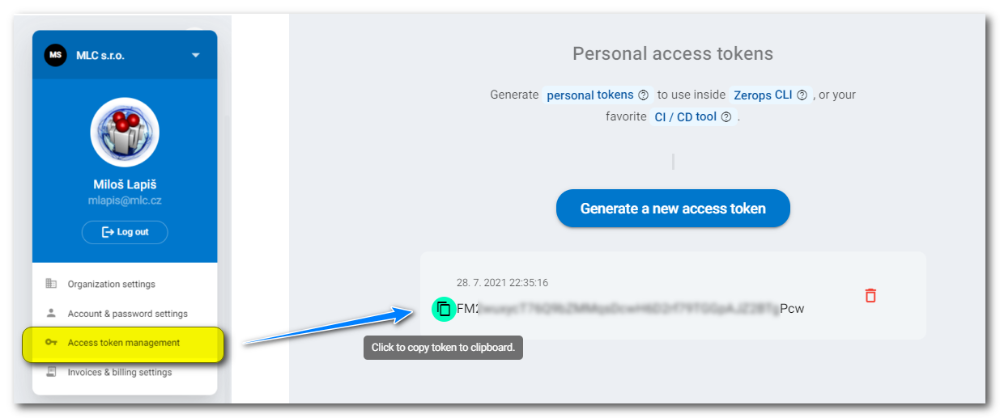

# Authorization

## Login using Personal Access Token

If you are using zCLI outside your computer, as in a [GitHub Action](/documentation/deploy/use-in-github-actions.html) or a [GitLab Job](/documentation/deploy/use-in-gitlab-ci.html), you might want to use a **personal access token** to log in to Zerops. These can be created by clicking on your avatar in the top right corner and heading to the **Access token management** page.



After you create your personal access token, you can log in using the command:

```bash
zcli login --zeropsToken=<token>
```

or even shorter, where the token value is used without its flag:

```bash
zcli login <token>
```

or better yet, add `ZEROPSTOKEN` to your environment variables, in which case the token doesn't need to be passed as a parameter. *This is the preferred* and more secure option, as this way, the token doesn't show up in logs.

```bash
zcli login
```

## Login using Email and Password

You can also log in using your email and password using the command:

```bash
zcli login --zeropsLogin=<email> --zeropsPassword=<password>
```

or even shorter, where the values are used without their flags:

```bash
zcli login my@mail.com foobar123
```

or add `ZEROPSLOGIN` and `ZEROPSPASSWORD` to your environment variables when the values don't show up in logs.

<!-- markdownlint-disable DOCSMD004 -->
::: tip Log in only once
You only need to log in once. Authorization token will be saved in your `~/.config/zerops/cli.data` folder inside your filesystem (on Mac or Linux platforms), or in `C:\Users\<user>\AppData\Roaming\.config\zerops\cli.data` (on Windows platform).
:::
<!-- markdownlint-enable DOCSMD004 -->
