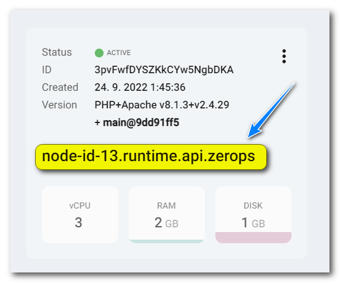
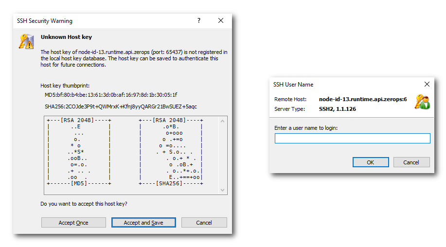

# SSH access to the containers

The zCLI command-line tool also allows you direct access to containers of Zerops [runtime](/documentation/services/runtimes.html) and [static server](/documentation/services/static-servers/nginx.html#nginx) services.

To use any SSH utility (like PuTTY, OpenSSH, WinSCP, Bitvise, Xshell, and many others), you must establish a [zCLI VPN](/documentation/cli/available-commands.html#vpn-start-project-name) tunnel that guarantees private and secure access to your Zerops project's services without generating or using any SSH credential keys.

```bash
zcli vpn start <projectName>
> wireguard tunnel is working properly
> dns is working properly
```

<!-- markdownlint-disable DOCSMD004 -->
::: tip When to use a SSH connection
It is essential to properly understand why Zerops offers the option to access the runtime container via SSH connection directly. The primary reason is to provide the user with the possibility of interactive debugging of the preparation of some procedures, which, however, should finally be carried out fully automatically, mainly through [build.prepare](/documentation/build/build-config.html#prepare-optional), [run.prepare](/documentation/build/build-config.html#prepare-optional-for-all-services) or [run.init](/documentation/build/build-config.html#init-optional-for-all-services) scripts.

**Runtime containers are inherently volatile**, and their instances can be replaced by others at any time, either for vertical scaling of their resources or for horizontal scaling of overall performance using the total number of their instances. Another reason may be the automatic repair of non-functional containers.

For these reasons, the creation and configuration of runtime containers **should always occur via the standard build and deploy pipelines** because manual changes are only temporary and can disappear anytime.
:::
<!-- markdownlint-enable DOCSMD004 -->

The rules you have to understand to correctly establish an SSH connection to a Zerops's container:

* it's necessary to specify a full container's domain address inside the project's private network,



* if the service runs in HA mode, connect each container separately,
* you have to connect explicitly to port 65437,
* the primary connection will always be created as a `root` user,
* with the working directory `/root`,
* after a successful connection, you can use `su <user>` for switching,
* idle timeout set on a server-side is 15 minutes,
* this duration is possible to control via the client's keep alive setting,
* all Zerops environment variables for such a container are available,
* you don't need to specify any SSH key,
* the zCLI VPN tunnel itself guarantees security,
* only runtime and static server containers are connectable.

Each SSH tool can have a few different switches or their order, but the two most typical syntaxes are:

```bash
ssh -p 65437 node-id-13.runtime.api.zerops
# or
ssh node-id-13.runtime.api.zerops 65437
> Host 'node-id-13.runtime.api.zerops' resolved to 2a02:1360:3:4e00::a00:7.
> Connecting to 2a02:1360:3:4e00::a00:7:65437...
> Connection established.
> Welcome to a Zerops container SSH session!
> You are logged in as root. Be careful making permanent changes, you can lose stuff.
```

Your SSH tool may inform you that the container's host key is not registered in the local host key database. You can accept it for one use or accept and save it for the next time. If you don't choose a `root` user name as a switch, the `root` user will be used automatically by default.



<!-- markdownlint-disable DOCSMD004 -->
::: tip SSH connections inside a project's private network
You always need an established WireGuard VPN tunnel to create an SSH connection. Suppose you would like to connect from one project's container to another. In that case, you don't need to install [Zerops zCLI](/documentation/cli/installation.html#download-the-zcli-static-binary) or [WireGuard](https://www.wireguard.com/install) package for Ubuntu inside such a container. Both are already pre-installed.
:::
<!-- markdownlint-enable DOCSMD004 -->
