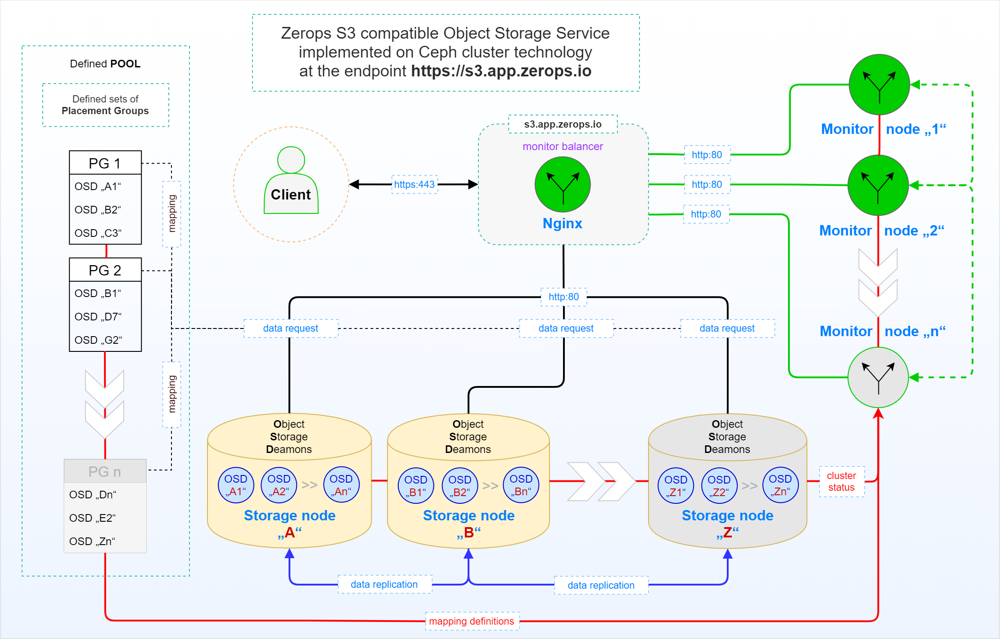

# Object Storage Service, Internal

The following figure shows a simplified schema of a standalone shared [Zerops S3 compatible Object Storage Service](/documentation/services/storage/s3.html) based on the [Ceph cluster](https://docs.ceph.com/en/latest/architecture) technology. At the heart of the Ceph storage cluster is the **CRUSH** algorithm. It calculates which **Storage node** needs to be contacted to retrieve or store data.

The Zerops Object Storage Service is directly accessible from everywhere using its public [API URL endpoint](/documentation/services/storage/s3.html#api-url-endpoint-and-port) through an HTTPS protocol in the same way. So in this unique case you don't need to utilize the [VPN](/documentation/cli/vpn.html) functionality of our [Zerops zCLI](/documentation/cli/installation.html), unlike all other Zerops services.

Data that are stored in a cluster are put into **pools**. Pools are logical representations of the cluster to the outside world. For each pool, a set of rules can be defined, for example, how **many replicas** of each object must exist. **The usual number is three or more replicas.**

**Placement Groups** (PGs) are used for the distribution of data within a pool. When creating a pool, a certain number of placement groups is set. The placement groups are used internally to group objects and are the essential factors for the performance of a Ceph cluster. **The object's name determines the PG for an object.**

**Monitor nodes** maintain information about a cluster's health state, a map of all nodes, and data distribution rules. Each **Storage node** has several physical hard disks/partitions attached, which are used as **OSDs** (Object Storage Devices) and managed by running **Ceph OSDs** (Object Storage Daemons).

## User request logic explanation

1. A client always sends a data request to the service through its endpoint `https://s3.app.zerops.io`.
2. The upstream **Nginx** server with `monitor balancer` functionality forwards the user's request to one of the available `Monitor nodes` based on its own logic.
3. The selected `Monitor node` evaluates the information contained in the request along with available data in `Placement Groups` mappings and the cluster status related to `Storage nodes`.
4. As a result, one of the **Storage nodes** is identified as the one to be contacted by the client's request, and the request is redirected to it.
5. The selected **Storage node** processes the request and responds to the client.
