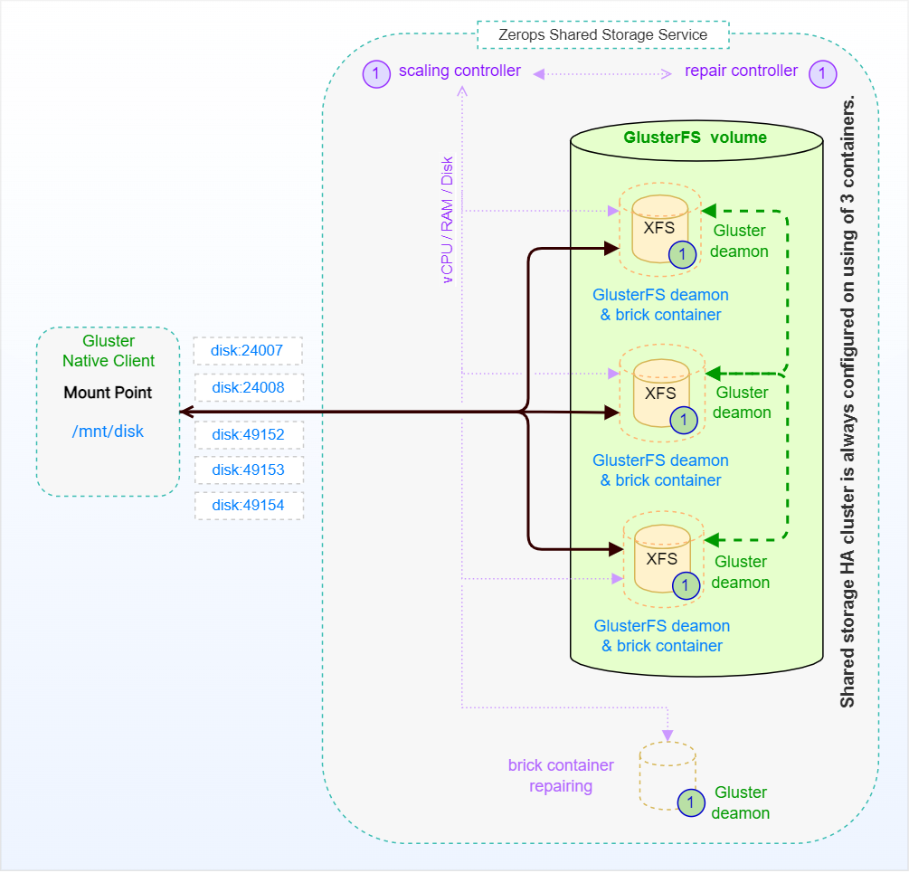

# Shared Storage Service, Internal

The following picture shows a simplified schema of a [Zerops Shared Storage Service](/documentation/services/storage/shared.html) based on the [GlusterFS cluster](https://docs.gluster.org/en/latest/Quick-Start-Guide/Architecture) technology.

A **gluster volume** in Zerops is a collection of 3 [containers](https://linuxcontainers.org/#LXD). Management **Gluster deamons** run on each container and manage brick processes (**GlusterFS deamons**), which in turn export the underlying on disk storage (XFS filesystem).

The **gluster native client** process mounts the volume and exposes the storage from all the bricks as a single unified storage namespace to the applications accessing it. I/O from the applications is routed to different bricks based on internal optimization mechanisms and rules.

The picture also supposes that the chosen [shared storage name](/documentation/services/storage/shared.html#shared-storage-name) has been **disk** and mounted in any [runtime service](/documentation/services/storage/shared.html#storage-mounting).

An independent **scaling controller** monitors and controls [vertical scaling](/documentation/automatic-scaling/how-automatic-scaling-works.html#vertical-scaling) (vCPU, RAM, Disk) for all brick containers. To ensure optimal performance, the cluster is configured and run with 3 brick instances, and [horizontal scaling](/documentation/automatic-scaling/how-automatic-scaling-works.html#horizontal-scaling) (number of containers) doesn't play any role in this case. An independent **repair controller** is then responsible for removing any containers that exhibit abnormal behavior and subsequently for replacing them with new ones.
