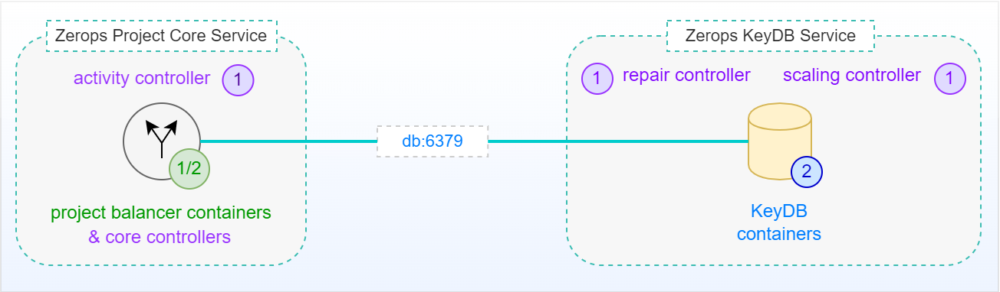
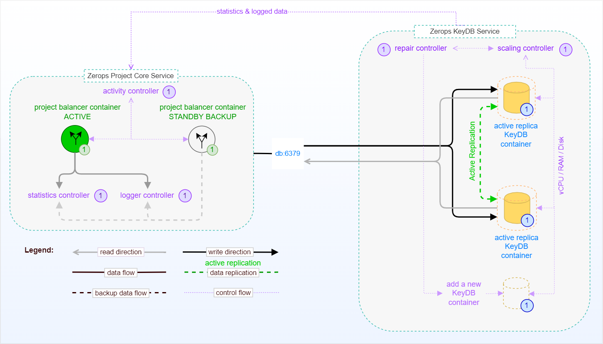

# KeyDB Service in HA Mode, Internal

The following picture shows a simplified schema of a standalone [Zerops KeyDB Service](/documentation/services/databases/keydb.html) in HA mode (with a default of 2 database instances) without external access. This means no access from outside of the Zerops project infrastructure, such as the Internet. Native access is only possible through a private network using a [default ports](/documentation/services/databases/keydb.html#hostname-and-ports) **==6379==** from the [Zerops Project Core Service](/documentation/overview/how-zerops-works-inside/typical-schemas-of-zerops-projects.html) itself, which is at the heart of each user-defined Zerops project.

## Simplified schema (no external access)

[Zerops KeyDB Service](/documentation/services/databases/keydb.html) shares the [same pricing structure](/documentation/overview/pricing.html#services) as other Zerops services. The instance of a [project balancer](/documentation/overview/how-zerops-works-inside/typical-schemas-of-zerops-projects.html#without-external-access) plays a crucial role and controls the routing of requests. It always directs the requests to the least busy instance of the KeyDB database service. An independent **scaling controller** monitors and controls all KeyDB database containers for [vertical scaling](/documentation/automatic-scaling/how-automatic-scaling-works.html#vertical-scaling) (vCPU, RAM, Disk). To ensure optimal performance, the KeyDB service is always configured and run with 2 database instances, and [horizontal scaling](/documentation/automatic-scaling/how-automatic-scaling-works.html#horizontal-scaling) (number of containers) doesn't play any role in this case (read more about how to [choose the right database mode](/documentation/services/databases/keydb.html#choosing-the-right-database-mode) for the KeyDB service). An independent **repair controller** is then responsible for removing any containers that exhibit abnormal behavior and subsequently replacing them with new ones.

KeyDB service containers are located on **different physical computers** to prevent service outages in the event of a fatal failure on a single physical computer. Below, you can see the same schema as before, this time including all relationships between the internal parts, including external access. You can read more about how the Zerops project works with [external access](/documentation/overview/how-zerops-works-inside/typical-schemas-of-zerops-projects.html#with-external-access).

## Extended schema (with external access)

KeyDB has support for active replicas (also known as "Active-Active") where both database instances are the master of each other. This dramatically simplifies fail-over scenarios as replicas no longer need to be promoted (neither manually nor automatically) to active masters. This scenario is also effectively used to distribute the load in high read/write scenarios. The main logic of the active replication is based on the fact that each write is timestamped, and the newest write will always win. It's also true for situations when one of the database instances fails or is temporarily unavailable. When both instances are ready again, the replication process uses this rule to decide what wins in duplicated collision cases.

To prevent the possibility of rebroadcasting replication changes between both database instances, each KeyDB instance will compute a dynamic UUID identification. This UUID is not saved and exists only for the life of the process. Both instances know the identification of each other and are able to use it to prevent conflict cases.
