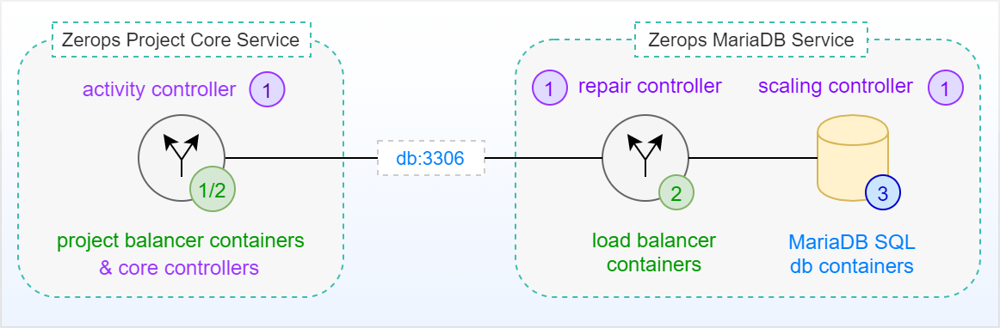
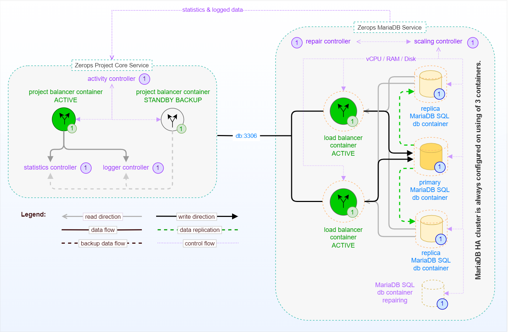

# MariaDB Service in HA Mode, Internal

The following image shows a simplified schema of a standalone Zerops MariaDB Service in HA mode (with a default of 3 database instances in a [Galera cluster](https://mariadb.com/kb/en/galera-cluster)) without external access. This means no access from outside of the Zerops project infrastructure, such as the Internet. There is only native access through a private network using a [default port](/documentation/services/databases/mariadb.html#hostname-and-port) **==3306==** from the [Zerops Project Core Service](/documentation/overview/how-zerops-works-inside/typical-schemas-of-zerops-projects.html) itself, which is the heart of each user-defined Zerops project.

## Simplified schema

[Zerops MariaDB Service](/documentation/services/databases/mariadb.html) shares the [same pricing structure](/documentation/overview/pricing.html#services) with other Zerops services. Two instances of a **[load balancer (MaxScale)](https://mariadb.com/kb/en/maxscale)** (both in the active state) play a crucial role and control the routing of data reading requests in tandem. They always direct the requests to the least busy instance of the MariaDB database service (or to the primary one in case of data writing requests). An independent **scaling controller** monitors and controls [vertical scaling](/documentation/automatic-scaling/how-automatic-scaling-works.html#vertical-scaling) (vCPU, RAM, Disk) for all load balancer and MariaDB database containers. To ensure optimal performance, the MariaDB cluster is always configured and run with 3 database instances, and [horizontal scaling](/documentation/automatic-scaling/how-automatic-scaling-works.html#horizontal-scaling) (number of containers) doesn't play any role in this case (read more about how to [choose the right database mode](/documentation/services/databases/mariadb.md#choosing-the-right-database-mode) for the MariaDB service). An independent **repair controller** is then responsible for removing any containers that exhibit abnormal behavior and subsequently for replacing them with new ones.

Both load balancers or MariaDB service containers are located on **different physical computers** to prevent service outages in the event of any fatal failure on a single physical computer. Below, you can see the same schema as before, this time including all relations among the internal parts.

## Extended schema

<!-- markdownlint-disable DOCSMD004 -->
::: details Primary & Replica MariaDB instances
There is always only one primary instance with write access. This is to minimize the risk of data drift and errant transactions. If the primary instance has failed for any reason, the replication mechanism will activate a new one using one of the available replica instances.
:::
<!-- markdownlint-enable DOCSMD004 -->
