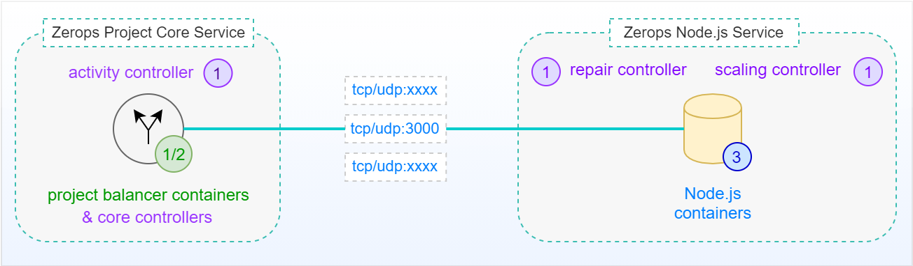
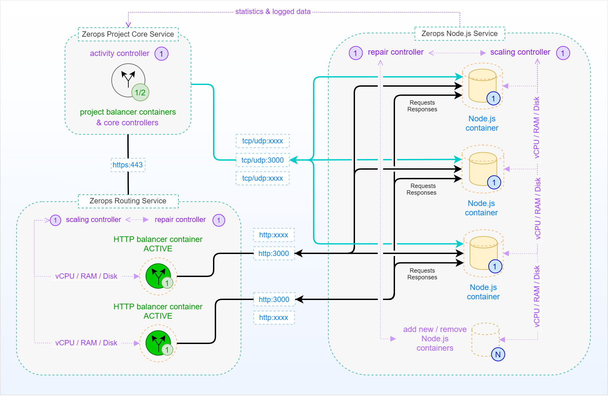

# Node.js Service in HA Mode, a deep-dive view

The following picture shows a simplified schema of a standalone [Zerops Node.js Service](/documentation/services/runtimes/nodejs.html) in HA mode with **3** runtime environment instances as a **Node.js cluster** without external access. This means no access from outside of the Zerops project infrastructure, such as the Internet. Access is only possible through a private network using a [tcp/udp port](/documentation/services/runtimes/nodejs.html#port) **==3000==** (could be added others) from the [Zerops Project Core Service](/documentation/overview/how-zerops-works-inside/typical-schemas-of-zerops-projects.html) itself, which is the heart of each user-defined Zerops project.

## Simplified schema (no external access)

[Zerops Node.js Service](/documentation/services/runtimes/nodejs.html) shares the [same pricing structure](/documentation/overview/pricing.html#services) as other Zerops services. The instance of a [project balancer](/documentation/overview/how-zerops-works-inside/typical-schemas-of-zerops-projects.html#without-external-access) plays a crucial role and controls the routing of requests. It always directs the requests to the least busy instance of the Node.js runtime environment service. An independent **scaling controller** monitors and controls all Node.js runtime environment containers for [vertical](/documentation/automatic-scaling/how-automatic-scaling-works.html#vertical-scaling) (vCPU, RAM, Disk) and [horizontal](/documentation/automatic-scaling/how-automatic-scaling-works.html#horizontal-scaling) (number of containers) scaling. An independent **repair controller** is then responsible for removing any containers that exhibit abnormal behavior and subsequently replacing them with new ones.

Node.js service containers are located on **different physical computers** to prevent service outages in the event of a fatal failure on a single physical computer. Below, you can see the same schema as before, this time including all relationships between the internal parts, including external access. You can read more about how the Zerops project works with [external access](/documentation/overview/how-zerops-works-inside/typical-schemas-of-zerops-projects.html#with-external-access).

## Extended schema (with external access)

**Zerops Routing Service** takes care of SSL certificate management and internal translation of HTTPS protocol to HTTP for all project services, including Zerops Node.js Services. If a request should or shouldn't be treated as HTTP, the crucial decision is made on the existence of the [HTTP protocol support](/documentation/services/runtimes/nodejs.html#port) flag. Both active **HTTP balancers** again direct requests to the least busy instance of the Node.js runtime environment service.

It's up to you if you choose the automatic support for SSL certificates or not when you map [public domains](/documentation/routing/using-your-domain.html) to your Zerops service.

All other non-HTTP requests on any **tcp/udp** port are managed by the **project balancer** and continue to be routed directly to the least busy instance of the Node.js runtime environment service.

