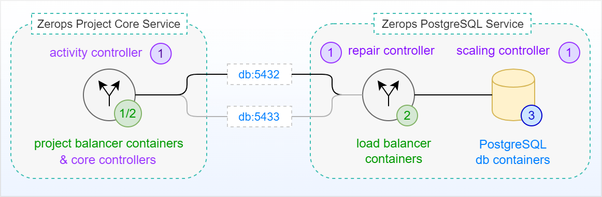
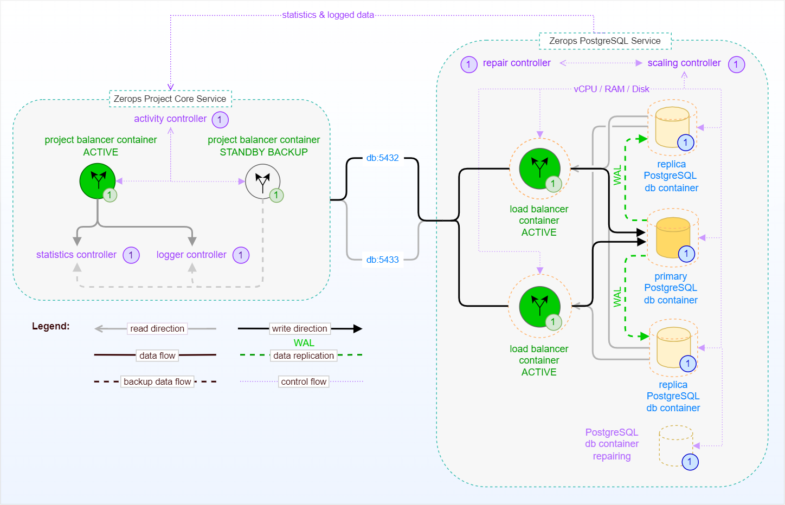

# PostgreSQL Service in HA Mode, Internal

The following picture shows a simplified schema of a standalone [Zerops PostgreSQL Service](/documentation/services/databases/postgresql.html) in HA mode (with a default of 3 database instances in a [Patroni cluster](https://patroni.readthedocs.io)) without external access. This means no access from outside of the Zerops project infrastructure, such as the Internet. Native access is only possible through a private network using a [default ports](/documentation/services/databases/postgresql.html#hostname-and-ports) **==5432==** or **==5433==** from the [Zerops Project Core Service](/documentation/overview/how-zerops-works-inside/typical-schemas-of-zerops-projects.html) itself, which is at the heart of each user-defined Zerops project.

## Simplified schema (no external access)

[Zerops PostgreSQL Service](/documentation/services/databases/postgresql.html) shares the [same pricing structure](/documentation/overview/pricing.html#services) as other Zerops services. Two instances of a **[load balancer (HAProxy)](http://www.haproxy.org)** (both in the active state) play a crucial role and control the routing of user requests in tandem. They always direct reading requests (SQL SELECTs through port 5433) to the least busy instance of the PostgreSQL database service (or to the primary one in case of data writing requests related to SQL INSERTs, UPDATEs, or DELETEs through port 5432). An independent **scaling controller** monitors and controls [vertical scaling](/documentation/automatic-scaling/how-automatic-scaling-works.html#vertical-scaling) (vCPU, RAM, Disk) for all load balancers, PostgreSQL database containers, and [horizontal scaling](/documentation/automatic-scaling/how-automatic-scaling-works.html#horizontal-scaling) (number of containers). An independent **repair controller** is then responsible for removing any containers that exhibit abnormal behavior and subsequently replacing them with new ones.

The primary database instance [streams WAL](https://www.postgresql.org/docs/9.6/runtime-config-replication.html) (Write-Ahead-Logs) records in chunks to replica instances to ensure that the data is always in-sync across the whole cluster. The replicas instances receive the WAL chunks by establishing a connection with the primary instance. The advantage of streaming WAL records is that they are streamed quickly and immediately. Streaming replication is set asynchronous.

Both load balancers or PostgreSQL database containers are located on **different physical computers** to prevent service outages in the event of a fatal failure on a single physical computer. Below, you can see the same schema as before, this time including all relations between the internal parts.

## Extended schema (no external access)

<!-- markdownlint-disable DOCSMD004 -->
::: details Primary & Replica PostgreSQL instances
There is always only one primary instance with write access. This is to minimize the risk of data drift and errant transactions. If the primary instance has failed for any reason, the internal mechanism of the Patroni cluster will activate a new one using one of the available replica instances.
:::
<!-- markdownlint-enable DOCSMD004 -->
