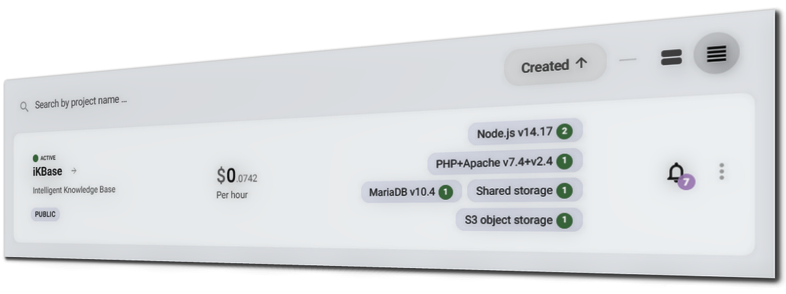
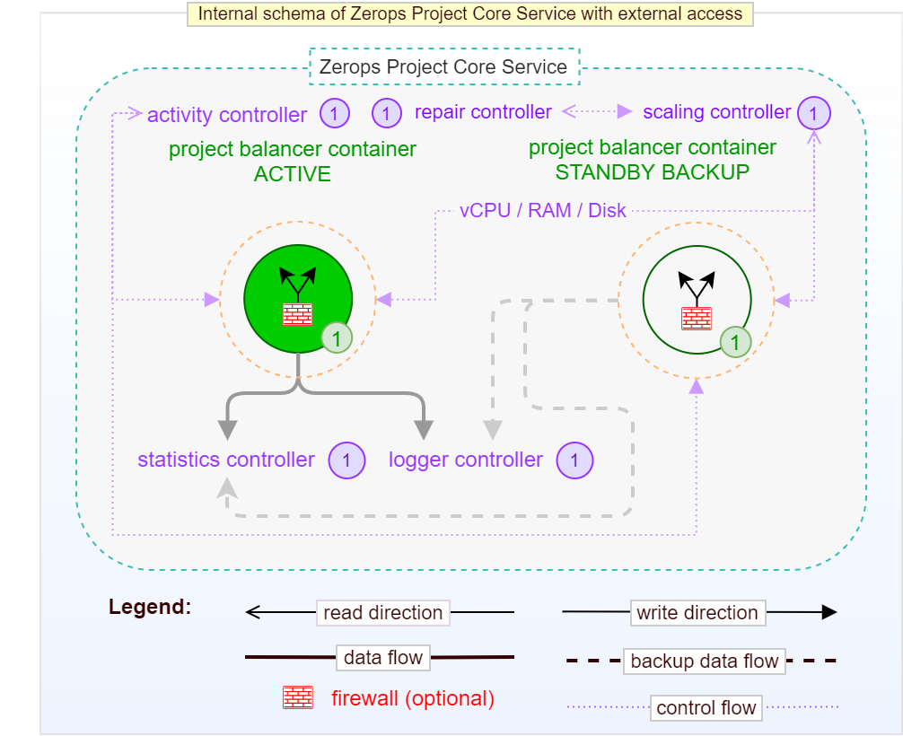

# Project & Services Structure

## Project

Zerops project is a group of services united by a name. It can, for example, consist of a NodeJS [runtime environment](/documentation/services/runtimes.html) with a MongoDB [database](/documentation/services/databases.html) and S3 [object storage](/documentation/services/storage.html).

Your project [team](/documentation/overview/pricing.html#html#team-members) can be as big as you want and need. You can create a [separate project](/documentation/overview/pricing.html#projects) for any environment (development, stage, production) or even for each developer if you want. Or benefit from a [single project](/documentation/overview/pricing.html#projects) shared among all developers reducing the cost. In both ways, developers can still utilize our powerful [dev tools](/documentation/cli/vpn.html).

All services inside such a project share a [dedicated private network](/documentation/routing/routing-between-project-services.html) and can see and reference [environment variables](/documentation/environment-variables/how-to-access.html) from other services.

Each project has a free unique [IPv6 address](/documentation/routing/unique-ipv4-ipv6-addresses.html) assigned and optionally an [IPv4 address](/documentation/overview/pricing.html#project-add-ons) applied as a paid add-on. You can then either set up public access through [domains](/documentation/routing/using-your-domain.html) and point your DNS records to the assigned IP addresses, or set up direct access to the service through the IP by [opening public ports](/documentation/routing/access-through-ip-and-firewall.html). A built-in optional [firewall](/documentation/routing/access-through-ip-and-firewall.html) can manage the direct access by defining a list of allowed and denied IP addresses for each open public port.

### Typical functional schemas of Zerops Projects

#### Without external access

This means no access from outside of Zerops project infrastructure, such as the Internet. In this case, there's only communication between Zerops Project Core Service and any of Zerops Services ([databases](/documentation/services/databases.html), runtimes environments, web servers, storages, search engines, message brokers) through the private network. Zerops Project Core Service is the heart of each Zerops project. It's a part of [Project Basic Package](/documentation/overview/pricing.html#projects) pricing logic.

The essential parts are two running instances of a **project balancer** (one in an active state and the other in a standby backup state) through which all communication is passing.

:::: tabs
::: tab Schema of Zerops Project

:::
::: tab Detail of Project Core Service

Technically, the project balancer is a Layer 3 balancer (establishing connections only on the transport layer, i.e., TCP, UDP). An independent **scaling controller** monitors and controls [vertical scaling](/documentation/automatic-scaling/how-automatic-scaling-works.html#vertical-scaling) (vCPU, RAM, Disk) for both project balancer container. An independent **repair controller** is then responsible for removing any container that exhibit abnormal behavior and subsequently replacing them with new one.

This ensures a high degree of reliability and stability for all traffic at any time. Each of them runs in a different container located on a **different physical machine**. An independent **activity controller** continuously monitors critical operating parameters of both project balancers. If the currently active instance shows any abnormalities, the running standby backup gets activated instead. From an external perspective, this change is not noticeable in any way.

You can also see details regarding the two remaining project core controllers. The **statistics one** is used for storing metrics of operational parameters of all project and service containers, and the **logger one** for recording all events. The legend can help you orient yourself.

:::
::::

#### With external access

This means access from outside of Zerops project infrastructure, such as the Internet. The role of a **project balancer** is extended to public port routing and firewall. Again, all communication is passing through, either private network traffic or traffic concerning the Internet.

As mentioned earlier, the optional [firewall](/documentation/routing/access-through-ip-and-firewall.html) allows you to explicitly deny or allow access from the external Internet to each of the project's [public accessible ports](/documentation/routing/access-through-ip-and-firewall.html). For runtime environments or web servers services, it essentially means that any port (except 80 or 443 ports) in combination with an assigned IPv4 or IPv6 address can be made public in this way (each project has only one free IPv6 or optionally one paid IPv4 as an add-on). For the rest of services (databases, storages, search engines, message brokers), you have to use our [dev tools](/documentation/cli/vpn.html) (VPN access and Zerops CLI). It is, for example, a case when you want to access database MariaDB Service on its native 3306 port.

In addition, as a general principle, you can use activated Zerops [subdomains](/documentation/routing/zerops-subdomain.html) (`*.app.zerops.io`) or [your public domains](/documentation/routing/using-your-domain.html) if you have pointed their DNS A or AAAA records to those assigned IPv4 or IPv6 addresses on HTTP (80) or HTTPS (443) ports. Zerops Routing Service is started with defining the first of these public routing rules. This service, among other things, also takes care of SSL certificate management and internal translation of HTTPS protocol to HTTP.

:::: tabs
::: tab Schema of Zerops Project

:::
::: tab Detail of Project Core Service

:::
::: tab Detail of Routing Service

:::
::::

## Services

Services are the most important part of Zerops. Each service consists of a cluster of Linux containers running a Zerops managed image of a technology, whether it's a [runtime](/documentation/services/runtimes.html), [database](/documentation/services/databases.html), [storage](/documentation/services/storage.html) or a [static webserver](/documentation/services/static-server.html)). Each service has a hostname and an _n_ number of [ports](/documentation/routing/routing-between-project-services.html), it can be made [public via a domain](/documentation/routing/using-your-domain.html) in case of HTTP(s) services, or via an [IP adress and a port](/documentation/routing/access-through-ip-and-firewall.html).

 

A project can contain an [unlimited number of services](/documentation/overview/made-for-developers.html#each-developer-should-have-his-own-account-no-artificial-pricing-boosting). Services are of different types and depending on their type they are either fully managed by Zerops, or partially managed by Zerops while giving you straightforward management abilities through the Zerops app.

 

 

### Runtime services
[Node.js](/documentation/services/runtimes.html#node-js), [Golang](/documentation/services/runtimes.html#golang), [PHP](/documentation/services/runtimes.html#php)

### Database services
[MariaDB (MySQL)](/documentation/services/databases.html#mariadb-mysql), [MongoDB](/documentation/services/databases.html#mongodb), [Redis](/documentation/services/databases.html#redis), [Elasticsearch](/documentation/services/databases.html#elasticsearch), 

## Message broker services 
[RabbitMQ](/documentation/services/databases.html#rabbitmq)

### Static webserver
[Nginx](/documentation/services/static-server.html)

### Storage services
[Shared storage](/documentation/services/storage.html#shared-storage), [S3 compatible Object Storage](/documentation/services/storage.html#s3-compatible-object-storage)

 

::: warning Internal services
Each project also has one or two internal services. A core service, which provides secure data communication between the Internet and your project, storage for application logs and technical statistics. And an l7 balancer, which handles HTTP(s) traffic from the Internet to your applications, HTTP(s) routing over Zerops subdomain or your own domain and SSL certificates.
:::
