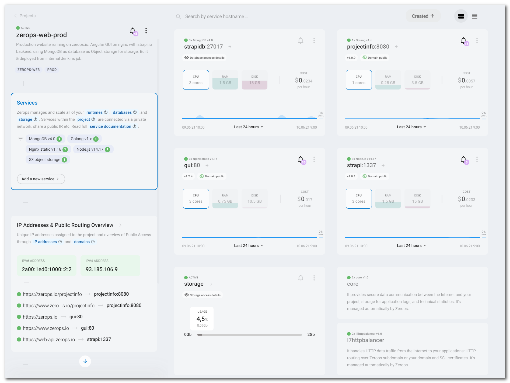

# Project & Services Structure

## Project

Zerops structure has three levels. At the top is a project, which can have services, which are made of containers. It can, for example, consist of a NodeJS [runtime environment](/documentation/services/runtimes.html) with a MongoDB [database](/documentation/services/databases.html) and S3 [object storage](/documentation/services/storage.html).

You can create a separate project for any environment (development, stage, production) or even for each developer if you want. Or benefit from a single project shared among all developers reducing the cost. In both ways, developers can still utilize our powerful [dev tools](/documentation/cli/vpn.html).

All services inside such a project share a [dedicated private network](/documentation/routing/routing-between-project-services.html) and can see and reference [environment variables](/documentation/environment-variables/how-to-access.html) from other services.

By default, nothing outside the project can access any of the services inside. Each service can be made publicly accessible through Zerops subdomains (*.app.zerops.io) or [domains](/documentation/routing/using-your-domain.html), pointing your DNS records to the [IPv6](/documentation/routing/unique-ipv4-ipv6-addresses.html) or [IPv4](/documentation/overview/pricing.html#project-add-ons) addresses assigned to the project, or by setting up direct access by [opening public ports](/documentation/routing/access-through-ip-and-firewall.html) on the assigned IP addresses. A built-in optional [firewall](/documentation/routing/access-through-ip-and-firewall.html) can manage the direct access by defining a list of allowed and denied IP addresses for each open public port.

The screenshot below shows an example of such a project, our own website. The project is called **zerops-web-prod**, and it consists of 2 runtime services (Node.js and Golang), a static web server (Nginx), a database (MongoDB), and S3 object storage. It is made accessible to the public through our domain (`zerops.io`).

Each project has the following items included in its [Basic Package](/documentation/overview/pricing.html#projects):

* 1 unique IPv6 address
* project balancers & core controllers
* 100 build minutes
* daily backup
* 10 GB of outbound traffic

More details can be found in the [pricing](/documentation/overview/pricing.html) document.

## Services and their containers

Services are the most important part of Zerops. Each service consists of a cluster of Linux containers running a Zerops managed image of a technology, whether it's a [runtime](/documentation/services/runtimes.html), [database](/documentation/services/databases.html), [storage](/documentation/services/storage.html) or a [static webserver](/documentation/services/static-server.html)). Each service has a hostname and an _n_ number of [ports](/documentation/routing/routing-between-project-services.html), it can be made [public via a domain](/documentation/routing/using-your-domain.html) in case of HTTP(s) services, or via an [IP adress and a port](/documentation/routing/access-through-ip-and-firewall.html).

 

A project can contain an [unlimited number of services](/documentation/overview/made-for-developers.html#each-developer-should-have-his-own-account-no-artificial-pricing-boosting). Services are of different types and depending on their type they are either fully managed by Zerops, or partially managed by Zerops while giving you straightforward management abilities through the Zerops app.

 

 

### Runtime services
[Node.js](/documentation/services/runtimes.html#node-js), [Golang](/documentation/services/runtimes.html#golang), [PHP](/documentation/services/runtimes.html#php)

### Database services
[MariaDB (MySQL)](/documentation/services/databases.html#mariadb-mysql), [MongoDB](/documentation/services/databases.html#mongodb), [Redis](/documentation/services/databases.html#redis), [Elasticsearch](/documentation/services/databases.html#elasticsearch), 

### Message broker services
[RabbitMQ](/documentation/services/databases.html#rabbitmq)

### Static webserver
[Nginx](/documentation/services/static-server.html)

### Storage services
[Shared storage](/documentation/services/storage.html#shared-storage), [S3 compatible Object Storage](/documentation/services/storage.html#s3-compatible-object-storage)
