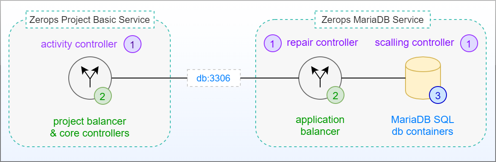
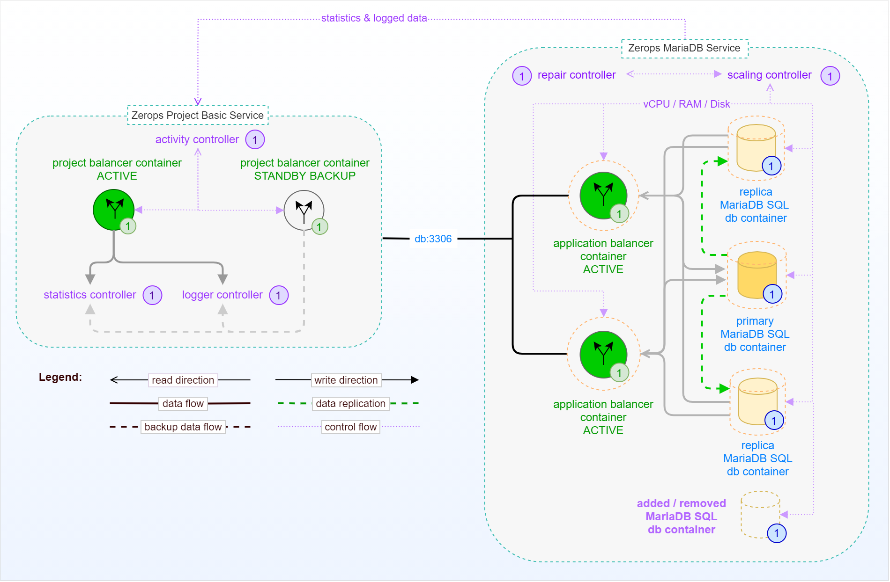

# Databases

## MariaDB (MySQL)

<!-- markdownlint-disable DOCSMD004 -->
::: details Compatibility & Differences to MySQL
Information on the compatibility of MariaDB software with similar, competing software, as well as their differences, can be found [here](https://mariadb.com/kb/en/compatibility-differences).
:::
<!-- markdownlint-enable DOCSMD004 -->

### Adding a new MariaDB service

The following presentation shows you how to do it in Zerops UI step by step.

<!-- markdownlint-disable DOCSMD004 -->
::: tip Keyboard shortcuts for viewing
For faster navigation through any presentation, you can use the shortcuts below.
|← Previous|→ Next|↓ Down|↑ Up|F: Full-screen|ESC: Overview|
|:--------:|:----:|:----:|:--:|:------------:|:-----------:|
:::

@slidestart simple

Click the button **Add the First Service** <br />
or **Add a New Service**


---

Choose **MariaDB** card from the services catalog


---

Choose **MariaDB version** which you want to use


---

<span class="r-fit-text">
Choose <b>MariaDB service hostname</b> which you want to use. <br /><br />
Use this hostname and the internal port, i.e., <b>mariadb:3306</b>, <br /> for access from other project services.
</span>


---

<span class="r-fit-text">
Zerops MariaDB service is actually configured always in HA mode [1].<br />
Unfortunately, you can't change it, but this limitation will be removed soon.
</span>


<span class="r-fit-text">
Clicking on the button <b>Add a new MariaDB</b> [2] starts the process.
</span>

---

<span class="r-fit-text">
Clicking on the <b>MariaDB</b> [1] tag inside the <b>Services</b> card <br />
and then on the symbol of a running process [2], <br />
you see the instantiation of the service.
</span>


---

<span class="r-fit-text">
You can switch to the row layout [1]. Show <b>Database access details</b> [2],<br />
readable password [3], and pay attention to Connection String [4].
</span>


@slideend

### Using a connection string from other services

As shown in the previous presentation, after creating a new MariaDB service, there are database access details (hostname, port, user, password, connection string) that you can use in other Zerops services. You can use them because all services have access to [environment variables](/documentation/environment-variables/how-to-access.html) of other services inside the same project prefixed by their name. For **MariaDB** there are automatically generated [helper variables](/documentation/environment-variables/helper-variables.html#mariadb).

#### Example for NodeJS runtime

The global **process** object is always available to applications without using **require()**.

```TypeScript
const dbServiceName = 'mariadb';
const env = process.env;
const dbConnectionString = env.`${dbServiceName}_connectionString`;
const dbHostname = env.`${dbServiceName}_hostname`;
const dbUser = env.`${dbServiceName}_user`;
const dbPassword = env.`${dbServiceName}_password`;
```

The value of **dbConnectionString** variable is **user:password@mariadb:3306** then. When using NodeJS driver **mysql**, it's possible to use this value directly to establish a connection.

```TypeScript
const mysql = require('mysql');
const dbName = 'db';
const connection = mysql.createConnection(`mysql://${dbConnectionString}/${dbName}`);
```

You can certainly also use more structured syntax with an object.

```TypeScript
const mysql = require('mysql');
const dbName = 'db';
const connection = mysql.createConnection({
  host: ${dbHostname},
  user: ${dbUser},
  password: ${dbPassword},
  database : ${dbName}
});
```

### The following documentation part will be restructured and moved to other places

The following image shows a simplified schema of a standalone Zerops MariaDB Service in HA mode (with a default of 3 database instances in a cluster) without external access. This means no access from outside of Zerops project infrastructure, such as the Internet. There is only native access through a private network using a default port 3306 from the Zerops Project Basic Service itself, representing the core of a user-defined project inside Zerops.



Zerops Project Core Service is the heart of each Zerops project. It has its own [pricing logic](/documentation/overview/pricing.html#projects). The essential parts are two running instances of a **project balancer** (one in an active state and the other in a standby backup state) through which all communication is passing (either related to the project's external environment or the private network). This ensures a high degree of reliability and stability for all traffic at any time. Each of them runs in a different container located on a **different physical machine**. An independent **activity controller** continuously monitors critical operating parameters of both project balancers. If the currently active instance shows any abnormalities, the running standby backup gets activated instead. From an external perspective, this change is not noticeable in any way.

Zerops MariaDB Service shares the [same pricing structure](/documentation/overview/pricing.html#services) with other Zerops services. Once again, two instances of a **[load balancer (MaxScale)](https://mariadb.com/kb/en/maxscale)** (both in the active state) play a crucial role and control the routing of data reading requests in tandem. They always direct the requests to the least busy instance of the MariaDB database service (or to the primary one in case of data writing requests). An independent **scaling controller** monitors and controls [vertical scaling](/documentation/automatic-scaling/how-automatic-scaling-works.html#vertical-scaling) (vCPU, RAM, Disk) for all load balancer and MariaDB database containers. To ensure optimal performance, the MariaDB cluster is always configured and run with 3 database instances, and [horizontal scaling](/documentation/automatic-scaling/how-automatic-scaling-works.html#horizontal-scaling) (number of containers) doesn't play any role in this case. An independent **repair controller** is then responsible for removing any containers that exhibit abnormal behavior and subsequently replacing them with new ones.

Both load balancers or MariaDB service containers are located on **different physical computers** to prevent service outages in the event of any fatal failure on a single physical computer.

Below, you can see the same schema as before, this time including all relations among internal parts. You can also see details regarding project core controllers. The **statistics one** is used for storing metrics of operational parameters of all project and service containers, and the **logger one** for recording all events. The legend can help you orient yourself.



<!-- markdownlint-disable DOCSMD004 -->
::: details Primary & Replica MariaDB instances
There is always only one primary instance with write access. This is to minimize the risk of data drift and errant transactions. If the primary instance has failed for any reason, the replication mechanism will activate a new one using one of the available replica instances.
:::
<!-- markdownlint-enable DOCSMD004 -->

<!-- markdownlint-disable DOCSMD004 -->
::: warning Volatile non-database storage
Each container has a separate disk space, which can theoretically be used by appropriate APIs of the database service and thus store data outside the replicated contents of the database. It should be noted that such data is considered volatile (reserved for this particular instance only). It will not be migrated if such a container is deleted due to a failure of this container. If it is necessary to store and share such data at the database level permanently, developers should use Zerops object storage or shared storage services. Also, separate direct access to an individual MariaDB instance is not supported in any way.
:::
<!-- markdownlint-enable DOCSMD004 -->

<!-- markdownlint-disable DOCSMD004 -->
::: tip Asynchronous behavior of MariaDB HA cluster
When data is stored in a MariaDB cluster (through its actual primary database instance), it is replicated across other replica instances asynchronously. This means that if one SQL statement stores some data, the next immediate statement may not retrieve the same data. The reason is that the given statement will be executed against another replica instance. If required to get the same data, it's necessary to encapsulate both commands into one SQL transaction, which will always be executed against the primary instance.
:::
<!-- markdownlint-enable DOCSMD004 -->

## MongoDB

## Redis
