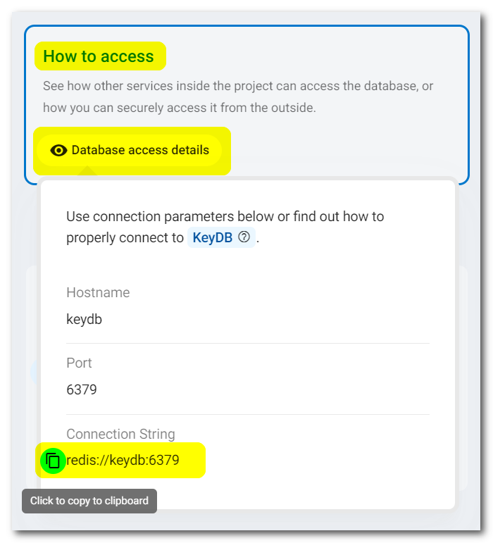
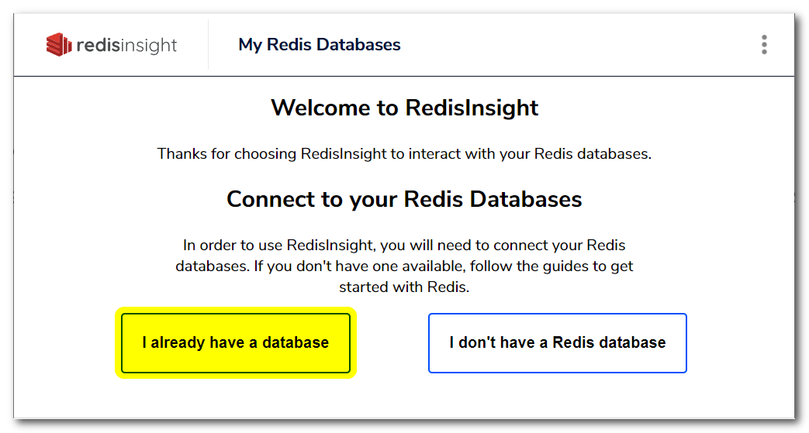
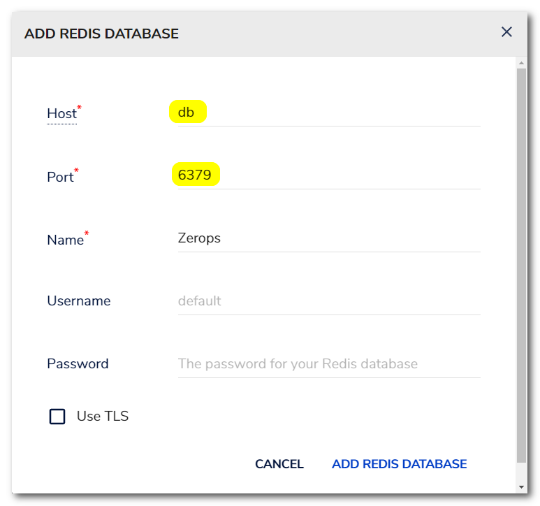
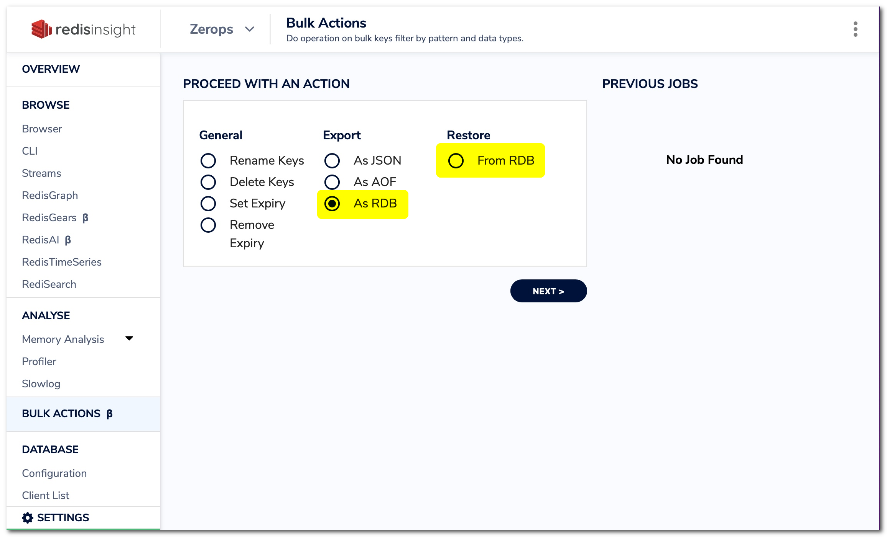

# KeyDB (Redis)

Zerops provides a fully managed and scaled KeyDB (Redis) key-value database service (type of NoSQL database in which keys serve as unique identifiers for their associated values), suitable for both development and production projects on any load. You can choose any variant you wish in the knowledge that it will work. Your peace of mind is our top priority.

[KeyDB](https://github.com/EQ-Alpha/KeyDB#what-is-keydb) is a high performance [fork of Redis](https://github.com/EQ-Alpha/KeyDB#why-fork-redis) with a focus on multi-threading, memory efficiency, and high throughput. KeyDB maintains full compatibility with the Redis protocol, modules, and scripts. All 16 default logical databases on each KeyDB instance can be used and standard KeyDB/Redis protocol is supported without any other limitations.

[[toc]]

## Adding the KeyDB Service in Zerops

The Zerops KeyDB service is based on a [Linux LXD container](/documentation/overview/projects-and-services-structure.html#services-containers) with **Ubuntu** **==v18.04.06==**.

There are two possible ways to create a new KeyDB service. Either manually in the [Zerops GUI](#through-the-zerops-gui-interface), or using the Zerops [import functionality](/documentation/export-import/project-service-export-import.html#how-to-export-import-a-project).

### Using the import functionality

Zerops uses a YAML definition format to describe the structure. View the complete specification of the [import/export syntax in the YAML format](/documentation/export-import/project-service-export-import.html#used-yaml-specification).

To import a KeyDB service, you can use something similar to the following:

```yaml
services:
  # Service will be accessible through zCLI VPN under <protocol>://db:<port>
  - hostname: db
    # Type and version of service used.
    type: keydb@6
    # Whether the service will be run on one or multiple containers.
    # Since this is a simple example, using only one container is fine.
    mode: NON_HA
```

### Through the Zerops GUI interface

#### Which version to choose

You can currently only choose version **v6** (version 6.2.2 to be precise).

Used as the export & import type: ==`keydb@6`== .

#### Hostname and ports

Choose a short and descriptive URL-friendly name, for example, **db**. The following rules apply:

* maximum length **==25==** characters,
* only lowercase ASCII letters **==a-z==** and numbers **==0-9==**,
* **==has to be unique==** in relation to other existing project hostnames,
* the hostname **==can't be changed==** later.

The port will automatically be set to the value of **==6379==** and can't be changed.

<!-- markdownlint-disable DOCSMD004 -->
::: warning Security inside a private project network
All services inside a Zerops project share a [dedicated private network](/documentation/routing/routing-between-project-services.html) and can see and reference [environment variables](/documentation/environment-variables/how-to-access.html) from other services. This means that, by default, nothing outside the project can access any of the services inside it.

The KeyDB service is configured to **allow full and unrestricted access without user authentication** only from the project internal network environment. In practice, this means that this service can only be accessed either programmatically through the runtime environment services ([Node.js](/documentation/services/runtimes/nodejs.html#port), [Golang](/documentation/services/runtimes/golang.html#port), and [PHP](/documentation/services/runtimes/php.html#hostname-and-port), which should implement their authentication logic not to allow anonymous access to the KeyDB service) or using [zCLI](/documentation/cli/installation-authorization.html) and [vpn](/documentation/cli/vpn.html) from your local environment, nothing else.
:::
<!-- markdownlint-enable DOCSMD004 -->

#### HA / non-HA database mode

When creating a new service, you can choose whether the database should be run in **HA** (High Availability) mode, using 2 containers, or **non-HA mode**, using only 1 container. ==**The chosen database mode can't be changed later.**== If you would like to learn more about the technical details and how this service is built internally, take a look at the [KeyDB Service in HA Mode, Internal](/documentation/overview/how-zerops-works-inside/keydb-ha-internally.html).

##### KeyDB in non-HA mode

* great for local development to save money,
* data is stored only in a single container, higher risk of data loss,
* all data changes since the last backup are not recoverable,
* not recommended for production projects.

##### KeyDB in HA mode

* will run on two containers, each on a **different physical machine**,
* therefore the data is stored redundantly in two places, with no risk of data loss,
* when one container fails, it's automatically replaced with a new one,
* with a project balancer to distribute the load,
* asynchronous behavior of the active replication between containers,
* recommended for production projects.

## How to access a KeyDB database

<!-- markdownlint-disable DOCSMD004 -->
::: warning Don't use additional security protocols for internal communication
The database service is not configured to support direct access using SSL/TLS or SSH protocols for internal communication inside a Zerops project private secured network. This is also the case for access using the Zerops [zCLI](/documentation/cli/installation.html) through a secure VPN channel.
:::
<!-- markdownlint-enable DOCSMD004 -->

### From other services inside the project

Other services can access the database using its **hostname** and **port** environment variables, as they are part of the same private project network. It’s highly recommended that you utilize the **==connectionString==** environment variable that Zerops creates automatically. More information related to **connectionString** can be found in the dedicated [environment variables](/documentation/environment-variables/how-to-access.html) section. See also a list of all automatically generated [environment variables](/documentation/environment-variables/helper-variables.html#keydb-redis) for the KeyDB service.

For more flexibility with future potential hostname changes, it's always recommended to use them indirectly via [custom environment variables](/knowledge-base/best-practices/how-to-use-environment-variables-efficiently.html) (referencing implicit Zerops environment [variables](/documentation/environment-variables/helper-variables.html#postgresql)) in each project service separately. This allows you to eliminate all direct dependencies in the application code, which in turn provides simplification and increased flexibility. Another reason not to hard-code the values inside your applications is that it can be dangerous because it is easy to commit them (like your credentials) into a repository, potentially exposing them to more people than intended.

### From other Zerops projects

Zerops always sets up a [private dedicated network](/documentation/overview/projects-and-services-structure.html#project) for each project. From this point of view, cross project communication can be done precisely in the same ways described in the following section: [From your public domains (common Internet environment)](#from-your-public-domains-common-internet-environment). There isn't any other specific way. These projects are not directly interconnected.

### From your local environment

The local environment offers ==**not only options for local development**== but also a general ability to ==**manage all Zerops development or production services**== , using zCLI VPN.

To connect to the database from your local workspace, you can utilize the [VPN](/documentation/cli/vpn.html) functionality of our [Zerops zCLI](/documentation/cli/installation.html), as previously mentioned. This allows you to access the database the same way other services inside the project can, but unlike those services, you cannot use references to the environment variables. Therefore, if you need some of them you should copy the values manually through the **How To Access** / **Database access details** section of the service detail in your application and use them in your private local configuration strategy.



### From your public domains (common Internet environment)

You can't access the KeyDB service directly in any way. You have to use one of the runtime environment services ([Node.js](/documentation/services/runtimes/nodejs.html), [Golang](/documentation/services/runtimes/golang.html), or [PHP](/documentation/services/runtimes/php.html)) and go indirectly through them in a programmatic way. They should implement their authentication logic not to allow anonymous access to the KeyDB service.

To understand this better, take a look at the following section: [With external access](/documentation/overview/how-zerops-works-inside/typical-schemas-of-zerops-projects.html#with-external-access) of **Typical schemas of Zerops Projects**.

## Default hardware configuration and autoscaling

* Each KeyDB container (1 in non-HA, 2 in HA) starts with 1 vCPU, 0.25 GB RAM, and 5 GB of disk space.
* Zerops will automatically scale the HW resources both in non-HA and HA mode only [vertically](/documentation/automatic-scaling/how-automatic-scaling-works.html#vertical-scaling).

## Database data persistence

KeyDB is an in-memory but persistent on-disk database, so it represents a different trade-off where very high write and read speed is achieved with the **limitation of data sets that can't be larger than memory**. Being the main data representation on memory, operations must be carefully handled to ensure an updated version of the data set on disk.

KeyDB provides a different range of [persistence options](https://docs.keydb.dev/docs/persistence). These are primarily RDB (Redis Database Backup) and AOF (Append Only File) options or combinations thereof.

The RDB persistence performs point-in-time snapshots of your dataset at specified intervals. The AOF persistence logs every write operation received by the server which will be played again at server startup, reconstructing the original dataset. It is possible to combine both AOF and RDB in the same instance.

<!-- markdownlint-disable DOCSMD004 -->
::: warning Zerops default setting
The default setting of the Zerops KeyDB service uses only the RDB option with the configuration:

* save 900 1
* save 300 10
* save 60 10000
  
This means that a new snapshot of the database to the rdb file is taken every 900 seconds if at least 1 key is changed, every 300 seconds if at least 10 keys are changed, and every 60 seconds if at least 10000 keys are changed.

However, if KeyDB stops working without a correct shutdown for any reason, you should be prepared to lose your most recent minutes of data. The probability of this is minuscule by using [HA mode](#keydb-in-ha-mode).
:::
<!-- markdownlint-enable DOCSMD004 -->

## How to backup / restore database data

### Using your favorite database management tool

Install any of your favorite database administration tools locally. KeyDB is compatible with all Redis [clients and tools](https://redis.io/clients). For example, you can use [RedisInsight](https://redis.com/redis-enterprise/redis-insight) or [RESP.app](https://resp.app) multi-platform GUI tools, [Red](https://echodot.com/red) GUI tool on the Mac platform, [phpRedisAdmin](https://github.com/ErikDubbelboer/phpRedisAdmin) web interface or many others.

First, connect to your Zerops project using [zCLI](/documentation/cli/installation.html) & [VPN](/documentation/cli/vpn.html) and then you can use ==`db:6379`== as the endpoint. After that, connect to the database service from your installed database management tool, as in the example below with **RedisInsight**:





<!-- markdownlint-disable DOCSMD004 -->
::: tip Connection security settings
As you are already using a secure VPN channel, and the database service is located on the internal Zerops project private secured network, you don't need to apply any additional security layers such as SSH or SSL/TLS. For this reason, the database service is not configured to support access using SSL/TLS or SSH protocols for internal communication inside a Zerops project. Find out more about how the Zerops project works with [external access](/documentation/overview/how-zerops-works-inside/typical-schemas-of-zerops-projects.html#with-external-access).
:::
<!-- markdownlint-enable DOCSMD004 -->

Now you can easily use the built-in export/restore RDB functions to save/load database data to/from your local file system.



### Using KeyDB CLI

Again, first access your Zerops project using [zCLI](/documentation/cli/installation.html) & [VPN](/documentation/cli/vpn.html). The `keydb-cli` KeyDB CLI client needs to already be installed locally. It comes with each local installation of a [KeyDB server](https://keydb.dev/downloads). There is the [Homebrew formula](https://formulae.brew.sh/formula/keydb) `brew install keydb` for the Mac platform. It's also possible to install the [keydb-tools](https://docs.keydb.dev/docs/ppa-deb#installation) (Debian, Ubuntu) that contains the `keydb-cli` binaries only (or equivalently `redis-tools`).

#### Alternative Redis CLI

The [redis-rdb-cli](https://github.com/leonchen83/redis-rdb-cli) advanced tool, based on Java (JDK 1.8+ requirement), is multi-platform, including the Windows operating system. It is a tool that can parse, filter, split, merge rdb and analyze memory usage offline. It can also sync two KeyDB (Redis) datasets and allow users to define their own sink service to **migrate data between different database instances, either local or remote**.

<!-- markdownlint-disable DOCSMD004 -->
::: tip Select the appropriate logical database
Each KeyDB instance supports 16 logical databases. These databases are effectively siloed off from one another. When you run a command in one database, it doesn’t affect any data stored in other databases in your KeyDB instance. The databases are numbered from 0 to 15, and by default, you connect to database 0 when you connect to your KeyDB instance.
:::
<!-- markdownlint-enable DOCSMD004 -->

<!-- markdownlint-disable DOCSMD004 -->
::: warning KeyDB on the Windows platform
Currently KeyDB is not ported on any Windows platform. You have to use the standard installation of the Windows Subsystem for Linux (WSL2) according to the official procedure on [Microsoft website](https://docs.microsoft.com/windows/wsl/install-win10). Then you can  install and use `keydb-tools` by the same way as on Linux.
:::
<!-- markdownlint-enable DOCSMD004 -->

#### Logical database backup

KeyDB CLI provides the [bgsave command](https://docs.keydb.dev/docs/commands/#bgsave) to help you create a new rdb snapshot at that moment. This tells the server to fork the database process when the parent continues to serve clients while the child saves the database rdb file before exiting. If clients add or modify data while the `bgsave` operation occurs, these changes won’t be captured in the snapshot. The snapshot is saved in the same path as the [automatic scheduled process](/documentation/services/databases/keydb.html#database-data-persistence) uses.

```bash
keydb-cli -h [hostname] -p [port] bgsave
```

Used values:

* hostname = **==db==** ([specified](#hostname-and-ports) when KeyDB Service was created)
* port = **==6379==** (the [default port](#hostname-and-ports))

```bash
keydb-cli -h db -p 6379 bgsave
```

If you want to get this **rdb** file at your local environment manually or using a cron job, use the [following command](https://docs.keydb.dev/docs/keydbcli#remote-backups-of-rdb-files):

```bash
keydb-cli -h [hostname] -p [port] --rdb [filename].rdb
```

Used values:

* hostname = **==db==** ([specified](#hostname-and-ports) when KeyDB Service was created)
* port = **==6379==** (the [default port](#hostname-and-ports))
* filename = **==db==** (specified filename to store the local database rdb backup)

```bash
keydb-cli -h db -p 6379 --rdb db.rdb
```

#### Logical database restore

RDB is a very compact single-file point-in-time representation of your KeyDB data. This allows you to restore different versions of the data set easily. You can use either your [favorite database administration](#using-your-favorite-database-management-tool) tools or the alternative Redis [redis-rdb-cli](#alternative-redis-cli) CLI tool mentioned above.

## What you should remember when using HA mode

### Asynchronous behavior

<!-- markdownlint-disable DOCSMD004 -->
::: warning Be sure you understand correctly
When data is stored in a KeyDB service through one database instance, it is replicated to the second active replica instance asynchronously. As a reading request can be directed again to any database instance, there is a slight chance that the previously stored key wouldn't be found. The probability is minuscule because the KeyDB database is primarily an in-memory database with data persistence through point-in-time dataset snapshots at specified intervals.
:::
<!-- markdownlint-enable DOCSMD004 -->

### Non-database local data

Each container has separate local disk space, which can theoretically be used by appropriate APIs of the database service and thus store data outside the replicated contents of the database. It should be noted that such data is reserved solely for this particular instance and not mirrored to another container nor backup-ed. It will not be migrated if such a container is deleted due to failure.
