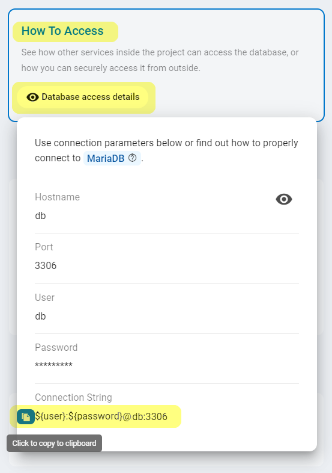
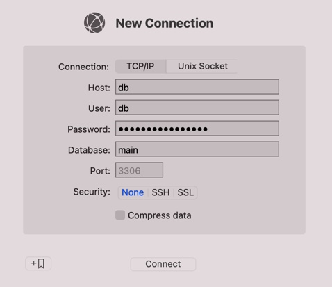
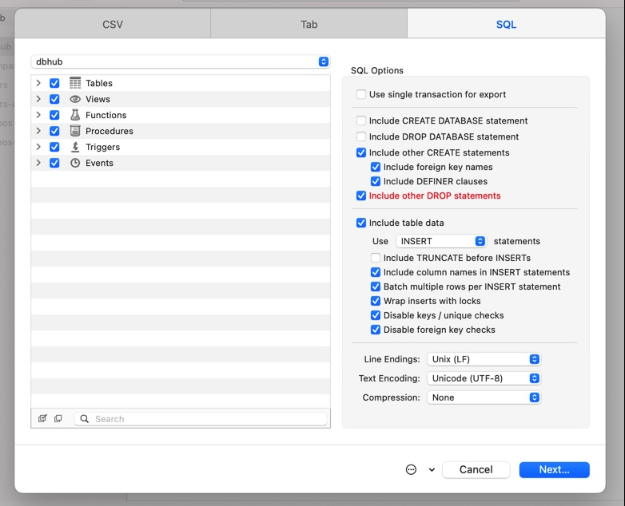
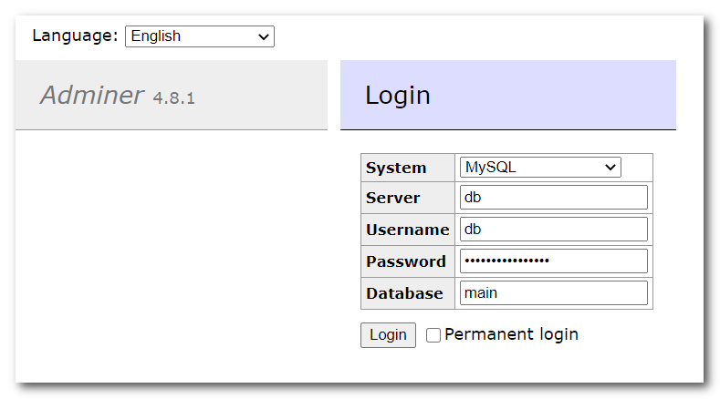
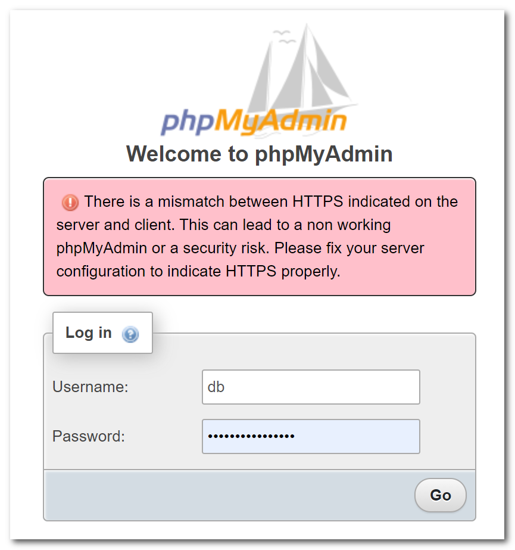

# MariaDB (MySQL)

Zerops provides a fully managed and scaled MariaDB (MySQL) database service, suitable for both development and production projects using any load. You can choose any option you want and be sure that it will work. Your certainty and peace of mind are our top priority.

<!-- markdownlint-disable DOCSMD004 -->
::: details Compatibility & Differences to MySQL
Information on the compatibility of MariaDB software with similar, competing software, as well as their differences, can be found [here](https://mariadb.com/kb/en/compatibility-differences).
:::
<!-- markdownlint-enable DOCSMD004 -->

[[toc]]

## Adding the MariaDB Service in Zerops

### Version to choose

You can currently choose **v10.4** or **v10.3**. The chosen version of the database **can't be changed afterward**. Switching must be done manually by creating a new service with another version and migrating data using a [backup / restore](#how-to-backup-restore-database-data) pattern.

### Hostname and port

Choose a short and descriptive URL-friendly name, for example, **db**. The following rules apply:

* maximum length **==25==** characters,
* only lowercase ASCII letters **==a-z==** and numbers **==0-9==**,
* **==has to be unique==** in relation to other existing project's hostnames,
* the hostname **==can't be changed==** later.

<!-- markdownlint-disable DOCSMD004 -->
::: warning Hostname is also used as the default admin user name
The chosen **hostname** is automatically used to create an [admin user account](#default-mariadb-user-and-password) with all privileges and grant options for accessing the database. You can change it later if you prefer.
:::
<!-- markdownlint-enable DOCSMD004 -->

The port will automatically be set to the value of **==3306==** and can't be changed.

### HA / non-HA database mode

When creating a new service, you can choose whether the database should be run in **HA** (High Availability) mode, using 3 containers, or **non-HA mode**, using only 1 container. ==**The chosen database mode can't be changed later.**== If you would like to learn more about the technical details and how this service is internally built, take a look at the [MariaDB Service in HA Mode, Internal](/documentation/overview/how-zerops-works-inside/mariadb-galera-cluster-internally.html).

#### MariaDB in non-HA mode

* great for local development to save money,
* doesn’t require any changes to the existing code,
* not necessary to respect HA mode [specifics](#what-you-should-remember-when-using-the-ha-mode), but see the recommendation tip below,
* data is stored only in a single container, higher risk of data loss,
* all data changes since the last backup is not recoverable,
* not recommended for production projects.

<!-- markdownlint-disable DOCSMD004 -->
::: tip Recommendation
Even when using the non-HA mode for a production project, we nonetheless recommend you respect all of the [HA mode specifics](#what-you-should-remember-when-using-the-ha-mode) because you never know when you'll need to switch to the HA mode. This is also true for the used storage engine, as InnoDB is the only option in HA mode.
:::
<!-- markdownlint-enable DOCSMD004 -->

#### MariaDB in HA mode

* will run on three containers as a [Galera cluster](https://mariadb.com/kb/en/galera-cluster), each on a **different physical machine**,
* so the data is stored redundantly in three places, no risk of data loss,
* when one container fails, it's automatically replaced with a new one,
* with two load balancers ([MaxScale](https://mariadb.com/kb/en/maxscale)) in [readwritesplit](https://mariadb.com/kb/en/mariadb-maxscale-25-readwritesplit) mode (no additional cost),
* [asynchronous behavior](#asynchronous-behavior) of a Galera HA cluster,
* only InnoDB storage engine is supported,
* the need to respect all of the [specifics](#what-you-should-remember-when-using-the-ha-mode) related to a Galera HA cluster,
* recommended for production projects.
  
## How to access a MariaDB database

<!-- markdownlint-disable DOCSMD004 -->
::: warning Don't use additional security protocols
The database service is not configured to support direct access using SSL/TLS or SSH protocols for internal communication inside a Zerops project private secured network. This is also the case for access using [zcli](/documentation/cli/installation.html) through a secure VPN channel.
:::
<!-- markdownlint-enable DOCSMD004 -->

### From other services inside the project

Other services can access the database using its **hostname** and **port**, as they are part of the same private project network. It’s highly recommended to utilize the **==connectionString==** environment variable that Zerops creates automatically for each database, especially when using the HA mode, as it makes sure to include all the info required for HA. More info in the dedicated [environment variables](/documentation/environment-variables/how-to-access.html) section, related to **connectionString**. See also the list of all automatically generated [variables](/documentation/environment-variables/helper-variables.html#mariadb) for the MariaDB Service.

For more flexibility with future potential hostname changes, it's always recommended to use them indirectly via [custom environment variables](/knowledge-base/best-practices/how-to-use-environment-variables-efficiently.html) (referencing implicit Zerops environment [variables](/documentation/environment-variables/helper-variables.html#mariadb)) in each project service separately. This allows you to eliminate all direct dependencies in the application code, which in turn means simplification and increased flexibility.

### From local development environment

To connect to the database from your local workspace, you can utilize the [VPN](/documentation/cli/vpn.html) functionality of our [CLI](/documentation/cli/installation.html). This allows you to access the database the same way as other services inside the project, but you cannot use references to the environment variables, unlike other services. Therefore, you should copy the values manually through the „**How To Access** / **Database access details**“ section of the service detail in your application.



## Default MariaDB user and password

Zerops automatically creates a user with all privileges and grant options when creating the service, where the name of **==user==** is based on the selected **hostname**, and the **==password==** is randomly generated. These are saved to the environment variables **user** and **password** and can be referenced from other services the same way as **connectionString**.

<!-- markdownlint-disable DOCSMD004 -->
::: warning Zerops doesn’t keep both places in sync
If you change your password inside the MariaDB database directly, the change is not reflected in the environment variable and vice versa. It’s up to you to keep these up to date through the „**Service env. Variables**“ section of the service detail in your application.


:::
<!-- markdownlint-enable DOCSMD004 -->

<!-- markdownlint-disable DOCSMD004 -->
::: info Default Zerops maintenance user
For system maintenance reasons, the `zps` user is also automatically created with all privileges. It's necessary to not change it in any way. Otherwise, there is a risk of disrupting the correct functionality, especially in HA mode.
:::
<!-- markdownlint-enable DOCSMD004 -->

## Default hardware configuration and autoscaling

* Each MariaDB container (1 in non-HA, 3 in HA) starts with 1 vCPU, 1 GB RAM, and 5 GB of disk space.
* Zerops will automatically scale the database only [vertically](/documentation/automatic-scaling/how-automatic-scaling-works.html#vertical-scaling) (both in non-HA and HA mode).
* The [horizontal autoscaling](/documentation/automatic-scaling/how-automatic-scaling-works.html#horizontal-scaling) in HA mode is not applied because of optimal performance.

## How to backup / restore database data

### Using your favorite database management tool

Install any of your favorite database administration tools locally. For example, you can use [DataGrip](https://www.jetbrains.com/datagrip), [DbVisualizer](https://www.dbvis.com/), [MySQL Workbench](https://dev.mysql.com/downloads/workbench) multi-platform database administration tools, or [Sequel Pro](https://www.sequelpro.com), [Querious](https://www.araelium.com/querious), specifically on the Mac platform. You can find the list with many others on the [Graphical and Enhanced Clients](https://mariadb.com/kb/en/graphical-and-enhanced-clients) page.

First, access your Zerops project using [zcli](/documentation/cli/installation.html). After that, connect to the database service from your installed database management tool, as in the example below with the **Querious** tool:



<!-- markdownlint-disable DOCSMD004 -->
::: info Connection security settings
As you are using a secure VPN channel already, and the database service is located on the internal Zerops project private secured network, it's unnecessary to apply any additional security layer such as SSH or SSL/TLS. For these reasons, the database service is not configured to support access using SSL/TLS or SSH protocols for internal communication inside a Zerops project. Here's more about how the Zerops project works with [external access](/documentation/overview/how-zerops-works-inside/typical-schemas-of-zerops-projects.html#with-external-access).
:::
<!-- markdownlint-enable DOCSMD004 -->

Now it's already easy to use its export/import built-in functions to backup/restore database data to/from your local file system.



### Using mariadb/mysql CLI

Again, first access your Zerops project using [zcli](/documentation/cli/installation.html). The `mariadb`/`mysql` CLI client has to be already installed locally. It comes with each local installation of a MariaDB server either on the [Mac platform with Homebrew](https://mariadb.com/resources/blog/installing-mariadb-10-1-16-on-mac-os-x-with-homebrew) or [Linux](https://mariadb.com/downloads). You can also use a multi-platform [MySQL Shell](https://dev.mysql.com/downloads/shell), `mysql-client` on [Mac](https://formulae.brew.sh/formula/mysql-client), or `mysql-client` / `mysql` on Linux (where concrete steps depend on each distribution version). The client CLI is a part of [MySQL Workbench](https://dev.mysql.com/downloads/workbench) as well.

#### Logical database backup

```powershell
mysqldump -h [hostname] -u [user] -p[password] -x [database] > filename.dump
```

And when used values:

* hostname = **==db==** (specified when MariaDB Service was created)
* user = **==db==** (automatically created with the name same as the hostname)
* password = **==xxxxxxxxxxxxxxxx==** (automatically created as a random value)
* database = **==main==** (created by a user later as a part of the project)
* filename = **==main==** (specified filename to store the database backup)

```powershell
mysqldump -h db -u db -pxxxxxxxxxxxxxxxx -x main > main.dump
```

#### Logical database restore

```powershell
mysql -h [hostname] -u [user] -p[password] [database] < filename.dump
```

<!-- markdownlint-disable DOCSMD004 -->
::: info Available aliases in the command-line client
Starting with MariaDB 10.4.6, `mariadb` is a [symlink](https://mariadb.com/kb/en/mariadb-command-line-client) to `mysql`. The same is true for `mariadb-dump` as a [symlink](https://mariadb.com/kb/en/mariadb-dump) to `mysqldump`.
:::
<!-- markdownlint-enable DOCSMD004 -->

### Using Adminer / phpMyAdmin

Create a new Zerops [PHP service](/documentation/services/runtimes.html#php) and [deploy](/documentation/services/runtimes/php.html#deployment-variants-how-to-deliver-the-project-code) a prepared [Adminer](/knowledge-base/how-to-do/how-to-prepare-adminer-application-kit.html) or [phpMyAdmin](/knowledge-base/how-to-do/how-to-prepare-phpmyadmin-application-kit.html) application kit. After enabling a [Zerops subdomain](/documentation/routing/zerops-subdomain.html) on such a service, you can access the application on its root URL. You can access the MariaDB database service using its hostname, port, user, and password. After that, you can use its built-in export/import functions to backup/restore database data to/from your local file system.



<!-- markdownlint-disable DOCSMD004 -->
::: info Explanation of the phpMyAdmin security warning
Zerops Routing Service (see the schema of a Zerops project with [external access](/documentation/overview/how-zerops-works-inside/typical-schemas-of-zerops-projects.html#with-external-access)) takes care of SSL certificate management and internal translation of HTTPS protocol to HTTP for all project's services. That's the reason why **phpMyAdmin** can see the difference between using HTTPS protocol on a client-side and HTTP protocol on a server-side. **From Zerops point of view, it's not a security risk**. It's the only positive falsy notification from the phpMyAdmin side (not supporting the `HTTP_X_FORWARDED_PROTO` HTTP header that says it has happened).
:::
<!-- markdownlint-enable DOCSMD004 -->



## What you should remember when using the HA mode

### Asynchronous behavior

<!-- markdownlint-disable DOCSMD004 -->
::: warning Be sure you understand correctly
When data is stored in a MariaDB cluster (through its actual primary database instance), it is replicated across other replica instances asynchronously. This means that if one SQL statement stores some data, the next immediate statement may not retrieve the same data. The reason is that the given statement will be executed against another replica instance. If required to get the same data, it's necessary to encapsulate both commands into a single SQL transaction, which will always be executed against the primary instance (because of the write operation that is included). The same would be the case with two immediately following SELECT statements to get the same data. Again, encapsulation of both commands into a single SQL transaction guarantees their execution against a selected but the same replica instance.

You can also force synchronization waits for causality checks on a cluster by [wsrep_sync_wait](https://mariadb.com/docs/reference/mdb/system-variables/wsrep_sync_wait) bitmask. Enabling it ensures that certain types of queries always execute against the most up to date database state, at the expense of query performance. [Sample usage](https://mariadb.com/kb/en/galera-cluster-system-variables/#wsrep_sync_wait) for a critical read that must have the most up-to-date data:

```sql
 SET SESSION wsrep_sync_wait=1;
 SELECT ...;
 SET SESSION wsrep_sync_wait=0;
```

:::
<!-- markdownlint-enable DOCSMD004 -->

### Non-database local data

Each container has separate disk space, which can theoretically be used by appropriate APIs of the database service and thus store data outside the replicated contents of the database. It should be noted that such data is reserved only for this particular instance. It will not be migrated if such a container is deleted due to its failure. If it is necessary to store and share such a non-database permanently, we recommend developers use Zerops shared storage services. Also, separate direct access to an individual MariaDB instance is not supported in any way.

Typical operations from this point of view can be a functionality of [SELECT INTO OUTFILE](https://mariadb.com/kb/en/select-into-outfile), [SELECT INTO DUMPFILE](https://mariadb.com/kb/en/select-into-dumpfile), [LOAD_FILE](https://mariadb.com/kb/en/load_file), or [LOAD DATA](https://dev.mysql.com/doc/refman/8.0/en/load-data.html).

### Selected specifics of a Galera HA cluster

* Only InnoDB storage engine is supported.
* No support for explicit locks, including LOCK TABLES, FLUSH TABLES {explicit table list} WITH READ LOCK, GET_LOCK, RELEASE_LOCK, etc. is provided. **These problems can be avoided by using transactions.** Global locking operators like FLUSH TABLES WITH READ LOCK are supported.
* All database tables should have a primary key (multi-column primary keys can also be used). **DELETE operations are unsupported on tables without a primary key.**
* Distributed [XA transactions](https://mariadb.com/kb/en/xa-transactions) are not supported.
* [AUTO_INCREMENT](https://galeracluster.com/library/kb/auto-increment-multiples.html) automatically uses the number of nodes in a Galera cluster as an increment. This means that it's not possible to rely on the next auto-generated value being max(x)+1.
* Other details about the limitations and behavior of MariaDB Galera clusters and MaxScale load balancers are available at [MariaDB Galera Cluster - Known Limitations](https://mariadb.com/kb/en/mariadb-galera-cluster-known-limitations) and [Limitations and Known Issues within MariaDB MaxScale](https://mariadb.com/kb/en/mariadb-maxscale-25-limitations-and-known-issues-within-mariadb-maxscale).
