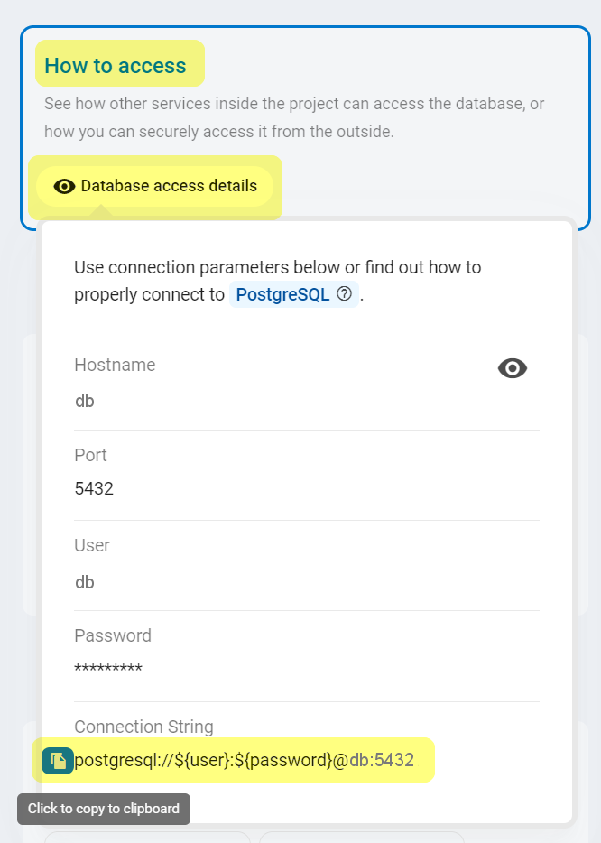
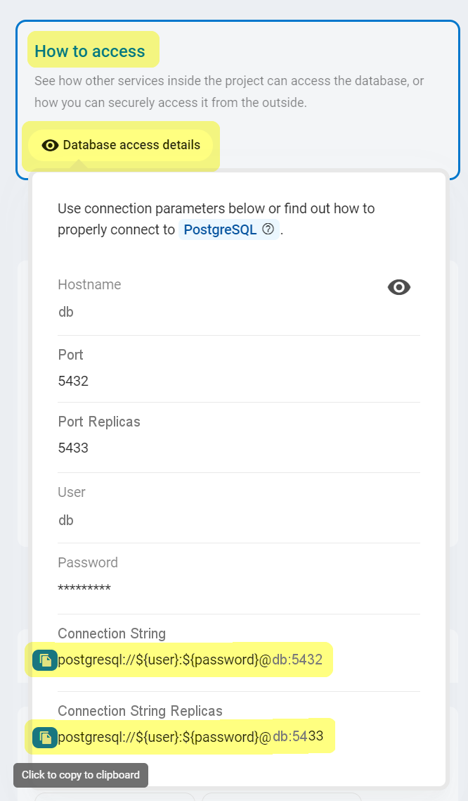
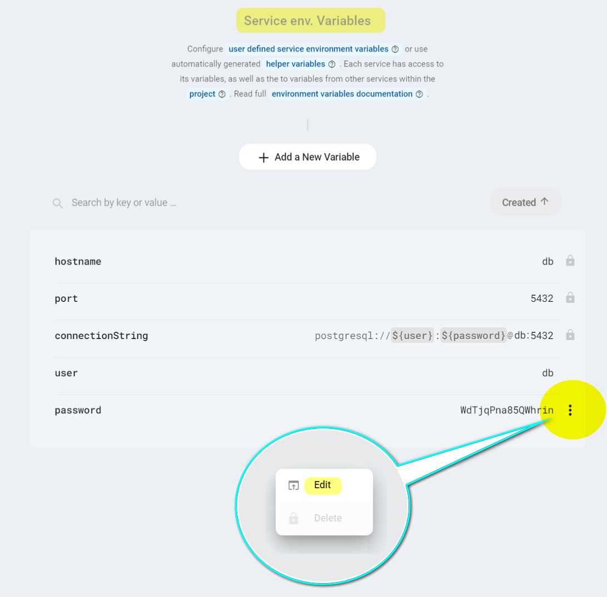
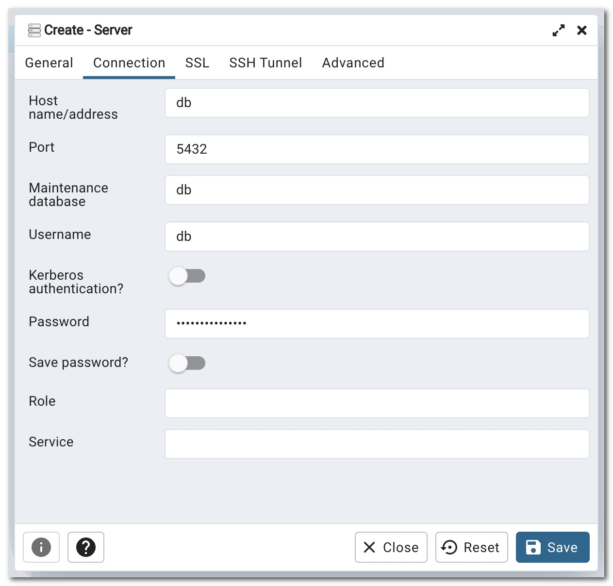
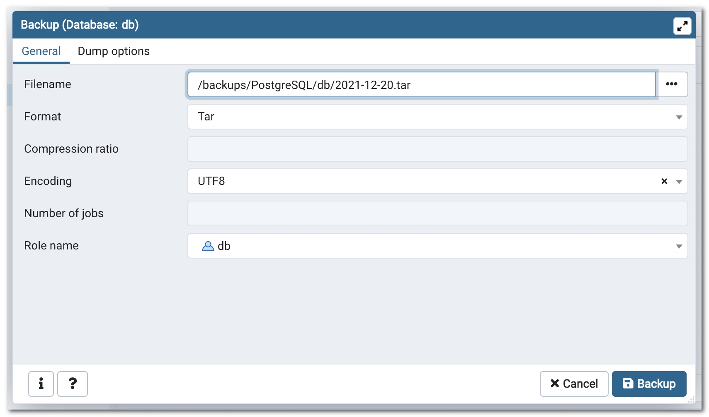
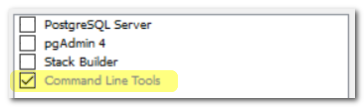
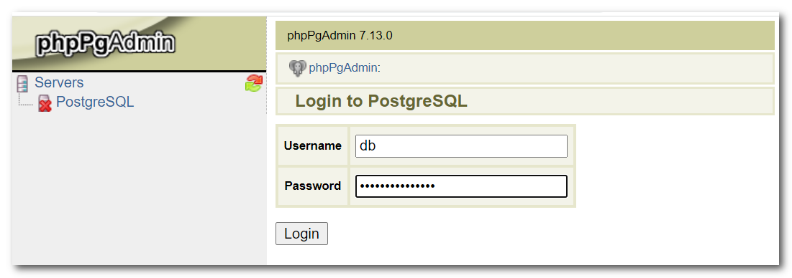

# PostgreSQL

Zerops provides a fully managed and scaled PostgreSQL database service, suitable for both development and production projects on any load. You can choose any variant you wish in the knowledge that it will work. Your peace of mind is our top priority.

[[toc]]

## Adding the PostgreSQL Service in Zerops

The Zerops PostgreSQL service is based on a [Linux LXD container](/documentation/overview/projects-and-services-structure.html#services-containers) with **Ubuntu** **==v18.04.06==**.

There are two possible ways to create a new PostgreSQL service. Either manually in the [Zerops GUI](#through-the-zerops-gui-interface), or using the Zerops [import functionality](/documentation/export-import/project-service-export-import.html#how-to-export-import-a-project).

### Using the import functionality

Zerops uses a YAML definition format to describe the structure. View the complete specification of the [import/export syntax in the YAML format](/documentation/export-import/project-service-export-import.html#used-yaml-specification).

To import a PostgreSQL service, you can use something similar to the following:

```yaml
services:
  # Service will be accessible through zCLI VPN under <protocol>://db:<port>
  - hostname: db
    # Type and version of service used.
    type: postgresql@12
    # Whether the service will be run on one or multiple containers.
    # Since this is a simple example, using only one container is fine.
    mode: NON_HA
```

### Through the Zerops GUI interface

#### Which version to choose

You can currently only choose PostgreSQL version **v12** (version 12.10, to be precise).

Used as the export & import type: ==`postgresql@12`== .

#### Hostname and ports

Choose a short and descriptive URL-friendly name, for example, **db**. The following rules apply:

* maximum length **==25==** characters,
* only lowercase ASCII letters **==a-z==** and numbers **==0-9==**,
* **==has to be unique==** in relation to other existing project hostnames,
* the hostname **==can't be changed==** later.

The port will automatically be set to the value of **==5432==** and can't be changed. It's important to mention that when HA mode is chosen, the additional port of **==5433==** is also automatically set. It allows you to send read-only requests to all members of the PostgreSQL cluster. If a data change request is sent to this port by mistake or because of an error and it will be directed to a standby replica member of the HA cluster, then the statement will be rejected.

<!-- markdownlint-disable DOCSMD004 -->
::: warning Hostname is also used as the default admin user name
The chosen **hostname** is automatically used to create an [admin user account](#default-postgresql-user-and-password) with all privileges and grant options for accessing the database. You can change it later if you prefer.
:::
<!-- markdownlint-enable DOCSMD004 -->

#### HA / non-HA database mode

When creating a new service, you can choose whether the database should be run in **HA** (High Availability) mode, using 3 containers, or **non-HA mode**, using only 1 container. ==**The chosen database mode can't be changed later.**== If you would like to learn more about the technical details and how this service is built internally, take a look at the [PostgreSQL Service in HA Mode, a deep-dive view](/documentation/overview/how-zerops-works-inside/postgresql-patroni-cluster-internally.html).

##### PostgreSQL in non-HA mode

* great for local development to save money,
* doesn’t require any changes to the existing code,
* not necessary to respect HA mode [specifics](#what-you-should-remember-when-using-ha-mode), but see the recommendation tip below,
* data is stored only in a single container, higher risk of data loss,
* all data changes since the last backup are not recoverable,
* not recommended for production projects.

<!-- markdownlint-disable DOCSMD004 -->
::: tip Recommendation
Even when using the non-HA mode for a production project, we nonetheless recommend you respect all of the [HA mode specifics](#what-you-should-remember-when-using-ha-mode) because you never know when you'll need to switch to the HA mode.
:::
<!-- markdownlint-enable DOCSMD004 -->

##### PostgreSQL in HA mode

* will run on three containers as a [Patroni cluster](https://patroni.readthedocs.io), each on a **different physical machine**,
* therefore the data is stored redundantly in three places, with no risk of data loss,
* when one container fails, it's automatically replaced with a new one,
* come with two load balancers ([HAProxy](http://www.haproxy.org)) (no additional cost),
* [asynchronous behavior](#asynchronous-behavior) of a Patroni HA cluster,
* the need to respect all of the [specifics](#what-you-should-remember-when-using-ha-mode) related to a Patroni HA cluster,
* recommended for production projects.

## How to access a PostgreSQL database

<!-- markdownlint-disable DOCSMD004 -->
::: warning Don't use additional security protocols for internal communication
The database service is not configured to support direct access using SSL/TLS or SSH protocols for internal communication inside a Zerops project private secured network. This is also the case for access using the Zerops [zCLI](/documentation/cli/installation.html) through a secure VPN channel.
:::
<!-- markdownlint-enable DOCSMD004 -->

### From other services inside the project

Other services can access the database using its **hostname** and **port** environment variables, as they are part of the same private project network. It’s highly recommended that you utilize the **==connectionString==** environment variable that Zerops creates automatically for the database in non-HA mode. See also the explanation of environment variables specifics for HA mode below. More information related to **connectionString** can be found in the dedicated [environment variables](/documentation/environment-variables/overview.html#referencing-environment-variables) section. See also a list of all automatically generated [environment variables](/documentation/environment-variables/helper-variables.html#postgresql) for the PostgreSQL service.

<!-- markdownlint-disable DOCSMD004 -->
::: tip Environment variables specifics for HA mode
Due to the Patroni cluster functionality, you can use an additional connection string to connect to the database in HA mode. It is ==**connectionStringReplicas**== , used to connect to any member (all standby replica instances + the current primary instance) of the database cluster to retrieve already existing data (only reading operations via SQL SELECT queries). The corresponding  ==**portReplicas**== environment variable value is used under the hood.

The names of ==**connectionString**== and ==**port**== are kept the same, but in HA mode, using them is reserved for creating a connection to the current primary instance and mainly processing all data modification requests (via SQL INSERT, UPDATE, and DELETE statements). And of course, any SELECT statement can also be sent, nothing prevents this from happening.
:::
<!-- markdownlint-enable DOCSMD004 -->

For more flexibility with future potential hostname changes, it's always recommended to use them indirectly via [custom environment variables](/knowledge-base/best-practices/how-to-use-environment-variables-efficiently.html) (referencing implicit Zerops environment [variables](/documentation/environment-variables/helper-variables.html#postgresql)) in each project service separately. This allows you to eliminate all direct dependencies in the application code, which in turn provides simplification and increased flexibility. Another reason not to hard-code the values inside your applications is that it can be dangerous because it is easy to commit them (like your credentials) into a repository, potentially exposing them to more people than intended.

### From other Zerops projects

Zerops always sets up a [private dedicated network](/documentation/overview/projects-and-services-structure.html#project) for each project. From this point of view, cross project communication can be done precisely in the same ways described in the following section: [From your public domains (common Internet environment)](#from-your-public-domains-common-internet-environment). There isn't any other specific way. These projects are not directly interconnected.

### From your local environment

The local environment offers ==**not only options for local development**== but also a general ability to ==**manage all Zerops development or production services**== , using zCLI VPN.

To connect to the database from your local workspace, you can utilize the [VPN](/documentation/cli/vpn.html) functionality of our [Zerops zCLI](/documentation/cli/installation.html), as previously mentioned. This allows you to access the database the same way other services inside the project can, but unlike those services, you cannot use references to the environment variables. Therefore, if you need some of them you should copy the values manually through the **How To Access** / **Database access details** section of the service detail in your application and use them in your private local configuration strategy.

The following picture shows how it looks in non-HA mode.



The following picture shows how it looks in HA mode.



### From your public domains (common Internet environment)

You can't access the PostgreSQL service directly in any way. You have to use one of the runtime environment services ([Node.js](/documentation/services/runtimes/nodejs.html), [Golang](/documentation/services/runtimes/golang.html), or [PHP](/documentation/services/runtimes/php.html)) and go indirectly through them in a programmatic way. They should implement their authentication logic to access the PostgreSQL service.

To understand this better, take a look at the following section: [With external access](/documentation/overview/how-zerops-works-inside/typical-schemas-of-zerops-projects.html#with-external-access) of **Typical schemas of Zerops Projects**.

## Default PostgreSQL user and password

Zerops automatically creates a user with all privileges and grant options when creating the service, where the name of **==user==** is based on the selected **hostname**, and the **==password==** is randomly generated. These are saved to the environment variables **user** and **password** and can be referenced from other services the same way as with a **connectionString**.

<!-- markdownlint-disable DOCSMD004 -->
::: warning Zerops doesn’t keep both places in sync
If you change your password inside the PostgreSQL database directly, the change is not reflected in the environment variable and vice versa. It’s up to you to keep these up to date through the **Service env. Variables** section of the service detail in your application.

The image below represents the state of environment variables available in non-HA mode (especially the names of the **port** and **connectionString**). In the case of HA mode, the particular situation is different. It's due to the specifics of the Patroni cluster functionality and methods of client communication.


:::
<!-- markdownlint-enable DOCSMD004 -->

<!-- markdownlint-disable DOCSMD004 -->
::: tip Default Zerops maintenance user
For system maintenance reasons, the `zps` user is also automatically created with all privileges (super-user). It's important not to change this in any way. Otherwise, there is a risk of disrupting the correct functionality, especially in HA mode. The password for this user can be taken via the `zeropsPassword` environment variable (not presented in the Zerops GUI).

If you log in as the `zps` super-user and make inappropriate changes to the system configuration (especially in the HA cluster setting), then you are fully responsible for any system or application failures that may lead to complete data loss.
:::
<!-- markdownlint-enable DOCSMD004 -->

## Default PostgreSQL database

A new database with the name based on the selected **hostname** is created during the initial service setup (for example, database **db** if the chosen hostname was **db**). It means that even if the original default database **postgres** is preserved, the login using **connectionString** without entering the target database will always occur correctly, no matter what value is selected for the hostname. It's also true for any other login type. The standard behavior is that if the target database is not entered, the PostgreSQL authentication logic uses the user name as the target database name.

## Default hardware configuration and autoscaling

* Each PostgreSQL container (1 in non-HA, 3 in HA) starts with 1 vCPU, 1 GB RAM, and 1 GB of disk space.
* Zerops will automatically scale the HW resources both [vertically](/documentation/automatic-scaling/how-automatic-scaling-works.html#vertical-scaling) (in non-HA and HA mode) and [horizontally](/documentation/automatic-scaling/how-automatic-scaling-works.html#horizontal-scaling) (in HA mode only).

## How to backup or restore database data

### Using your favorite database management tool

Install any of your favorite database administration tools locally. For example, you can use [DataGrip](https://www.jetbrains.com/datagrip), [DbVisualizer](https://www.dbvis.com), [DBeaver](https://dbeaver.io), or [pgAdmin](https://www.pgadmin.org). They are all multi-platform database administration tools.

First, connect to your Zerops project using [zCLI](/documentation/cli/installation.html) & [VPN](/documentation/cli/vpn.html) and then you can use ==`db:5432`== as the endpoint. After that, connect to the database service from your installed database management tool, as in the example below with **pgAdmin**:



<!-- markdownlint-disable DOCSMD004 -->
::: tip Connection security settings
As you are already using a secure VPN channel, and the database service is located on the internal Zerops project private secured network, you don't need to apply any additional security layers such as SSH or SSL/TLS. For this reason, the database service is not configured to support access using SSL/TLS or SSH protocols for internal communication inside a Zerops project. Find out more about how the Zerops project works with [external access](/documentation/overview/how-zerops-works-inside/typical-schemas-of-zerops-projects.html#with-external-access).
:::
<!-- markdownlint-enable DOCSMD004 -->

Now you can easily use the built-in backup/restore functions to save/load database data to/from your local file system.



### Using libpg CLI

Again, first access your Zerops project using [zCLI](/documentation/cli/installation.html) & [VPN](/documentation/cli/vpn.html). The `libpg` PostgreSQL CLI client needs to already be installed locally. It comes with each local installation of a [PostgreSQL server](https://www.postgresql.org/download) or a [pgAdmin client](https://www.pgadmin.org).

On the Windows platform you can selectively install just the **Command Line Tools** if you wish.



To install just **libpg** CLI on the Mac platform you can use the [Homebrew Formulae](https://formulae.brew.sh/formula/libpq) `brew install libpq`, and on the Linux (Debian or Ubuntu) platform either use `apt-get install libpq-dev` command or find further information for [PostgreSQL server](https://www.postgresql.org/download) CLI and specific steps on other operating systems.

#### Logical database backup

PostgreSQL CLI provides the [pg_dump utility](https://www.postgresql.org/docs/current/app-pgdump.html) to help you back up databases as follows (you have to enter a password interactively):

```bash
pg_dump -U [user] -h [hostname] -p [port] -F c -W [database] > [filename].dump
```

And when used values:

* hostname = **==db==** ([specified]((#hostname-and-ports)) when PostgreSQL Service was created)
* user = **==db==** ([automatically created](#default-postgresql-user-and-password) with the same name as the hostname)
* database = **==db==** ([automatically created](#default-postgresql-database) with the same name as the hostname)
* port = **==5432==** (the [default port](#hostname-and-ports))
* filename = **==db==** (specified filename to store the database backup)

* **-F c** parameter means a compressed custom-format suitable for input later into **pg_restore**
* **-W** parameter means forcing a prompt for a password interactively

```bash
pg_dump -U db -h db -p 5432 -F c -W db > db.dump
```

<!-- markdownlint-disable DOCSMD004 -->
::: tip Passing a secure password in batch jobs and scripts
To eliminate the need to interactively enter a password you can use ==`.pgpass`== [file](https://www.postgresql.org/docs/current/libpq-pgpass.html) located in a user's home directory. In such a case, use **pg_dump** with the parameter `-w` instead of `-W`. This file should contain lines of the following format: `<hostname>:<port>:<database>:<user>:<password>`. Each of the first four fields can be a literal value, or *, which matches anything. The line of `*:*:*:*:<password>` allows to use the same password for any database connection. On Linux or Mac systems, set the file's mode to `0600` by `chmod 600 ~/.pgpass`. Otherwise, it will be ignored.
:::
<!-- markdownlint-enable DOCSMD004 -->

#### Logical database restore

PostgreSQL CLI provides the [pg_restore utility](https://www.postgresql.org/docs/current/app-pgrestore.html) to help you restore databases as follows (you have to enter a password interactively):

```bash
pg_restore -U [user] -h [hostname] -p [port] -d [database] -1 -W [filename].dump
```

And when used values:

* hostname = **==db==** ([specified]((#hostname-and-ports)) when PostgreSQL Service was created)
* user = **==db==** ([automatically created](#default-postgresql-user-and-password) with the same name as the hostname)
* database = **==db==** ([automatically created](#default-postgresql-database) with the same name as the hostname)
* port = **==5432==** (the [default port](#hostname-and-ports))
* filename = **==db==** (specified filename has been used to store the database backup)

* **-1** parameter means executing the restore as a single transaction
* **-W** parameter means forcing a prompt for a password interactively

```bash
pg_restore -U db -h db -p 5432 -d db -1 -W db.dump
```

### Using phpPgAdmin

You can use the Zerops [import functionality](/documentation/export-import/project-service-export-import.html) to quickly add a service to your project with **phpPgAdmin** and use its built-in export/import functionality. Use the Zerops [recipe-phppgadmin](https://github.com/zeropsio/recipe-phppgadmin) import. The syntax shown below supposes that you have already created the Zerops PostgreSQL service with the chosen hostname ==`db`== . If your service has a different hostname, change the **content** value of the **DATABASE_HOSTNAME** environment variable appropriately in the import syntax below.

```yaml
# Import syntax for creating a phpPgAdmin instance.
services:
  # Service will be accessible through zCLI VPN under: http://phppgadmin
- hostname: phppgadmin
  # Type and version of service used.
  type: php-apache@7.4+2.4
  # Whether the service will be run on one or multiple containers.
  # Since this is a utility service, using only one container is fine.
  minContainers: 1
  maxContainers: 1
  # Folder name used as the root of the publicly accessible web server content.
  documentRoot: public
  # Repository that contains phpPgAdmin code with build and deploy instructions.
  buildFromGit: https://github.com/zeropsio/recipe-phppgadmin@main
  # Setting of the "DATABASE_HOSTNAME" environment variable.
  # It specifies the chosen hostname for the Zerops PostgreSQL service that should be managed.
  envVariables:
    # Here, the Zerops PostgreSQL service's chosen hostname is "db".
    # Change it if you need to use a different one.
    DATABASE_HOSTNAME: db
```

After that you can either use **phpPgAdmin** either using [Zerops VPN](/documentation/cli/vpn.html) built into the [zCLI](/documentation/cli/installation.html) through URL `http://<hostname>:<port>` (here, it means: `http://phppgadmin`) or enable Zerops [subdomain access](/documentation/routing/zerops-subdomain.html).



## What you should remember when using HA mode

### Asynchronous behavior

<!-- markdownlint-disable DOCSMD004 -->
::: warning Be sure you understand correctly
When data is stored in a PostgreSQL Patroni cluster (always through its current primary database instance), it is replicated across other standby replica instances asynchronously. As described above, there are two communication channels clients can choose from. The first allows **data writing** through **port 5432**, and the second, allowing **only data reading** through **port 5433**. A reading request can be directed to any cluster member, while a writing request is directed only to the current primary  member of the cluster.

This means that if one SQL statement stores some data through port 5432, the following immediate select query through port 5433 may not retrieve the same data. This is because the given select will be executed against another replica instance. If required to get the same data, it's necessary to use the same port for the select query as it was used for storing that data.

A similar case would be with two immediately following SELECT statements to get the same data. The basic premise in such a case is that both select queries are sent over the same TCP connection and therefore routed to the same cluster member. Encapsulating both commands into a single SQL transaction can guarantee their execution against the same replica instance. Otherwise, send both select requests to the current primary node through port 5432 again.
:::
<!-- markdownlint-enable DOCSMD004 -->

### Non-database local data

Each container has separate local disk space, which can theoretically be used by appropriate APIs of the database service and thus store data outside the replicated contents of the database. It should be noted that such data is reserved solely for this particular instance, and not mirrored across the PostgreSQL Patroni cluster nor backup-ed. It will not be migrated if such a container is deleted due to failure. Also, separate direct access to an individual PostgreSQL instance is not supported in any way.

We don't recommend using the functionality of [COPY](https://www.postgresql.org/docs/current/sql-copy.html) because you can't save/load such data directly to/from any shared storage. Instead, use the standard functionality of the [export/import](/documentation/services/databases/postgresql.html#how-to-backup-or-restore-database-data) mechanism.

### Selected specifics of a Patroni HA cluster

* All database tables should have a primary key (multi-column primary keys can also be used) to get performant and effective streaming replication between the current primary instance and all standby replica nodes through a Write-Ahead Log (WAL). This is the process by which write transactions (INSERT, UPDATE, or DELETE) and schema changes (Data Definition Language - DDL) are reliably captured, logged, and then serially applied to all downstream databases replica nodes in the cluster architecture.
* The PostgreSQL streaming replication is set up to be asynchronous, and you can't individually change it to synchronous because it has to be done through `postgresql.conf` you don't have access to.
* Using [ALTER SYSTEM](https://www.postgresql.org/docs/12/sql-altersystem.html) and changing `postgresql.auto.conf` is also prohibited because the created [default PostgreSQL user](#default-postgresql-user-and-password) is not a super-user.
