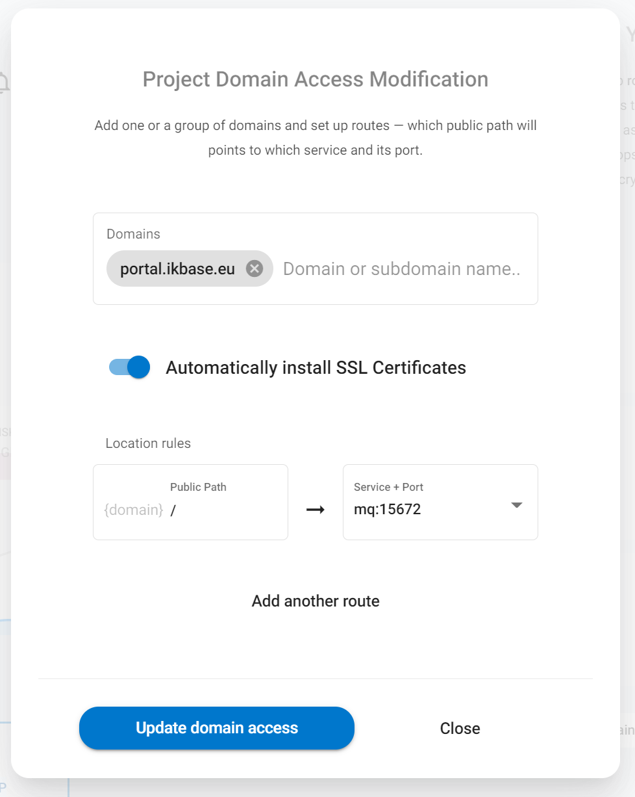
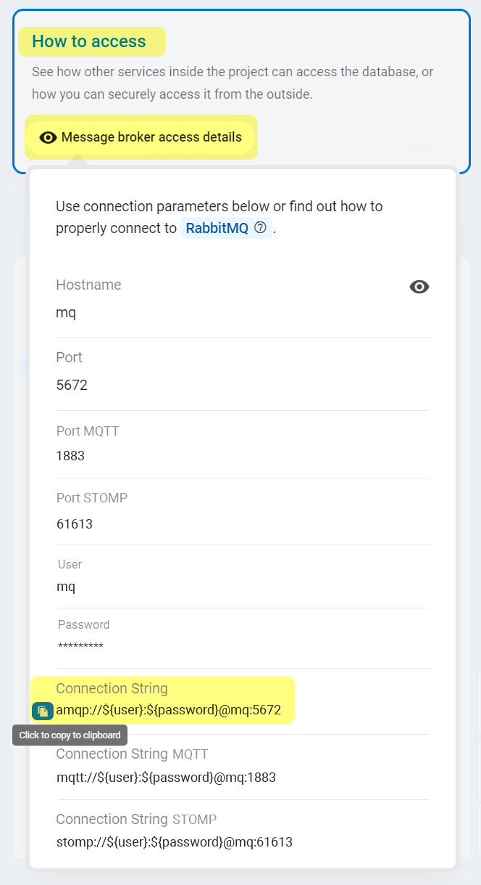

# RabbitMQ

Zerops provides a fully managed and scaled [RabbitMQ](https://www.rabbitmq.com) service, suitable for both development and production projects using any load. It's a highly available, fault tolerant and scalable message queuing solution. It understands the AMQP (Advanced Message Queuing Protocol), STOMP (Streaming Text Orientated Messaging Protocol), MQTT (Message Queuing Telemetry Transport), and other [protocols](https://www.rabbitmq.com/protocols.html). You can choose any option you wish in the knowledge that it will work.

[[toc]]

## Adding the RabbitMQ Service in Zerops

The Zerops RabbitMQ service is based on a [Linux LXD container](/documentation/overview/projects-and-services-structure.html#services-containers) with **Ubuntu** **==v18.04.06==**.

### Two ways to do it

There are two possible ways to create a new RabbitMQ service. Either manually in the Zerops GUI, as described in the [rest of this document](#which-version-to-choose), or using the Zerops [import functionality](/documentation/export-import/project-service-export-import.html#how-to-export-import-a-project).

#### A simple import example in the YAML syntax

Zerops uses a YAML definition format to describe the structure. To import a service, you can use something similar to the following:

```yaml
services:
  # Service will be accessible through zCLI VPN under <protocol>://mq:<port>
  - hostname: mq
    # Type and version of service used.
    type: rabbitmq@3
    # Whether the service will be run on one or multiple containers.
    # Since this is a simple example, using only one container is fine.
    mode: NON_HA
```

A complete specification of the [import/export syntax in the YAML format](/documentation/export-import/project-service-export-import.html#used-yaml-specification).

### Which version to choose

You can currently only choose version **v3** (version 3.9.13 to be precise).

Used as the export & import types: ==`rabbitmq@3`== .

### Hostname and ports

Choose a short and descriptive URL-friendly name, for example, **mq**. The following rules apply:

* maximum length **==25==** characters,
* only lowercase ASCII letters **==a-z==** and numbers **==0-9==**,
* **==has to be unique==** in relation to other existing project hostnames,
* the hostname **==can't be changed==** later.

The ports will automatically be set to the values of **==1883==** (the `mqtt` protocol), **==5672==** (the `amqp` protocol), **==61613==** (the `stomp` protocol), **==15672==** (web management portal),  **==15674==** (WebSocket for the `stomp` protocol), **==15675==** (WebSocket for the `mqtt` protocol) and can't be changed.

<!-- markdownlint-disable DOCSMD004 -->
::: warning Hostname is also used as the default admin user name
The chosen **hostname** is automatically used to create an admin user account with all privileges and grant options for accessing the message broker. You can change it later if you prefer. The standard default user `guest` is removed during the installation phase of the service.
:::
<!-- markdownlint-enable DOCSMD004 -->

<!-- markdownlint-disable DOCSMD004 -->
::: warning Security inside a private project network
All services inside a Zerops project share a [dedicated private network](/documentation/routing/routing-between-project-services.html) and can see and reference [environment variables](/documentation/environment-variables/how-to-access.html) from other services. This means that, by default, nothing outside the project can access any of the services inside.

The RabbitMQ service is configured to **allow access** for native `mqtt`, `amqp`, `stomp` protocols only from the project internal network environment. In practice, this means that this service can only be accessed either programmatically through the runtime environment services ([Node.js](/documentation/services/runtimes/nodejs.html#port), [Golang](/documentation/services/runtimes/golang.html#port), and [PHP](/documentation/services/runtimes/php.html#hostname-and-port), which should implement their authentication logic not to allow anonymous access to the RabbitMQ service) or using [zCLI](/documentation/cli/installation-authorization.html) and [vpn](/documentation/cli/vpn.html) from your local environment, nothing else.
:::
<!-- markdownlint-enable DOCSMD004 -->

#### Selective access to the internal ports

You can use the Zerops HTTP routing feature for browser access to the RabbitMQ [web management portal](https://www.rabbitmq.com/management.html) (port 15672) or transmit messages using WebSockets and the RabbitMQ [STOMP](https://www.rabbitmq.com/web-stomp.html) (port 15674) and [MQTT](https://www.rabbitmq.com/web-mqtt.html) (port 15675) plugins. This access is disabled by default from the outside Internet, but you can enable it if necessary using the RabbitMQ **Internal ports** section:


In turn, Zerops uses this setting to optimize its internal logic to only offer enabled options and SSL certificates in useful places. These ports are used to set up public Internet access as described in the section [From the external Internet environment](#from-the-external-internet-environment).

The following image shows the case of the `management.ikbase.eu` public domain is pointed to the web management portal of the RabbitMQ service on the host `mq:15672`. The same could be done for WebSockets STOMP `wsstomp.ikbase.eu` -> `mq:15674` or MQTT `wsmqtt.ikbase.eu` -> `mq:15675` plugins.



### HA / non-HA message broker mode

When creating a new service, you can choose whether the database should be run in **HA** (High Availability) mode, using 3 containers, or **non-HA mode**, using only 1 container. ==**The chosen database mode can't be changed later.**== If you would like to learn more about the technical details and how this service is built internally, take a look at the [RabbitMQ Service in HA Mode, Internal](/documentation/overview/how-zerops-works-inside/rabbitmq-cluster-internally.html).

#### RabbitMQ in non-HA mode

* great for local development to save money,
* queues data are stored only in a single container, higher risk of loss,
* all queues data changes since the last backup are not recoverable,
* not recommended for production projects.

#### RabbitMQ in HA mode

* will run on three containers as a [cluster](https://www.rabbitmq.com/clustering.html), each on a **different physical machine**,
* so the queues data are stored redundantly in three places, with no risk of loss,
* when one container fails, it's automatically replaced with a new one,
* with two load balancers ([HAProxy](http://www.haproxy.org)) (no additional cost),
* recommended for production projects.

## How to access a RabbitMQ message broker

<!-- markdownlint-disable DOCSMD004 -->
::: warning Don't use additional security protocols for internal communication
The messaging service is not configured to support direct access using SSL/TLS or SSH protocols for internal communication inside a Zerops project private secured network. This is also the case for access using the Zerops [zCLI](/documentation/cli/installation.html) through a secure VPN channel.
:::
<!-- markdownlint-enable DOCSMD004 -->

### From other services inside the project

Other services can access the broker using its **hostname** and **port** environment variables (the primary native `amqp` communication protocol applied), as they are part of the same private project network (for example, `amqp://mq:5672`). It’s highly recommended that you utilize the **==connectionString==** environment variable that Zerops creates automatically for the message broker in non-HA mode. See also the explanation of environment variables specifics for HA mode below. More information related to **connectionString** can be found in the dedicated [environment variables](/documentation/environment-variables/how-to-access.html) section. See also a list of all automatically generated [environment variables](/documentation/environment-variables/helper-variables.html#rabbitmq) for the RabbitMQ service.

If you need to use the `mqtt` or `stomp` protocols, use the **==connectionStringMqtt==** or **==connectionStringStomp==** environment variables (the **portMqtt** and **portStomp** ones also exist).

For more flexibility with future potential hostname changes, it's always recommended to use them indirectly via [custom environment variables](/knowledge-base/best-practices/how-to-use-environment-variables-efficiently.html) (referencing implicit Zerops environment [variables](/documentation/environment-variables/helper-variables.html#rabbitmq)) in each project service separately. This allows you to eliminate all direct dependencies in the application code, which in turn means simplification and increased flexibility. Another reason not to hard-code the values inside your applications is that it can be dangerous because it is easy to commit them (like your credentials) into a repository, potentially exposing them to more people than intended.

### From other Zerops projects

Zerops always sets up a [private dedicated network](/documentation/overview/projects-and-services-structure.html#project) for each project. From this point of view, cross projects communication can be done precisely in the same ways described in the section [From your public domains (common Internet environment)](#from-your-public-domains-common-internet-environment). There isn't any other specific way. The projects are not directly interconnected.

### From your local environment

The local environment offers ==**not only possibilities for local development**== but also a general ability to ==**manage all Zerops development or production services**== , using zCLI VPN.

To connect to the message broker from your local workspace, you can utilize the [VPN](/documentation/cli/vpn.html) functionality of our [Zerops zCLI](/documentation/cli/installation.html), as previously mentioned. This allows you to access the message broker the same way other services inside the project can, but unlike those services, you cannot use references to the environment variables. Therefore, if you need some of them you should copy the values manually through the **How To Access** / **Access details** section of the service detail in your application and use them in your private local configuration strategy.



### From your public domains (common Internet environment)

You can's access the RabbitMQ service native protocols (`amqp`, `mqtt`, `stomp`) directly in any way. You have to use one of the runtime environment services ([Node.js](/documentation/services/runtimes/nodejs.html), [Golang](/documentation/services/runtimes/golang.html), or [PHP](/documentation/services/runtimes/php.html)) and go indirectly through them in a programmatic way. They should implement either their custom authentication logic and access the RabbitMQ service under a system shared account or use personalized authentication mechanisms that RabbitMQ supports internally.

To understand this better, take a look at the section [With external access](/documentation/overview/how-zerops-works-inside/typical-schemas-of-zerops-projects.html#with-external-access) of **Typical schemas of Zerops Projects**.

To get the advantage of the direct access to the RabbitMQ [web management portal](https://www.rabbitmq.com/management.html) (port 15672) or transmit messages using WebSockets and the RabbitMQ [STOMP](https://www.rabbitmq.com/web-stomp.html) (port 15674) and [MQTT](https://www.rabbitmq.com/web-mqtt.html) (port 15675) plugins, see the [Selective access to the internal ports](#selective-access-to-the-internal-ports) section.

## Default RabbitMQ user and password

Zerops automatically creates a user with all privileges and grant options when creating the service, where the name of **==user==** is based on the selected **hostname**, and the **==password==** is randomly generated. These are saved to the environment variables **user** and **password** and can be referenced from other services the same way as **connectionString**, for example.

<!-- markdownlint-disable DOCSMD004 -->
::: warning Zerops doesn’t keep both places in sync
If you change your password inside the RabbitMQ broker directly, the change is not reflected in the environment variable and vice versa. It’s up to you to keep these up to date through the **Service env. Variables** section of the service detail in your application.


:::
<!-- markdownlint-enable DOCSMD004 -->

<!-- markdownlint-disable DOCSMD004 -->
::: tip Default Zerops maintenance user
For system maintenance reasons, the `zps` user is also automatically created with all privileges. It's vital not to change this in any way. Otherwise, there is a risk of disrupting the correct functionality, especially in HA mode. The password for this user can be taken via the `zeropsPassword` environment variable (not presented in the Zerops GUI).

Suppose you log in as the `zps` user and make inappropriate changes to the system configuration (especially in the HA cluster setting). You are fully responsible for any system or application failures that may lead to complete data loss.
:::
<!-- markdownlint-enable DOCSMD004 -->

## Default hardware configuration and autoscaling

* Each RabbitMQ container (1 in non-HA, 3 in HA) starts with the technological minimum of vCPUs (allowing a meaningful initial start and response time), 0.5 GB RAM, and 5 GB of disk space.
* Zerops will only automatically scale the database [vertically](/documentation/automatic-scaling/how-automatic-scaling-works.html#vertical-scaling) (both in non-HA and HA mode).
* The [horizontal autoscaling](/documentation/automatic-scaling/how-automatic-scaling-works.html#horizontal-scaling) in HA mode is not applied because of optimal performance.
