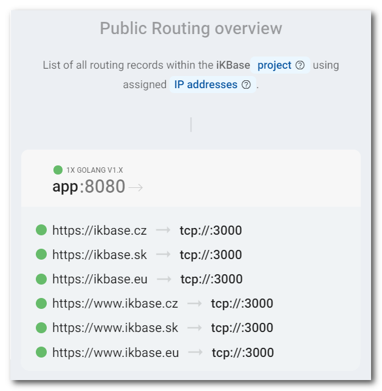
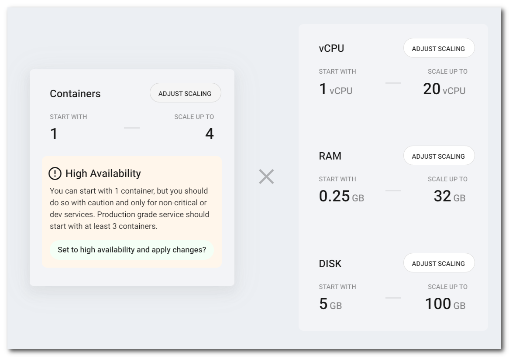

# Golang

Zerops provides a fully managed and scaled Golang runtime service, suitable for both development and production projects using any load. You can choose any option you wish in the knowledge that it will work.

[[toc]]

## Adding the Golang Service in Zerops

The Zerops Golang service is based on a [Linux LXD container](/documentation/overview/projects-and-services-structure.html#services-containers) with **Ubuntu** **==v18.04.06==**. It has the Git version control system pre-installed.

There are two possible ways to create a new Golang service. Either manually in the [Zerops GUI](#through-the-zerops-gui-interface), or using the Zerops [import functionality](/documentation/export-import/project-service-export-import.html#how-to-export-import-a-project).

### Using the import functionality

Zerops uses a YAML definition format to describe the structure. View the complete specification of the [import/export syntax in the YAML format](/documentation/export-import/project-service-export-import.html#used-yaml-specification).

To import a Golang service, you can use something similar to the following:

```yaml
services:
# Service will be accessible through zCLI VPN under <protocol>://app:<port>
- hostname: app
  # Type and version of service used.
  type: golang@1
  # Whether the service will be run on one or multiple containers.
  # Since this is a simple example, using only one container is fine.
  minContainers: 1
  maxContainers: 1
  ports:
  # Internal port number.
  - port: 8080
    # If a web server is running on the port.
    httpSupport: true
  # A command that should start your service.
  # It will be triggered after each deployment or after you manually start or re-start it.
  # The executable can be created using a command: go build -o ./bin/server ./app/server.go
  startCommand: ./bin/server
```

### Through the Zerops GUI interface

#### Which version to choose

You can currently only choose Golang version **v1** (version v1.17.8 to be precise).

Used as the export & import type: ==`golang@1`== .

#### Hostname

Choose a short and descriptive URL-friendly name, for example, **app**. The following rules apply:

* maximum length **==25==** characters,
* only lowercase ASCII letters **==a-z==** and numbers **==0-9==**,
* **==has to be unique==** in relation to other existing project hostnames,
* the hostname **==can't be changed==** later.

#### Port

The **Golang** service is one of the Zerops services that allows you to use **any port number** you want. The service can even have [multiple internal ports](/documentation/routing/routing-between-project-services.html) open (**1** - **65535**), running on **tcp** or **udp** protocols. The port will be preset to the **==tcp==** protocol and the value of **==8080==**. You can change it immediately or anytime after that.


Because domain access or subdomains can only be enabled for **tcp** ports with support for HTTP, the checkbox **HTTP protocol support** allows you to mark such an instance. In turn, Zerops uses this flag to optimize its internal logic to only offer this option and SSL certificates in useful places. These ports are used to set up public Internet access as described in the following section: [From the external Internet environment](#from-the-external-internet-environment).



#### Start Command

A command to start your service will be triggered after each deployment or after you manually start or re-start it. For example, if the result of your Golang application build command ==`go build -o ./bin/server ./app/server.go`== is an executable deployed via the [zerops.yml](/documentation/build/build-config.html#deploy) `deploy: [ "./bin/server" ]` directive, then the start command should be ==`./bin/server`== .

#### HA / non-HA runtime environment mode

When creating a new service, you can choose how many containers the runtime environment should be run on. The default setting starts with 1 container, allowing the automatic horizontal scaling up to 4 containers. To guarantee **HA** (High Availability) mode from the beginning, you should adjust the minimum container numbers to 2 at least. If you want to use only **non-HA mode** with 1 container, the minimum and maximum container numbers should be set to 1. ==**The chosen number of containers can be changed anytime later.**== If you would like to learn more about the technical details and how this service is built internally, take a look at the [Golang Service in HA Mode, a deep-dive view](/documentation/overview/how-zerops-works-inside/golang-cluster-internally.html) part of the documentation.




##### Golang runtime in non-HA mode

* great for local development to save money,
* doesn’t require any changes to the existing code,
* not necessary to respect HA mode [specifics](#what-you-should-remember-when-using-ha-mode), but see the recommendation tip below,
* not recommended for production projects.

<!-- markdownlint-disable DOCSMD004 -->
::: tip Recommendation
Even when using the non-HA mode for a production project, we nonetheless recommend you respect all of the [HA mode specifics](#what-you-should-remember-when-using-ha-mode) because you never know when you'll need to switch to the HA mode.
:::
<!-- markdownlint-enable DOCSMD004 -->

##### Golang runtime in HA mode

* runs on two containers at least, each on a **different physical machine**,
* with increasing operating load, the number of containers can reach up to 4,
* therefore the application runs redundantly in more places, with no risk of total failure,
* when one container fails, it's automatically replaced with a new one,
* the need to respect all of the [specifics](#what-you-should-remember-when-using-ha-mode) related to a Golang cluster,
* recommended for production projects.

## How to deploy application code

<!-- markdownlint-disable DOCSMD004 -->
::: tip Preface
Conceptually, you can either use Zerops deploy functionality to upload application files which are already built to Zerops, say at the end of your existing CI/CD pipeline, or utilize the Zerops build & deploy pipeline, which can build and then deploy the application for you automatically.
:::
<!-- markdownlint-enable DOCSMD004 -->

There are **two ways** you can physically deliver application code to the service. Either via a direct connection to a [GitHub](/documentation/github/github-integration.html) or [GitLab](/documentation/gitlab/gitlab-integration.html) repository or by using the Zerops **zCLI** [push](/documentation/cli/available-commands.html#push-project-name-service-name) or [deploy](/documentation/cli/available-commands.html#deploy-project-name-service-name-space-separated-files-or-directories) commands.

When a Zerops service has been connected to a GitHub or GitLab repository, you can select the checkbox `Build immediately after the service creation` to run the first build immediately after the service creation. Otherwise, you have to make a **new commit/tag** to invoke that first [build & deploy](http://localhost:8081/documentation/build/how-zerops-build-works.html) pipeline task.


When the build process has been successfully finished, you can download the entire zipped **artifact of the build container** and browse it locally if you need to check its content.


## Accessing a Zerops S3 Object Storage

You can [access the object storage](/documentation/services/storage/s3.html#how-to-access-an-object-storage-service) using its public [API URL endpoint](/documentation/services/storage/s3.html#api-url-endpoint-and-port) as you would access anything from the outside Internet, including your local development environment.

## Accessing a Zerops Shared Storage

When a Zerops Golang Service is created, you can mount a Zerops [Shared Storage Service](/documentation/services/storage/shared.html#storage-mounting) to it. If you don't have any as of yet, create a new one first.

Because Golang code runs under the **`root`** user account, any saved file has `-rw-r--r-- root root` permissions and created directories `drwxr-xr-x root root`.

The **`zeropsSharedStorageMounts`** environment variable allows you to get the list of mounted shared storage services (separated by a pipe, if there are more than only one). For more flexibility, it's always recommended to use such environment variables indirectly, as shown in an example of [custom environment variables](/knowledge-base/best-practices/how-to-use-environment-variables-efficiently.html), in each project service separately.

<!--
## Accessing a Zerops Elasticsearch service

Look at the Zerops repository [recipe-es-golang-basic](https://github.com/zeropsio/recipe-es-golang-basic) for how to do it. There is a simple code example of inserting a new document from the Golang environment into the Elasticsearch service. You can use the <span style="background-color: #80ff80"><b>&nbsp;Import service&nbsp;</b></span> functionality of the [Zerops import](/documentation/export-import/project-service-export-import.html#how-to-export-import-a-project) to create a working demo in your existing Zerops project with just a few clicks.

If it would be beneficial, you can also use the Elasticsearch [REST API](https://www.elastic.co/guide/en/elasticsearch/reference/current/rest-apis.html) in a standard way in different places, for example, through the [cURL](https://curl.se) utility.
-->

## How to access a Golang runtime environment

<!-- markdownlint-disable DOCSMD004 -->
::: warning Don't use additional security protocols for internal communication
The runtime environment service is not configured to support direct access using SSL/TLS or SSH protocols for internal communication inside a Zerops project private secured network. This is also the case for access using the Zerops [zCLI](/documentation/cli/installation.html) through a secure VPN channel.
:::
<!-- markdownlint-enable DOCSMD004 -->

### From other services inside the project

Other services can access the Golang application using its **hostname** and **port** environment variables, as they are part of the same private project network (for example, `http://app:8080`).

It's always recommended to not set the configuration values as constants directly into the application code. It is preferable to use them indirectly, for example, via [custom environment variables](/knowledge-base/best-practices/how-to-use-environment-variables-efficiently.html), referencing Zerops [implicit environment variables](/documentation/environment-variables/helper-variables.htm) and given that [all environment variables](/documentation/environment-variables/overview.html#referencing-environment-variables) are shared within the project across all services.

### From other Zerops projects

Zerops always sets up a [private dedicated network](/documentation/overview/projects-and-services-structure.html#project) for each project. From this point of view, cross project communication can be done precisely in the same ways described in the following section: [From your public domains (common Internet environment)](#from-your-public-domains-common-internet-environment). There isn't any other specific way. These projects are not directly interconnected.

### From your local environment

The local environment offers ==**not only options for local development**== but also a general ability to ==**manage all Zerops development or production services**== , using zCLI VPN.

You can access the Zerops Golang Service from your local workspace by using the [VPN](/documentation/cli/vpn.html) functionality of our [Zerops zCLI](/documentation/cli/installation.html), as mentioned above. This might come in handy if you, for example, use the service as a REST API and you don’t want it publicly available (via [public domains](/documentation/routing/using-your-domain.html) or Zerops [subdomains](/documentation/routing/zerops-subdomain.html)), so you connect to the project using **zCLI VPN** and use ==`app:8080`== as your API endpoint.

You can also run an application fully in your local workspace and access other services in the Zerops project using the VPN. However, you cannot use references to the environment variables because you are outside the project's network. Therefore, you should copy the values manually if you need some of them and use them in your private local configuration strategy.

### From your public domains (common Internet environment)

The Zerops [routing system](/documentation/routing/using-your-domain.html) allows you to set the mappings between those internal ports and external Internet access. In general, Zerops doesn’t try to detect which ports your application is running. Instead, it relies on the user to let Zerops know.

If you run a **web server** on that internal port (HTTP protocol support checkbox is selected), it means that you can map [public Internet domains](/documentation/routing/using-your-domain.html) with the option of automatic support for SSL certificates (this also works for Zerops [subdomains](/documentation/routing/zerops-subdomain.html)).

You can also [open public ports](/documentation/routing/access-through-ip-and-firewall.html) on the [IP addresses](/documentation/routing/unique-ipv4-ipv6-addresses.html) assigned to the project and point them to a service and its internal port. Each public port on the IP address can be protected with a built-in [firewall](/documentation/routing/access-through-ip-and-firewall.html#firewall).

To understand this better, take a look at the following section: [With external access](/documentation/overview/how-zerops-works-inside/typical-schemas-of-zerops-projects.html#with-external-access) of **Typical schemas of Zerops Projects**.

## Default hardware configuration and autoscaling

* Each Golang container starts with 1 vCPU, 0.25 GB RAM, and 5 GB of disk space.
* Zerops will automatically scale the resources vertically (up to 20 vCPU, 32 GB RAM, 100 GB DISK) and horizontally (up to 4 containers).

## Logging

Both console and **important** system messages coming from the container's runtime environment are configured using a syslog service to centralize all records and allow for live access through the **Runtime log** tab inside your service detail for each Zerops service container. It's not necessary to refresh the view. New logs are automatically passed through a web socket channel and displayed immediately.


All messages sent to **Stderr** (standard error file descriptor) or **Stdout** (standard output file descriptor), using the Golang `fmt` or `log` packages, are processed via **Linux Systemd daemon** as log messages with **facility number 16** ( ==`local0`== ) and **severity 6** (**Informational**) by default (see [RFC5424](https://datatracker.ietf.org/doc/html/rfc5424#section-6.2.1)).

If you prefer to set a different severity level, use a message prefix ==`<N>`== to encode your chosen log severity in printed lines, as shown below.

```go
fmt.Println("A message with the informational severity ...")
fmt.Println("<0>Emergency (0) severity > system is unusable.")
fmt.Println("<1>Alert (1) severity > action must be taken immediately.")
fmt.Println("<2>Critical (2) severity > critical conditions.")
fmt.Println("<3>Error (3) severity > error conditions.")
fmt.Println("<4>Warning (4) severity > warning conditions.")
fmt.Println("<5>Notice (5) severity > normal, but significant, condition.")
fmt.Println("<6>Informational (6) severity > informational message.")
fmt.Println("<7>Debug (7) severity > debug-level message.")

log.SetFlags(0) // To eliminate a timestamp as a default message prefix.
log.Println("--- Ekvivalent using log package ---")
log.Println("A message with the informational severity ...")
log.Println("<0>Emergency (0) severity > system is unusable.")

fmt.Println("--- Ekvivalent syntax using Stderr & Stdout ---")
fmt.Fprintf(os.Stderr, "<3>Error (3) severity > error conditions.\n")
fmt.Fprintf(os.Stdout, "<0>Emergency (0) severity > system is unusable.\n")
```

Then you can show log messages with **facility number 16** ( ==`local0`== ) in the **Runtime log** view and choose the severity level, or show all of them by selecting the **All** option. Keep the dedicated switch ==**`Show web server logs`**== in the disabled state. This switch is related only to web server access & error logs if anyone is operating in the runtime environment.


When you configure and run a web server (for example, [Gin](https://github.com/gin-gonic/gin), [BeeGo](https://github.com/astaxie/beego), [Echo](https://github.com/labstack/echo), [Fast HTTP](https://github.com/valyala/fasthttp)) as a part of the application code, you may prefer to log in a different way, for example, by using logging libraries such as [Zerolog](https://github.com/rs/zerolog), or [Logrus](https://github.com/sirupsen/logrus). These could be more suitable for your projects, especially for the production environment.

What's important in such cases is choosing **facility number 17** ( ==`local1`== ) as the configuration option. This is because the dedicated switch ==**`Show web server logs`**== in the **Runtime log** view that allows you to show web access & error logs separately from standard application logs. It's important, especially from an access log point of view, because there could be thousands and thousands of records.

<!-- markdownlint-disable DOCSMD004 -->
::: tip Stdout & Stderr output streams
**In the Zerops environment, the output is piped to a logger controller of the Project Core Service, so that the logging operations are processed asynchronously** (see the [Detail of Project Core Service](/documentation/overview/how-zerops-works-inside/typical-schemas-of-zerops-projects.html) tab). The environment was tested for throughput of around ~50K logs/second.
:::
<!-- markdownlint-enable DOCSMD004 -->

<!-- markdownlint-disable DOCSMD004 -->
::: warning Supported facility numbers
Don't use any other facility number except ==`local0`== and ==`local1`== as shown above. If you use a different one (0 .. 15, 18 .. 23) by [RFC5424](https://datatracker.ietf.org/doc/html/rfc5424#section-6.2.1), they will be filtered out on the Zerops backend and you won't see them in the Zerops GUI. At the same time, **important** system messages originating from the container's runtime environment are checked and included transparently in the application logs, regardless of their original facility number, in order to inform the user.
:::
<!-- markdownlint-enable DOCSMD004 -->

## How to browse the content of a runtime container

You can use **File browser** functionality available in all runtime services to view folders, files, and their contents & attributes. The mounted shared storage disks are accessible at the path ==/mnt/== .


## How to detect HTTPS sessions

Zerops Routing Service (see the schema of a Zerops project with [external access](/documentation/overview/how-zerops-works-inside/typical-schemas-of-zerops-projects.html#with-external-access)) takes care of SSL certificate management and internal translation of HTTPS protocol to HTTP for all project's services.

Your application logic may need to check or do something when a client is accessing it using an HTTPS protocol (user's encrypted requests). In such a case, it's possible to inspect the **`x-forwarded-proto`** header. You can see an example of this below using a super simple Golang application that uses the Golang native `net/http` package to implement and run a web server.

```go
package main

import (
  "fmt"
  "log"
  "net/http"
  "strings"
)

func main() {
  http.HandleFunc("/", CheckProtocol)
  if err := http.ListenAndServe(":8080", nil); err != nil {
    log.Fatal(err)
  }
}

func CheckProtocol(w http.ResponseWriter, r *http.Request) {
  forwarded := r.Header.Get("x-forwarded-proto")
  if forwarded == "" {
    fmt.Fprintln(w, "... x-forwarded-proto header does not exist")
    return
  }
  if strings.ToLower(forwarded) == "https" {
      fmt.Fprintln(w, "... secured communication through HTTPS protocol")
      return
  }
  fmt.Fprintln(w, "... communication only through HTTP protocol")
}
```

## What you should remember when using HA mode

### Store data locally only for a temporary purpose

You should not store your permanent data or sessions in the local disk space of containers running your application. The reason being that locally stored data is reserved only for this particular container instance, not mirrored across the Golang cluster nor backup-ed. It will not be migrated if such a container is deleted due to failure. If it is necessary to store and share such data permanently, we recommend developers to utilize [Zerops Shared Storage](/documentation/services/storage/shared.html) or [Zerops S3 compatible Object Storage](/documentation/services/storage/s3.html) services.

## Known specifics

* Golang application itself is run via **systemd** service unit, which keeps it running and handles restarts.
