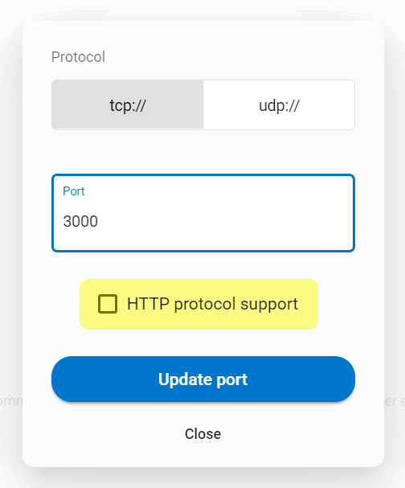
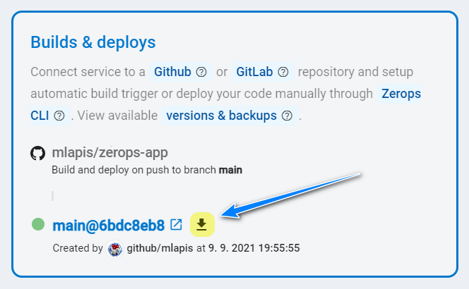
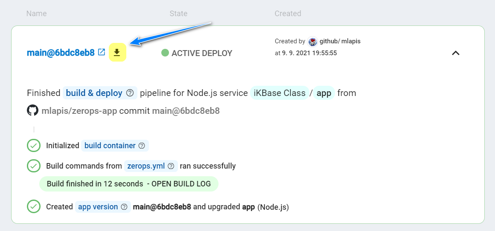

# Node.js

Zerops provides a fully managed and scaled Node.js runtime service, suitable for both development and production projects using any load. You can choose any option you want and be sure that it will work.

[[toc]]

## Adding the Node.js Service in Zerops

### Version to choose

You can currently choose Node.js version **v14.17**, **v12.13**, or **v10.17**. The chosen version of it **can't be changed afterward**.

<!-- markdownlint-disable DOCSMD004 -->
::: info Changing version
Switching must be done manually by creating a new service with another version and migrating service code using a new [deploy](/documentation/deploy/how-deploy-works.html) or [build & deploy](/documentation/build/how-zerops-build-works.html) process.
:::
<!-- markdownlint-enable DOCSMD004 -->

### Hostname

Choose a short and descriptive URL-friendly name, for example, **app**. The following rules apply:

* maximum length **==25==** characters,
* only lowercase ASCII letters **==a-z==** and numbers **==0-9==**,
* **==has to be unique==** in relation to other existing project's hostnames,
* the hostname **==can't be changed==** later.

### Port

**Node.js** service, together with the [Golang service](/documentation/services/runtimes/golang.html), is the only one that allows you to use **any port number** you want. The service can even have [multiple internal ports](/documentation/routing/routing-between-project-services.html) open (**0** - **65535**), running on **tcp** or **udp** protocols. The port will be preset to the **==tcp==** protocol and the value of **==3000==**. You can change it immediately or anytime later.

Additionally, the Zerops [routing system](/documentation/routing/using-your-domain.html) allows you to set the mappings between those internal ports and external Internet access. If you run a web server on that internal port (HTTP application protocol is supported), it means that you can even map [public Internet domains](/documentation/routing/using-your-domain.html) with the possibility of automatic support for SSL certificates (it also works for Zerops [subdomains](/documentation/routing/zerops-subdomain.html)).



Because domain access or subdomains can be enabled only for **tcp** ports with support for HTTP, the checkbox **HTTP protocol support** allows marking such a case. In turn, Zerops uses this flag to optimize its internal logic to offer this possibility and SSL certificates only in handy places.

To understand it better, look at the section [With external access](/documentation/overview/how-zerops-works-inside/typical-schemas-of-zerops-projects.html#with-external-access) of **Typical schemas of Zerops Projects**. In general, the logic is not that you would open some ports primarily in Zerops and thus put some functionality into operation, but that the given Node.js application in a particular container binds a local port (e.g., 3000). The following setting in Zerops then only enables the path to it. In other words, nothing is accessible at the beginning from the outside, and you will map only a specific one with this setting.

### Start Command

A command that should start your service will be triggered after each deployment or manually starting or re-starting it. For example, if you have a `scripts` section defined in your project's `package.json` like:

```json
"scripts": {
    "start": "node ./app/index.js"
}
```

then, you can use the command ==`npm start`== .

### HA / non-HA runtime environment mode

When creating a new service, you can choose whether the runtime environment should be run in **HA** (High Availability) mode, using 3 or more containers, or **non-HA mode**, using only 1 container. ==**The chosen runtime environment mode can't be changed later.**== If you would like to learn more about the technical details and how this service is internally built, take a look at the [Node.js Service in HA Mode, Internal](/documentation/overview/how-zerops-works-inside/nodejs-cluster-internally.html).

#### Node.js runtime in non-HA mode

* great for local development to save money,
* doesn’t require any changes to the existing code,
* not necessary to respect HA mode [specifics](#what-you-should-remember-when-using-the-ha-mode), but see the recommendation tip below,
* not recommended for production projects.

<!-- markdownlint-disable DOCSMD004 -->
::: tip Recommendation
Even when using the non-HA mode for a production project, we nonetheless recommend you respect all of the [HA mode specifics](#what-you-should-remember-when-using-the-ha-mode) because you never know when you'll need to switch to the HA mode.
:::
<!-- markdownlint-enable DOCSMD004 -->

#### Node.js runtime in HA mode

* will start to run on three containers, each on a **different physical machine**,
* with increasing operating load, the number of containers can reach up to 64,
* so the application runs redundantly in 3 or more places, with no risk of total failure,
* when one container fails, it's automatically replaced with a new one,
* the need to respect all of the [specifics](#what-you-should-remember-when-using-the-ha-mode) related to a Node.js cluster,
* recommended for production projects.

### How to deploy application code

You have **two ways** how you can deliver application code to the service. Either a direct connection to a [GitHub](/documentation/github/github-integration.html) or [GitLab](/documentation/gitlab/gitlab-integration.html) repository or using the Zerops **zcli** [push](/documentation/cli/available-commands.html#push-project-name-service-name) or [deploy](/documentation/cli/available-commands.html#deploy-project-name-service-name-space-separated-files-or-directories) commands.

When a Zerops service has been connected to a GitHub or GitLab repository, you can select the checkbox `Build immediately after the service creation` to run the first build immediately after the service creation. Otherwise, you have to make a **new commit/tag** to invoke that first [build & deploy](http://localhost:8081/documentation/build/how-zerops-build-works.html) pipeline task.


When the build process has been successfully finished, you can download the whole zipped **artifact of the build container** and browse locally if you need to check its content.




<!-- markdownlint-disable DOCSMD004 -->
::: info Simple projects and how to deploy them using the Zerops zcli
You can look at the two step-by-step described real projects, **Adminer** and **phpMyAdmin** web tools, used to administer the Zerops MariaDB (MySQL) databases. How to create and deploy them with the Zerops **zcli**.

* [Preparing and deploying phpMyAdmin application kit](/knowledge-base/how-to-do/how-to-prepare-phpmyadmin-application-kit.html)
* [Preparing and deploying Adminer application kit](/knowledge-base/how-to-do/how-to-prepare-adminer-application-kit.html)
:::
<!-- markdownlint-enable DOCSMD004 -->

## Accessing a Zerops S3 Object Storage

You can [access the object storage](/documentation/services/storage/s3.html#how-to-access-an-object-storage-service) using its public [API URL endpoint](#api-url-endpoint-and-port) in the same way as any access from the outside Internet, and including your local development environment.

## Accessing a Zerops Shared Storage

When a Zerops PHP Service is created, you can mount a Zerops [Shared Storage Service](/documentation/services/storage/shared.html#storage-mounting) to it. If you don't have any of such yet, create a new one first.

Because PHP code runs under the **`www-data`** user account, any saved file has `-rw-r--r-- www-data www-data` permissions and created directories `drwxr-xr-x www-data www-data`.

The **`zeropsSharedStorageMounts`** environment variable allows you to get the list of mounted shared storage services (separated by a pipe, if there are more than only one). For more flexibility, it's always recommended to use such environment variables indirectly, as shown in an example of [custom environment variables](/knowledge-base/best-practices/how-to-use-environment-variables-efficiently.html), in each project service separately.