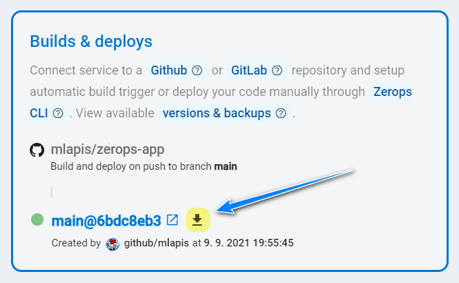
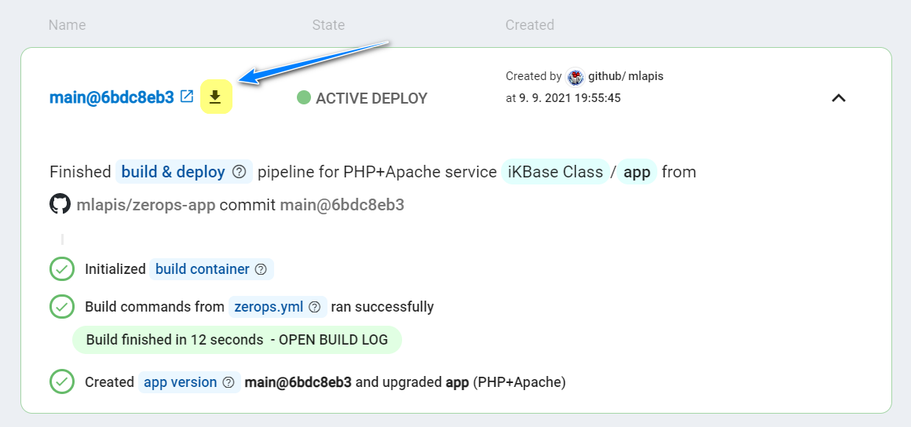
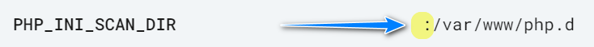
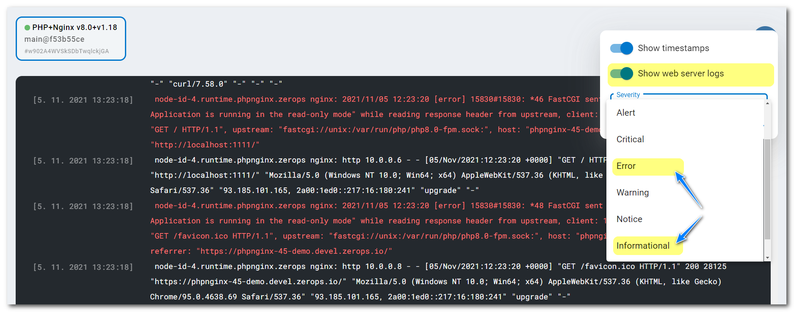
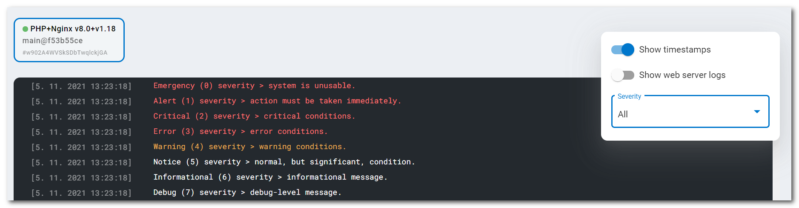

# PHP

Zerops provides a fully managed and scaled PHP runtime service, suitable for both development and production projects using any load. You can choose any option you wish in the knowledge that it will work.

[[toc]]

## Adding the PHP Service in Zerops

Zerops PHP service is based on a [Linux LXD container](/documentation/overview/projects-and-services-structure.html#services-containers). It has the [Composer dependency manager](#pre-installed-php-composer), a lot of popular [PHP modules and extensions](#pre-installed-php-modules-and-extensions), together with the Git version control system pre-installed.

### Two ways to do it

There are two possible ways to create a new PHP service. Either manually in the Zerops GUI, as described in the [rest of this document](#which-version-to-choose), or using Zerops [import functionality](/documentation/export-import/project-service-export-import.html#how-to-export-import-a-project).

#### A simple import example in the YAML syntax

Zerops uses a YAML definition format to describe the structure. To import a service, you can use something similar to the following. This is the case for when the Apache web server is used, but similar syntax can also be used for the Nginx web server.

```yaml
services:
# Service will be accessible through zcli VPN under: http://app
- hostname: app
  # Type and version of a used service combined with the Apache web server.
  type: php-apache@8.0
  # Whether the service will be run on one or multiple containers.
  # Since this is a simple example, using only one container is fine.
  mode: NON_HA
  # Folder name used as the root of the publicly accessible web server content.
  documentRoot: public
```

You can also read the complete specification of the [import/export syntax in the YAML format](/documentation/export-import/project-service-export-import.html#used-yaml-specification).

### Which version to choose

You can currently choose PHP version **v8.0**, **v7.4**, or **v7.3**. The chosen version **can't be changed afterwards**. The service is always combined with a web server. It can be either **Apache v2.4** or **Nginx v1.18**. The differences and configuration specifics for each web server are listed below.

Used as the export & import types: ==`php-apache@8.0`== , ==`php-apache@7.4`== , ==`php-apache@7.3`== ,
==`php-nginx@8.0`== , ==`php-nginx@7.4`== , and ==`php-nginx@7.3`== .

<!-- markdownlint-disable DOCSMD004 -->
::: info Changing versions
Switching must be done manually by creating a new service with another version and migrating the service code using a new [deploy](/documentation/deploy/how-deploy-works.html) or [build & deploy](/documentation/build/how-zerops-build-works.html) process.
:::
<!-- markdownlint-enable DOCSMD004 -->

### Hostname and port

Choose a short and descriptive URL-friendly name, for example, **app**. The following rules apply:

* maximum length **==25==** characters,
* only lowercase ASCII letters **==a-z==** and numbers **==0-9==**,
* **==has to be unique==** in relation to other existing project hostnames,
* the hostname **==can't be changed==** later.

The port will be automatically set to the value of **==80==** and can't be changed.

### Application code root and document root

The application code you deploy will always be placed in the ==**/var/www**== **code root** folder. You can choose a **document root** (the publicly accessible folder, usually the location of your ==index.php==). By default, the document root is set to the folder ==**/var/www/public**== , which you can change.

<!-- markdownlint-disable DOCSMD004 -->
::: tip Recommendation
Using a subdirectory like ==**/var/www/public**== for a document root is always a good idea. This allows you to use service code root level for overhead stuff and improve the readability of the directory structure as a result.
:::
<!-- markdownlint-enable DOCSMD004 -->

#### Setting PHP/Apache document root

You set it through a separate input.


It is also possible to make changes to the **document root** later, you make them by editing the **`documentRoot`** environment variable.

#### Setting PHP/Nginx document root

You set it through a service Nginx configuration file in the following section (see below). For more on what this config looks like and what it means, see the [Default Nginx config](#default-nginx-config) part of the documentation.

```nginx
# Be sure that you set up a correct document root!
root /var/www/public;
```

You can also make changes to the **document root** later, just do so through a separate **Nginx configuration** service card.

### Default Nginx config


* You can adjust the default config (with the pre-defined content specific for each PHP engine version) as you wish, as long as you respect the correct syntax and valid paths. However, there are two exceptions. First, **==don't modify port 80==** at the point marked <span style="background-color: #ff8080">&nbsp;[**1**]&nbsp;</span>. If you do, you will break your project.

* Defined separated **document root** as a subdirectory such as **public** `/var/www/public` (optional name) or keeping it identical with the service **code root** `/var/www` at the marked point <span style="background-color: #ffff00">&nbsp;[**2**]&nbsp;</span>.

* Which file (`index.php` here) at the point marked <span style="background-color: #00ff40">&nbsp;[**3**]&nbsp;</span> is used for serving **document root content**.

* The location defined at the point marked <span style="background-color: #00ffff">&nbsp;[**4**]&nbsp;</span> blocks access to any `*.php` file for external requests (case insensitive) using the directive **internal** at the point marked <span style="background-color: #00ffff">&nbsp;[**5**]&nbsp;</span>. Any attempt to access leads to a **404 Not Found** response. If you would like to allow external access to `*.php` files in a subdirectory, for example, the `uploads`, you need to add a new location:

```nginx
location ^~ /uploads/ {
   fastcgi_pass unix:/var/run/php/php7.4-fpm.sock;
   fastcgi_split_path_info ^(.+\.php)(/.*)$;
   include fastcgi_params;

   fastcgi_param SCRIPT_FILENAME $realpath_root$fastcgi_script_name;
   fastcgi_param DOCUMENT_ROOT $realpath_root;
}
```

* And as the second exception, ==**`don't modify`**== **storage log paths** at the point marked <span style="background-color: #8000ff; color: white">&nbsp;[**6**]&nbsp;</span> for the **access_log** and the **error_log**. The chosen facility ==`local1`== is related to the mechanism for showing [runtime logs](#logging) in the Zerops GUI.

* The configuration syntax is validated on saving with `nginx -t` command.

### HA / non-HA runtime environment mode

When creating a new service, you can choose whether the runtime environment should be run in **HA** (High Availability) mode, using 3 or more containers, or **non-HA mode**, only using 1 container. ==**The chosen runtime environment mode can't be changed later.**== If you would like to learn more about the technical details and how this service is built internally, take a look at the [PHP Service in HA Mode, Internal](/documentation/overview/how-zerops-works-inside/php-cluster-internally.html) part of the documentation.

#### PHP runtime in non-HA mode

* great for local development to save money,
* doesn’t require any changes to the existing code,
* not necessary to respect HA mode [specifics](#what-you-should-remember-when-using-ha-mode), but see the recommendation tip below,
* not recommended for production projects.

<!-- markdownlint-disable DOCSMD004 -->
::: tip Recommendation
Even when using the non-HA mode for a production project, we nonetheless recommend you respect all of the [HA mode specifics](#what-you-should-remember-when-using-ha-mode) because you never know when you'll need to switch to the HA mode.
:::
<!-- markdownlint-enable DOCSMD004 -->

#### PHP runtime in HA mode

* will start to run on three containers, each on a **different physical machine**,
* with increasing operating load, the number of containers can reach up to 64,
* so the application runs redundantly in 3 or more places, with no risk of total failure,
* when one container fails, it's automatically replaced with a new one,
* it's necessary to respect all of the [specifics](#what-you-should-remember-when-using-ha-mode) related to a PHP cluster,
* recommended for production projects.

## How to deploy application code

<!-- markdownlint-disable DOCSMD004 -->
::: tip Preface
Conceptually, you can either use Zerops deploy functionality to upload application files which are already built to Zerops, say at the end of your existing CI/CD pipeline, or utilize Zerops build & deploy pipeline, which can build and then deploy the application for you automatically.
:::
<!-- markdownlint-enable DOCSMD004 -->

There are **two ways** you can physically deliver application code to the service. Either via a direct connection to a [GitHub](/documentation/github/github-integration.html) or [GitLab](/documentation/gitlab/gitlab-integration.html) repository or by using the Zerops **zcli** [push](/documentation/cli/available-commands.html#push-project-name-service-name) or [deploy](/documentation/cli/available-commands.html#deploy-project-name-service-name-space-separated-files-or-directories) commands.

When a Zerops service has been connected to a GitHub or GitLab repository, you can select the checkbox `Build immediately after the service creation` to run the first build immediately after service creation. Otherwise, you have to make a **new commit/tag** to invoke that first [build & deploy](http://localhost:8081/documentation/build/how-zerops-build-works.html) pipeline task.


When the build process has been successfully finished, you can download the entire zipped **artifact of the build container** and browse it locally if you need to check its content.




<!-- markdownlint-disable DOCSMD004 -->
::: info Simple projects and how to deploy the code using the Zerops zcli
You can look at the two real projects with step-by-step descriptions, **Adminer** and **phpMyAdmin** web tools, used to administer the Zerops MariaDB (MySQL) databases. Take a look at how you can create and deploy them with the Zerops **zcli**. It is assumed that you have already created your project in Zerops GUI and an empty PHP service (not connected to any repository). You can use the [service import](#a-simple-import-example-in-the-yaml-syntax) functionality for it.

* [Preparing and deploying phpMyAdmin application kit](/knowledge-base/how-to-do/how-to-prepare-phpmyadmin-application-kit.html)
* [Preparing and deploying Adminer application kit](/knowledge-base/how-to-do/how-to-prepare-adminer-application-kit.html)
:::
<!-- markdownlint-enable DOCSMD004 -->

## Accessing a Zerops S3 Object Storage

You can [access the object storage](/documentation/services/storage/s3.html#how-to-access-an-object-storage-service) using its public [API URL endpoint](/documentation/services/storage/s3.html#api-url-endpoint-and-port) as you would access anything from the outside Internet, including your local development environment.

## Accessing a Zerops Shared Storage

When a Zerops PHP Service is created, you can mount a Zerops [Shared Storage Service](/documentation/services/storage/shared.html#storage-mounting) to it. If you don't have any as of yet, start by creating a new one.

Because PHP code runs under the **`www-data`** user account, any saved file has `-rw-r--r-- www-data www-data` permissions and created directories `drwxr-xr-x www-data www-data`.

The **`zeropsSharedStorageMounts`** environment variable allows you to get a list of mounted shared storage services (separated by a pipe, if there are more than only one). For more flexibility, it's always recommended to use such environment variables indirectly, as shown in an example of [custom environment variables](/knowledge-base/best-practices/how-to-use-environment-variables-efficiently.html), in each project service separately.

## Accessing a Zerops Elasticsearch service

Look at the Zerops repository [recipe-es-php-basic](https://github.com/zeropsio/recipe-es-php-basic) for how to do it. There is a simple code example of inserting a new document from the PHP environment into the Elasticsearch service. You can use the <span style="background-color: #80ff80"><b>&nbsp;Import service&nbsp;</b></span> functionality of the [Zerops import](/documentation/export-import/project-service-export-import.html#how-to-export-import-a-project) to create a working demo in your existing Zerops project with just a few clicks.

If it would be beneficial, you can also use the Elasticsearch [REST API](https://www.elastic.co/guide/en/elasticsearch/reference/current/rest-apis.html) in a standard way in different places, for example, through the [cURL](https://curl.se) utility.

## How to access a PHP runtime environment

<!-- markdownlint-disable DOCSMD004 -->
::: warning Don't use additional security protocols for internal communication
The runtime environment service is not configured to support direct access using SSL/TLS or SSH protocols for internal communication inside a Zerops project private secured network. This is also the case for access using the Zerops [zcli](/documentation/cli/installation.html) through a secure VPN channel.
:::
<!-- markdownlint-enable DOCSMD004 -->

### From other services inside the project

Other services can access the PHP application using its **hostname** and **port**, as they are part of the same private project network (for example, `http://app` , where the port `:80` is implicit).

It's always recommended to not set the configuration values as constants directly into the application code. It is preferable to use them indirectly, for example, via [custom environment variables](/knowledge-base/best-practices/how-to-use-environment-variables-efficiently.html), referencing Zerops [implicit environment variables](/documentation/environment-variables/helper-variables.htm) and given that [all environment variables](/documentation/environment-variables/how-to-access.html) are shared within the project across all services.

### From other Zerops projects

Zerops always sets up a [private dedicated network](/documentation/overview/projects-and-services-structure.html#project) for each project. From this point of view, cross project communication can be done precisely in the same ways described in the section [From your public domains (common Internet environment)](#from-your-public-domains-common-internet-environment). There isn't any other specific way. The projects are not directly interconnected.

### From your local environment

The local environment offers ==**not only possibilities for local development**== but also a general ability to ==**manage all Zerops development or production services**== , using zcli VPN.

You can access the Zerops PHP Service from your local workspace by using the [VPN](/documentation/cli/vpn.html) functionality of our [Zerops zcli](/documentation/cli/installation.html), as mentioned above. This might come in handy if you, for example, use the service as a REST API and you don’t want it publicly available (via [public domains](/documentation/routing/using-your-domain.html) or Zerops [subdomains](/documentation/routing/zerops-subdomain.html)), so you connect to the project using **zcli VPN** and use ==`app:80`== as your API endpoint.

You can also run an application fully in your local workspace and access other services in the Zerops project using the VPN. However, you cannot use references to the environment variables because you are outside of the project's network. Therefore, you should copy the values manually if you need some of them and use them in your private local configuration strategy.

### From your public domains (common Internet environment)

The Zerops [routing system](/documentation/routing/using-your-domain.html) allows you to set the mappings between the service [internal port](#port) and external Internet access. Because the port is implicitly fixed, Zerops knows how to do it.

**The web server** always runs on that internal port, and it means that you can map [public Internet domains](/documentation/routing/using-your-domain.html) with the option of automatic support for SSL certificates (this also works for Zerops [subdomains](/documentation/routing/zerops-subdomain.html)).

To understand this better, take a look at the section [With external access](/documentation/overview/how-zerops-works-inside/typical-schemas-of-zerops-projects.html#with-external-access) of **Typical schemas of Zerops Projects**.

## Default hardware configuration and autoscaling

* Each PHP container (1 in non-HA, 3 in HA) starts with 1 vCPU, 0.25 GB RAM, and 5 GB of disk space.
* Zerops will automatically scale the resources vertically (both in non-HA and HA mode up to 32 vCPU, 128 GB RAM, 1 TB disk space) and horizontally (HA mode only, up to 64 containers).

## Pre-installed PHP Composer

[Composer](https://getcomposer.org) **v2.1.5**, as a dependency manager for PHP, is pre-installed globally in each Zerops PHP Service. You can run it by adding the line  ==`composer install`== to the **run** section in the [zerops.yml](/documentation/build/build-config.html) configuration file. It supposes that you have a **`composer.json`** file placed in the root directory of application code that defines what should be installed.

## Pre-installed PHP modules and extensions

Zerops PHP service includes the most used PHP extensions by default. If you need to use one that's not on the list, let us know through a new issue on the Zerops.io [GitHub Documentation Repository](https://github.com/zeropsio/docs) or send us an e-mail at [dev@zerops.io](mailto:dev@zerops.io).

|Module / Extension                                             |Module / Extension                                           |Module / Extension                                             |Module / Extension                                           |Module / Extension                                           |
|:--------------------------------------------------------------|:------------------------------------------------------------|:--------------------------------------------------------------|:------------------------------------------------------------|:------------------------------------------------------------|
|[calendar](https://www.php.net/manual/en/book.calendar.php)    |[gettext](https://www.php.net/manual/en/book.gettext.php)    |[pcntl](https://www.php.net/manual/en/book.pcntl.php)          |[session](https://www.php.net/manual/en/book.session.php)    |[tidy](https://www.php.net/manual/en/book.tidy.php)          |
|[bcmath](https://www.php.net/manual/en/book.bc.php)            |[hash](https://www.php.net/manual/en/book.hash.php)          |[pcre](https://www.php.net/manual/en/book.pcre.php)            |[shmop](https://www.php.net/manual/en/ref.shmop.php)         |[mysqli](https://www.php.net/manual/en/book.mysqli.php)      |
|[Core](https://www.php.net/manual/en/extensions.membership.php)|[iconv](https://www.php.net/manual/en/book.iconv.php)        |[PDO](https://www.php.net/manual/en/book.pdo.php)              |[ftp](https://www.php.net/manual/en/book.ftp.php)            |[tokenizer](https://www.php.net/manual/en/book.tokenizer.php)|
|[ctype](https://www.php.net/manual/en/intro.ctype.php)         |[igbinary](https://github.com/igbinary/igbinary)             |[pdo_mysql](https://www.php.net/manual/en/ref.pdo-mysql.php)   |[SimpleXML](https://www.php.net/manual/en/book.simplexml.php)|[xml](https://www.php.net/manual/en/book.xml.php)            |
|[curl](https://www.php.net/manual/en/book.curl.php)            |[imagick](https://www.php.net/manual/en/book.imagick.php)    |[pdo_pgsql](https://www.php.net/manual/en/ref.pdo-pgsql.php)   |[sockets](https://www.php.net/manual/en/book.sockets.php)    |[xmlreader](https://www.php.net/manual/en/book.xmlreader.php)|
|[date](https://www.php.net/manual/en/book.datetime.php)        |[intl](https://www.php.net/manual/en/book.intl.php)          |[pdo_sqlite](https://www.php.net/manual/en/ref.pdo-sqlite.php) |[sodium](https://www.php.net/manual/en/book.sodium.php)      |[xmlwriter](https://www.php.net/manual/en/book.xmlwriter.php)|
|[dom](https://www.php.net/manual/en/book.dom.php)              |[json](https://www.php.net/manual/en/book.json.php)          |[pgsql](https://www.php.net/manual/en/book.pgsql.php)          |[SPL](https://www.php.net/manual/en/book.spl.php)            |[xsl](https://www.php.net/manual/en/book.xsl.php)            |
|[exif](https://www.php.net/manual/en/book.exif.php)            |[libxml](https://www.php.net/manual/en/book.libxml.php)      |[Phar](https://www.php.net/manual/en/book.phar.php)            |[sqlite3](https://www.php.net/manual/en/book.sqlite3.php)    |[Zend OPcache](https://pecl.php.net/package/ZendOpcache)     |
|[FFI](https://www.php.net/manual/en/book.ffi.php)              |[mbstring](https://www.php.net/manual/en/book.mbstring.php)  |[posix](https://www.php.net/manual/en/book.posix.php)          |[standard](https://www.php.net/manual/en/book.spl.php)       |[zip](https://www.php.net/manual/en/book.zip.php)            |
|[fileinfo](https://www.php.net/manual/en/book.fileinfo.php)    |[mongodb](https://www.php.net/manual/en/set.mongodb.php)     |[readline](https://www.php.net/manual/en/book.readline.php)    |[sysvmsg](https://www.php.net/manual/en/sem.installation.php)|[zlib](https://www.php.net/manual/en/book.zlib.php)          |
|[filter](https://www.php.net/manual/en/book.filter.php)        |[mysqlnd](https://www.php.net/manual/en/book.mysqlnd.php)    |[redis](https://github.com/phpredis/phpredis)                  |[sysvsem](https://www.php.net/manual/en/sem.installation.php)|                                                             |
|[gd](https://www.php.net/manual/en/book.image.php)             |[openssl](https://www.php.net/manual/en/book.openssl.php)    |[Reflection](https://www.php.net/manual/en/book.reflection.php)|[sysvshm](https://www.php.net/manual/en/sem.installation.php)|                                                             |

## How to customize php.ini setting from application code

To overwrite current `php.ini` settings, it's necessary to create a new `PHP_INI_SCAN_DIR` [environment variable](/documentation/environment-variables/how-to-access.html). As its value, you have to enter the full path to a directory located in the application code scanned by the system for all files ending in `.ini` in alphabetical order, where you can place any directive and its value.

You can also use the path **`:`** separator to define the relative order to the pre-defined `php.ini` [configuration](https://www.php.net/manual/en/configuration.file.php). Placing it at the beginning means that `.ini` files from the application code will overwrite the existing `php.ini` settings. Placing it at the end means the logic is reversed. Pre-defined `php.ini` configuration will overwrite `.ini` files from the application code.



We recommend that you create a directory ==`php.d`== in the [code root](#code-root-and-document-root) (always in `/var/www`) and place all custom `*.ini` files there.

Generally, you have several options for customizing PHP configuration settings. The list of `php.ini` [directives](https://www.php.net/manual/en/ini.list.php) also contains a column with `Changeable` header that shows [modes determining](https://www.php.net/manual/en/configuration.changes.modes.php) when and where a directive may be set. Directives with `PHP_INI_USER`, `PHP_INI_PERDIR`, or `PHP_INI_ALL` mode can be easily controlled from the application code. But directives marked with `PHP_INI_SYSTEM` can be set only through `php.ini` configuration to which you don't have direct access.

<!-- markdownlint-disable DOCSMD004 -->
::: info
To see the current `php.ini` configuration, use the `phpinfo()` function.
:::
<!-- markdownlint-enable DOCSMD004 -->

### A real example of `PHP_INI_SCAN_DIR` use

If you want to block file uploads at the service level, you need to set the ==`file_uploads = Off`== directive. Follow these steps to achieve that:

1. Create the `php.d` subdirectory in your code root.

2. Place a `changes_php.ini` file into that subdirectory with the content:

```php
; Whether to allow HTTP file uploads (http://php.net/file-uploads)
file_uploads = Off
```

<!-- markdownlint-disable MD029 -->
3. Deploy your changed code to the service.

4. Create a new service environment variable `PHP_INI_SCAN_DIR` with the value ==`:/var/www/php.d`== .

5. Restart the PHP service.

6. Check the current status using the `phpinfo()` function. There should be the `file_uploads` directive set to `Off` value (in the **Core** module section).
<!-- markdownlint-enable MD029 -->

## Logging

Application logs, together with web access and error logs are configured using a syslog service to centralize all records and allow live access through the **Runtime log** tab inside your service detail for each Zerops service container. It's not necessary to refresh the view. New logs are automatically passed through a web socket channel and displayed immediately.


The default **Apache** configuration is done through `/etc/apache2/sites-enabled/vhost.conf`, and you don't have direct edit access to its content. **You can't change it**.

```bash
CustomLog "| /usr/bin/logger -thttpd -plocal1.notice" combined
ErrorLog  "| /usr/bin/logger -thttpd -plocal1.err"
```

The default **Nginx** configuration is done through `/etc/nginx/sites-enabled/default.site`, and you have direct edit access to its content through the [Nginx configuration](#default-nginx-config) section. **You can change it**, but do so with care.

```bash
access_log syslog:server=unix:/dev/log,facility=local1 default_short;
error_log syslog:server=unix:/dev/log,facility=local1;
```

As you can see in both cases, **web access & error logs** are directed with **facility number 17** ( ==`local1`== ). This is important since the Zerops GUI has a dedicated switch ==**`Show web server logs`** for showing. Access logs are set up with **severity 6** (**Informational**) and error logs with **severity 4** (**Error**).



Applications can emit custom web error logs using the PHP [error_log](https://www.php.net/manual/en/function.error-log.php) directive,

```php
error_log("Application is running in the read-only mode.");
```

and you can see them with **severity 4** (**Error**) in the **Runtime log** tab again.

System logs generated by application code using the PHP [syslog](https://www.php.net/manual/en/function.syslog.php) functionality, are processed via **Linux Systemd daemon** as log messages (see [RFC5424](https://datatracker.ietf.org/doc/html/rfc5424#section-6.2.1)). You have to use ==`LOG_LOCAL0`== as **facility number 16** ( ==`local0`== ) in [openlog](https://www.php.net/manual/en/function.openlog.php) to emit those logs correctly and show them in the **Runtime log** tab, now with the dedicated switch ==**`Show web server logs`**== in the **disabled state**.

You are setting a log severity via the first parameter when calling the [syslog](https://www.php.net/manual/en/function.syslog.php) function.

```php
openlog("", LOG_PID, LOG_LOCAL0);
syslog(LOG_EMERG, "Emergency (0) severity > system is unusable.");
syslog(LOG_ALERT, "Alert (1) severity > action must be taken immediately.");
syslog(LOG_CRIT, "Critical (2) severity > critical conditions.");
syslog(LOG_ERR, "Error (3) severity > error conditions.");
syslog(LOG_WARNING, "Warning (4) severity > warning conditions.");
syslog(LOG_NOTICE, "Notice (5) severity > normal, but significant, condition.");
syslog(LOG_INFO, "Informational (6) severity > informational message.");
syslog(LOG_DEBUG, "Debug (7) severity > debug-level message.");
closelog();
```

Then you can filter log messages generated by application code by selecting the severity level, or show all of them by selecting the **All** option.



<!-- markdownlint-disable DOCSMD004 -->
::: info Syslog output
**In the Zerops environment, the output is piped to a logger controller of the Project Core Service, so that logging operations are processed asynchronously** (see [Detail of Project Core Service](/documentation/overview/how-zerops-works-inside/typical-schemas-of-zerops-projects.html) tab). The environment was tested for throughput of around ~50K logs/second.
:::
<!-- markdownlint-enable DOCSMD004 -->

<!-- markdownlint-disable DOCSMD004 -->
::: warning Supported facility numbers
Don't use any other facility number except ==`local0`== and ==`local1`== as shown above. If you use a different one (0 .. 15, 18 .. 23) by [RFC5424](https://datatracker.ietf.org/doc/html/rfc5424#section-6.2.1), they will be filtered out on the Zerops backend and you won't see them in the Zerops GUI. At the same time, **important** system messages originating from the container's runtime environment are checked and included transparently in the application logs, regardless of their original facility number, in order to inform the user.
:::
<!-- markdownlint-enable DOCSMD004 -->

<!-- markdownlint-disable DOCSMD004 -->
::: warning Openlog prefix parameter
Currently, the first parameter of the [openlog](https://www.php.net/manual/en/function.openlog.php) function (prefix) is not shown in the **Runtime log** view. If you enter it, it's processed internally and saved in the log data but not shown. Simply use an empty string as the value `openlog("", LOG_PID, LOG_LOCAL0);`.
:::
<!-- markdownlint-enable DOCSMD004 -->

See the [Apache](https://httpd.apache.org/docs/2.4/logs.html) or [Nginx](https://docs.nginx.com/nginx/admin-guide/monitoring/logging) documentation for more information about web logging.

## How to browse the content of a runtime container

You can use the **File browser** functionality available in all runtime services to view folders, files, and their contents & attributes. The mounted shared storage disks are accessible via the path ==/mnt/== .


## How to detect HTTPS sessions

Zerops Routing Service (see the schema of a Zerops project with [external access](/documentation/overview/how-zerops-works-inside/typical-schemas-of-zerops-projects.html#with-external-access)) takes care of SSL certificate management and internal translation of HTTPS protocol to HTTP for all project services.

Your application logic may need to check or do something when a client is accessing it using an HTTPS protocol (user's encrypted requests). In such a case, it's possible to inspect the **`HTTP_X_FORWARDED_PROTO`** header.

```php
if (
   isset($_SERVER['HTTP_X_FORWARDED_PROTO']) &&
   strtolower($_SERVER['HTTP_X_FORWARDED_PROTO']) === 'https'
) {
   // Here, you know that HTTPS protocol is used.
}
```

## What you should remember when using HA mode

### Store data locally only for a temporary purpose

You should not store your permanent data or sessions in the local disk space of containers running your application. This is because locally stored data is reserved only for this particular container instance, not mirrored across the PHP cluster nor backed up. It will not be migrated if such a container is deleted due to failure. If it is necessary to store and share such data permanently, we recommend developers to utilize [Zerops Shared Storage](/documentation/services/storage/shared.html) or [Zerops S3 compatible Object Storage](/documentation/services/storage/s3.html) services.

## Known specifics

* Configuration through the **.htaccess** file is supported only on Apache-based services.
* The default `php.ini` resource limitations (for example, **max_execution_time**, **max_input_time**, **memory_limit**, **post_max_size**, **upload_max_size**, …) can be changed through a [PHP_INI_SCAN_DIR](#how-to-customize-php-ini-setting-from-a-user-s-service-code) environment variable and `*.ini` files in the user's code.
* Default value of [error_reporting](https://www.php.net/manual/en/errorfunc.configuration.php#ini.error-reporting) directive has been set to **E_ALL** (except **E_DEPRECATED** and **E_STRICT**) and can be changed through a [PHP_INI_SCAN_DIR](#how-to-customize-php-ini-setting-from-a-user-s-service-code) environment variable again.
* The following functions have been disabled in the Zerops environment for security reasons through **disable_functions** directive by default in `php.ini`:

|Function        |Function          |Function                |Function           |
|:---------------|:-----------------|:-----------------------|:------------------|
|pcntl_alarm     |pcntl_wifsignaled |pcntl_signal_get_handler|pcntl_sigtimedwait |
|pcntl_fork      |pcntl_wifcontinued|pcntl_signal_dispatch   |pcntl_exec         |
|pcntl_waitpid   |pcntl_wexitstatus |pcntl_get_last_error    |pcntl_getpriority  |
|pcntl_wait      |pcntl_wtermsig    |pcntl_strerror          |pcntl_setpriority  |
|pcntl_wifexited |pcntl_wstopsig    |pcntl_sigprocmask       |pcntl_async_signals|
|pcntl_wifstopped|pcntl_signal      |pcntl_sigwaitinfo       |                   |
