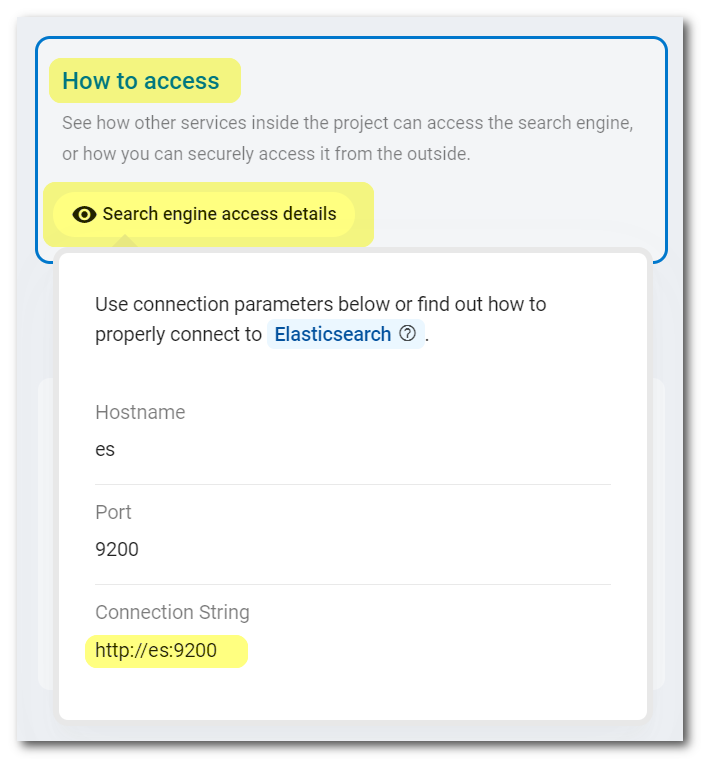
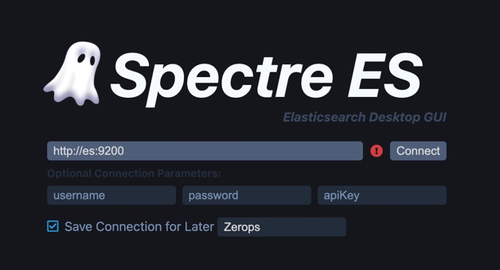
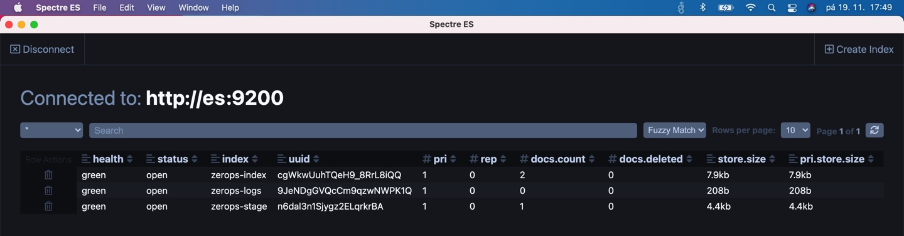

# Elasticsearch

Zerops provides a fully managed and scaled [Elasticsearch](https://www.elastic.co/what-is/elasticsearch) service (without **Kibana GUI**), suitable for both development and production projects using any load. It's a distributed, open search and analytics engine for all types of data, including textual, numerical, geospatial, structured, and unstructured. You can choose any option you wish in the knowledge that it will work.

[[toc]]

## Adding the Elasticsearch Service in Zerops

The Zerops Elasticsearch service is based on a [Linux LXD container](/documentation/overview/projects-and-services-structure.html#services-containers).

### Two ways to do it

There are two possible ways to create a new Elasticsearch service. Either manually in the Zerops GUI, as described in the [rest of this document](#which-version-to-choose), or using the Zerops [import functionality](/documentation/export-import/project-service-export-import.html#how-to-export-import-a-project).

#### A simple import example in the YAML syntax

Zerops uses a YAML definition format to describe the structure. To import a service, you can use something similar to the following:

```yaml
services:
  # Service will be accessible through zcli VPN under: http://es
  - hostname: es
    # Type and version of service used.
    type: elasticsearch@7
    # Whether the service will be run on one or multiple containers.
    # Since this is a simple example, using only one container is fine.
    mode: NON_HA
```

A complete specification of the [import/export syntax in the YAML format](/documentation/export-import/project-service-export-import.html#used-yaml-specification).

### Which version to choose

You can currently choose version **v7.12** or **v6.8**. The chosen version of the database **can't be changed afterwards**.

Used as the export & import types: ==`elasticsearch@7`== or ==`elasticsearch@6`== .

<!-- markdownlint-disable DOCSMD004 -->
::: tip Changing version
Switching must be done manually by creating a new service with another version and migrating data using a [snapshot](https://www.elastic.co/guide/en/elasticsearch/reference/current/snapshot-restore.html) backup / restore pattern.
:::
<!-- markdownlint-enable DOCSMD004 -->

### Hostname and port

Choose a short and descriptive URL-friendly name, for example, **es**. The following rules apply:

* maximum length **==25==** characters,
* only lowercase ASCII letters **==a-z==** and numbers **==0-9==**,
* **==has to be unique==** in relation to other existing project hostnames,
* the hostname **==can't be changed==** later.

The port will automatically be set to the value of **==9200==** and can't be changed.

<!-- markdownlint-disable DOCSMD004 -->
::: warning Security inside a private project network
All services inside a Zerops project share a [dedicated private network](/documentation/routing/routing-between-project-services.html) and can see and reference [environment variables](/documentation/environment-variables/how-to-access.html) from other services. This means that, by default, nothing outside the project can access any of the services inside.

The Elasticsearch service is configured to **allow full and unrestricted access without user authentication** only from the project internal network environment. In practice, this means that this service can only be accessed either programmatically through the runtime environment services ([Node.js](/documentation/services/runtimes/nodejs.html#port), [Golang](/documentation/services/runtimes/golang.html#port), and [PHP](/documentation/services/runtimes/php.html#hostname-and-port), which should implement their authentication logic not to allow anonymous access to the Elasticsearch service) or using [zcli](/documentation/cli/installation-authorization.html) and [vpn](/documentation/cli/vpn.html) from your local environment, nothing else.
:::
<!-- markdownlint-enable DOCSMD004 -->

### HA/non-HA mode

When creating a new service, you can choose whether the database should be run in **HA** (High Availability) mode, initially using 3 containers by default, or **non-HA mode**, using only 1 container. ==**The chosen mode can't be changed later.**== If you would like to learn more about the technical details and how this service is built internally, take a look at the [Elasticsearch Service in HA Mode, Internal](/documentation/overview/how-zerops-works-inside/elasticsearch-cluster-internally.html).

#### Elasticsearch in non-HA mode

* great for local development to save money,
* data is only stored in a single container, higher risk of data loss,
* all data changes from the last backup are not recoverable,
* the need to respect the Zerops [specifics](#the-specifics-you-should-remember),
* not recommended for production projects.

<!-- markdownlint-disable DOCSMD004 -->
::: tip Recommendation
Even when using non-HA mode for a production project, we recommend you implement the same logic and consider other possible related factors as you would do in HA mode because you never know when you'll need to switch to it.
:::
<!-- markdownlint-enable DOCSMD004 -->

#### Elasticsearch in HA mode

* will run initially on three containers as an [Elasticsearch cluster](https://www.elastic.co/guide/en/elasticsearch/reference/current/modules-discovery.html) with standard vendor functionality provided, each on a **different physical machine**,
* therefore data is stored redundantly (by default in three places), with no risk of data loss,
* when one container fails, it's automatically replaced with a new one,
* with two load [Nginx Layer 7](https://www.nginx.com/resources/glossary/layer-7-load-balancing) balancers (no additional cost) that route incoming HTTP traffic in a sophisticated way directly to Elasticsearch cluster data nodes,
* the need to respect the Zerops [specifics](#the-specifics-you-should-remember),
* recommended for production projects.

## How to access an Elasticsearch service

<!-- markdownlint-disable DOCSMD004 -->
::: warning Don't use additional security protocols for internal communication
The Elasticsearch service is not configured to support direct access using SSL/TLS or SSH protocols for internal communication inside a Zerops project private secured network. This is also the case for access using the Zerops [zcli](/documentation/cli/installation.html) through a secure VPN channel.
:::
<!-- markdownlint-enable DOCSMD004 -->

### From other services inside the project

Other services can access the database using its **hostname** and **port**, as they are part of the same private project network (for example, `http://es:9200`). It’s highly recommended to utilize the **==connectionString==** environment variable that Zerops creates automatically for each service, especially when using HA mode, as it makes sure to include all the information required for HA. More information related to **connectionString** can be found in the dedicated [environment variables](/documentation/environment-variables/how-to-access.html) section. See also a list of all automatically generated [environment variables](/documentation/environment-variables/helper-variables.html#elasticsearch) for the Elasticsearch service.

For more flexibility surrounding future potential hostname changes, it's always recommended to use them indirectly via [custom environment variables](/knowledge-base/best-practices/how-to-use-environment-variables-efficiently.html) (referencing implicit Zerops environment [variables](/documentation/environment-variables/helper-variables.html#mariadb)) separately in each project service. This allows you to eliminate all direct dependencies in the application code, which in turn results in simplification and increased flexibility. Another reason not to hard-code the values inside your applications is that there is a danger of easily committing them (like your credentials) into a repository, potentially exposing them to more people than intended.

### From other Zerops projects

Zerops always sets up a [private dedicated network](/documentation/overview/projects-and-services-structure.html#project) for each project. From this point of view, cross project communication can be done precisely in the same ways described in the section [From your public domains (common Internet environment)](#from-your-public-domains-common-internet-environment). There isn't any other specific way. The projects are not directly interconnected.

### From your local environment

The local environment offers ==**not only possibilities for local development**== but also a general ability to ==**manage all Zerops development or production services**== , using zcli VPN.

To connect to the Elasticsearch from your local workspace, you can utilize the [VPN](/documentation/cli/vpn.html) functionality of our [Zerops zcli](/documentation/cli/installation.html), as mentioned above. This allows you to access the search engine the same way other services inside the project can, but unlike those services, you cannot use references to the environment variables. Therefore, if you need them, you should copy the values manually through the **How To Access** / **Search engine access details** section of the service detail in your application and use them in your private local configuration strategy.



### From your public domains (common Internet environment)

You can't access the Elasticsearch service directly in any way. You have to use one of the runtime environment services ([Node.js](/documentation/services/runtimes/nodejs.html#accessing-a-zerops-elasticsearch-service), [Golang](/documentation/services/runtimes/golang.html#accessing-a-zerops-elasticsearch-service), or [PHP](/documentation/services/runtimes/php.html#accessing-a-zerops-elasticsearch-service)) and go indirectly through them in a programmatic way. They should implement their authentication logic not to allow anonymous access to the Elasticsearch service.

To understand this better, take a look at the section [With external access](/documentation/overview/how-zerops-works-inside/typical-schemas-of-zerops-projects.html#with-external-access) of **Typical schemas of Zerops Projects**.

## Default hardware configuration and autoscaling

* Each Elasticsearch container (1 in non-HA, 3 in HA) starts with 1 vCPU, 1 GB RAM, and 5 GB of disk space.
* Zerops will automatically scale the HW resources both [vertically](/documentation/automatic-scaling/how-automatic-scaling-works.html#vertical-scaling) (in non-HA and HA mode) and [horizontally](/documentation/automatic-scaling/how-automatic-scaling-works.html#horizontal-scaling) (in HA mode only).

## Zerops Elasticsearch service data backups & restores

Zerops uses [Elasticsearch snapshots](https://www.elastic.co/guide/en/elasticsearch/reference/current/snapshot-restore.html) to backup up and restore data. The whole process is configured and automatically managed exclusively by Zerops, and users can't currently affect it. It means that snapshots are created periodically each day, and if the operational data becomes damaged, it will be restored from them upon user request (both [non-HA](#elasticsearch-in-non-ha-mode) & [HA](#elasticsearch-in-ha-mode) modes).

## Using a local data management tool

Install any of your favorite data management tools locally. For example, you can use [Spectre ES GUI](https://spectregui.com/elasticsearch-gui.html), a standalone installable tool on Windows, Linux, and Mac platforms. There is also a browser extension-only solution, like [Elasticvue](https://elasticvue.com), a free and open-source Elasticsearch GUI for Firefox, Chrome, Edge browsers. You can try others from the list on the [Best Elasticsearch GUI Clients](https://www.slant.co/topics/11537/~elasticsearch-gui-clients) page.

First, connect to your Zerops project using [zcli](/documentation/cli/installation.html) & [VPN](/documentation/cli/vpn.html) and then use ==`http://es:9200`== as the endpoint ([without authentication](#hostname-and-port) on the project private network). After that, connect to the Elasticsearch service from the data management tool, as in the example below which shows **Spectre ES**:



<!-- markdownlint-disable DOCSMD004 -->
::: tip Connection security settings
As you are using a secure VPN channel already, and the Elasticsearch service is located on the internal Zerops project private secured network, it's unnecessary to apply any additional security layers such as SSH or SSL/TLS. For this reason, the database service is not configured to support access using SSL/TLS or SSH protocols for internal communication inside a Zerops project. Here's more about how the Zerops project works with [external access](/documentation/overview/how-zerops-works-inside/typical-schemas-of-zerops-projects.html#with-external-access).
:::
<!-- markdownlint-enable DOCSMD004 -->

Now it's easy to browse or edit your data.



## The specifics you should remember

Don't change the default setting of **two replicas** for indices. Otherwise, you risk the cluster not working as expected. Zerops [horizontal scaling](/documentation/automatic-scaling/how-automatic-scaling-works.html#horizontal-scaling) algorithm supposes that the **number of replicas is always 2**.

### Don't use sniffing to optimize a connection from a client-side

Elasticsearch is a distributed system, which means its indices live in multiple nodes connected to each other, forming a cluster. One of the main advantages of being a distributed system — other than fault tolerance — is that data can be sharded into multiple data nodes, allowing searches to run much faster than searches run through a single node.

In the Zerops environment, the Elasticsearch service uses two load [Nginx Layer 7](https://www.nginx.com/resources/glossary/layer-7-load-balancing) balancers to route incoming HTTP traffic directly to cluster data nodes.

It would be a mistake for the client application to get a list of data nodes to communicate (sniffing). The point is that, on the one hand, it makes no sense from a performance point of view, and in the event of any change in the cluster arrangement (e.g. failure of one data node and its replacement by another), such a list would not even correspond to reality.

<!-- markdownlint-disable DOCSMD004 -->
::: tip Authentication is not required
It's unnecessary to use any authentication because the Elasticsearch service is [fully accessible inside](#hostname-and-port) the Zerops project private network.
:::
<!-- markdownlint-enable DOCSMD004 -->

From the point of view of individual client SDKs, the following applies:

#### Node.js

Get the ==**`connectionString`**== environment variable published by your Elasticsearch service and [build the API client](https://www.elastic.co/guide/en/elasticsearch/client/javascript-api/current/client-connecting.html#client-usage) using the taken host and disabled sniffing.

```javascript
const {Client} = require('@elastic/elasticsearch');
// Get the global environment object.
const env = process.env;
// The chosen hostname of the Elasticsearch service.
const hostname = 'es';
// The requested environment variable name.
const connectionString = 'connectionString';
// For example, the result of the <host> would be: ["http://es:9200"]
const host = env[`${hostname}_${connectionString}`];
const esClient = new Client({
  node: host
  // Sniffing should be disabled.
  sniffOnStart: false
});
```

#### Golang

Get the ==**`connectionString`**== environment variable published by your Elasticsearch service and [build the API client](https://www.elastic.co/blog/the-go-client-for-elasticsearch-configuration-and-customization) using the taken host and disabled sniffing (disable nodes discovering).

```go
import (
  "github.com/elastic/go-elasticsearch/v7"
)
// The chosen hostname of the Elasticsearch service.
const hostname = "es"
// The requested environment variable name.
const connectionString = "connectionString"
// For example, the result of the <host> would be: ["http://es:9200"]
var host, _ = os.LookupEnv(hostname + "_" + connectionString)
var cfg = elasticsearch.Config{
  Addresses: []string{host},
  // Sniffing should be disabled.
  DiscoverNodesOnStart: false,
}
var esClient, _ = elasticsearch.NewClient(cfg)
```

#### PHP

Get the ==**`connectionString`**== environment variable published by your Elasticsearch service and [build the API client](https://www.elastic.co/guide/en/elasticsearch/client/php-api/current/connceting.html) using the taken host and disabled sniffing.

```php
use Elasticsearch\ClientBuilder;
// The chosen hostname of the Elasticsearch service.
$hostname = "es";
// The requested environment variable name.
$connectionString = "connectionString";
// For example, the result of the <$hosts> would be: ["http://es:9200"]
$hosts = [getenv("${hostname}_${connectionString}")];
$esClient = ClientBuilder::create()
  ->setHosts($hosts)
  // Sniffing should be disabled.
  ->setSniffOnStart(false)
  ->build();
```
