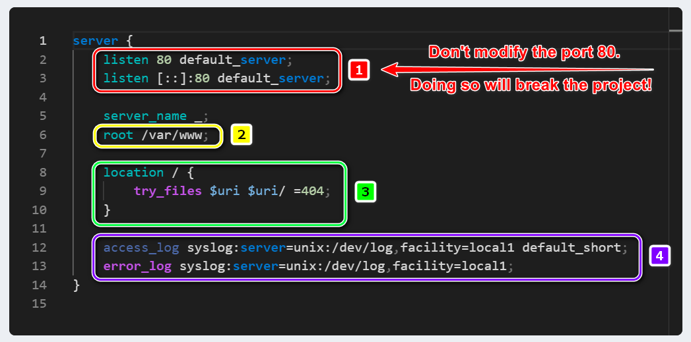
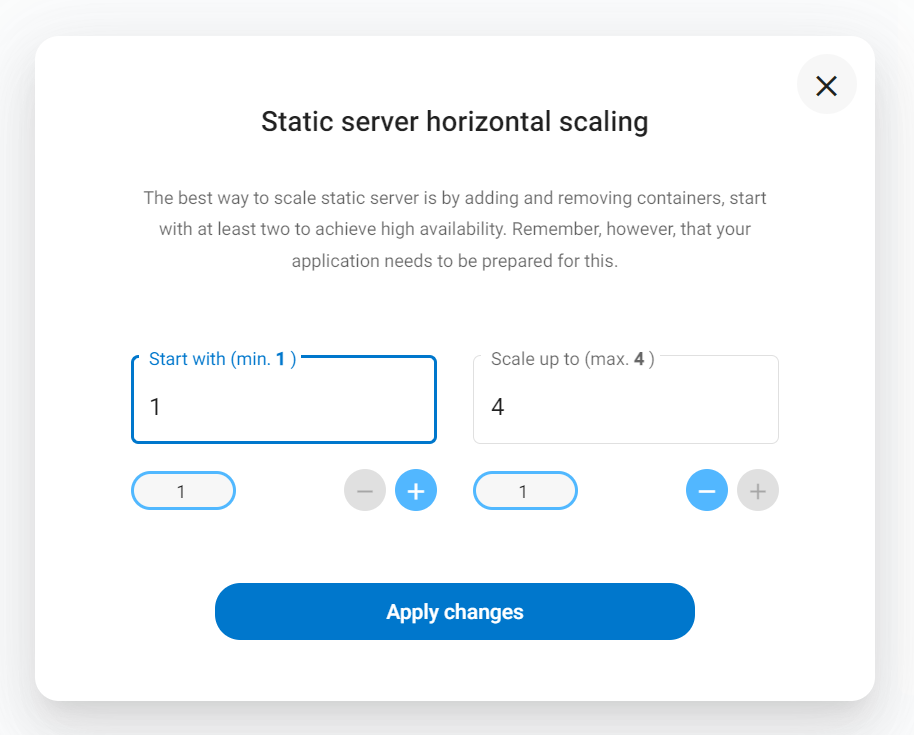
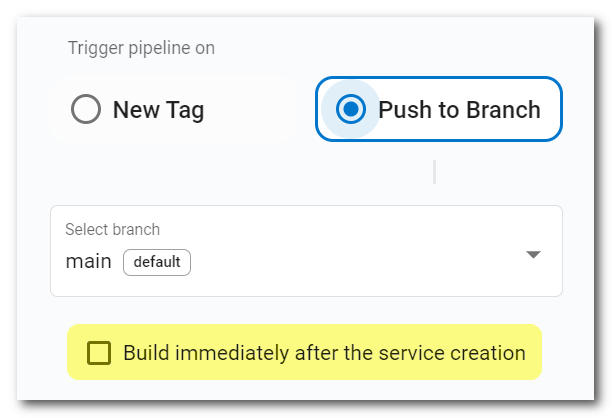
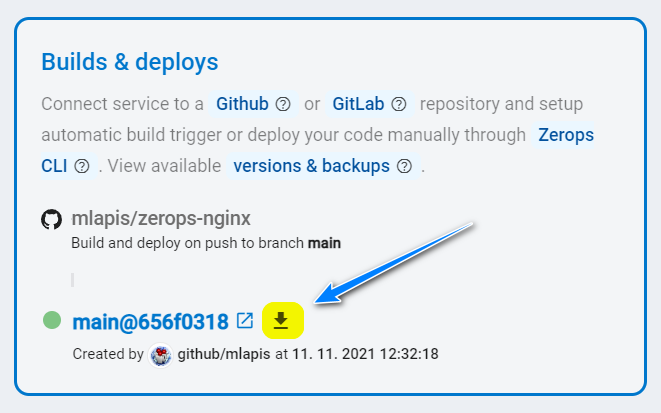
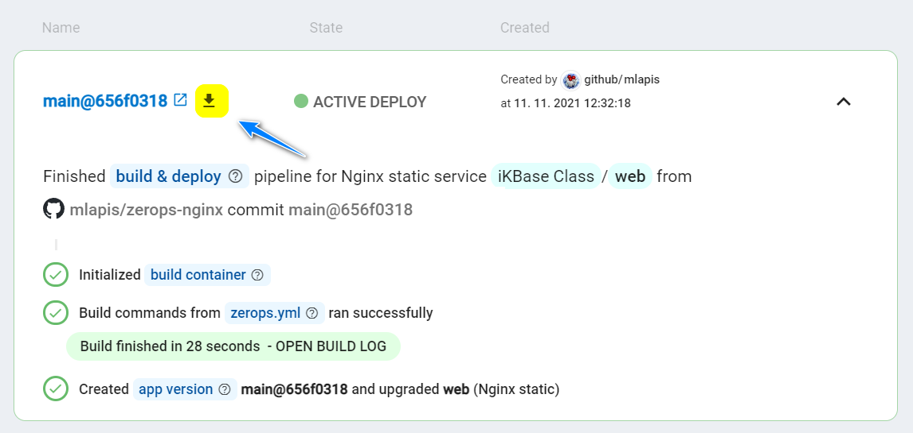
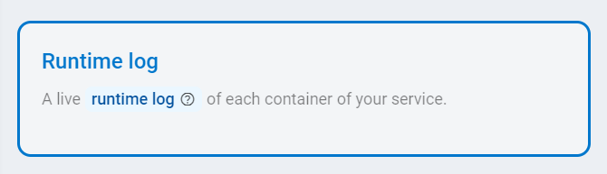
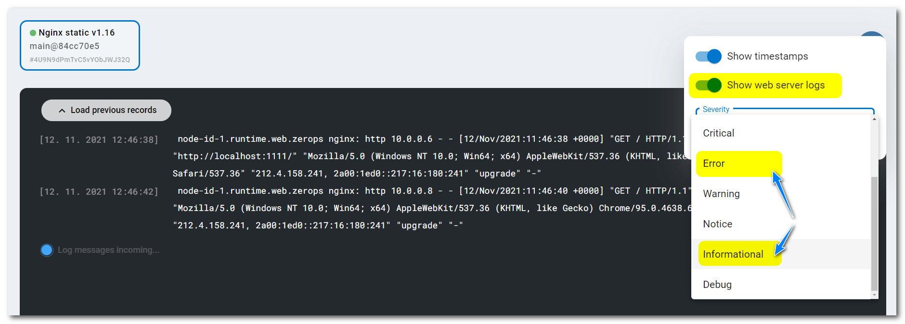
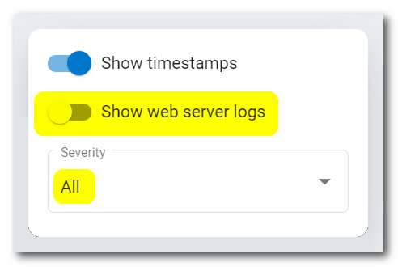

# Nginx

Zerops provides a fully managed and scaled Nginx static web server service, suitable for both development and production projects using any load. You can choose any option you wish in the knowledge that it will work.

This service is usually used as a web server for serving static files (index.html, *.js bundles, fonts, images, other assets) of front-end applications, like **Angular**, **Vue**, **React**.

[[toc]]

## Adding the Nginx Service in Zerops

The Zerops Nginx service is based on a [Linux LXD container](/documentation/overview/projects-and-services-structure.html#services-containers) with **Ubuntu** **==v18.04.06==**. It has the Git version control system pre-installed.

There are two possible ways to create a new Nginx service. Either manually in the [Zerops GUI](#through-the-zerops-gui-interface), or using the Zerops [import functionality](/documentation/export-import/project-service-export-import.html#how-to-export-import-a-project).

### Using the import functionality

Zerops uses a YAML definition format to describe the structure. View the complete specification of the [import/export syntax in the YAML format](/documentation/export-import/project-service-export-import.html#used-yaml-specification).

To import a Nginx service, you can use something similar to the following:

```yaml
services:
  # Service will be accessible through zCLI VPN under http://web
  - hostname: web
    # Type and version of service used.
    type: nginx@1.20
    # Whether the service will be run on one or multiple containers.
    # Since this is a simple example, using only one container is fine.
    minContainers: 1
    maxContainers: 1
    # Nginx configuration of `nginx.conf` file used by the Nginx server.
    # The default setting is shown.
    nginxConfig: |
      server {
          listen 80 default_server;
          listen [::]:80 default_server;
          server_name _;
          # The document root of the web server content.
          root /var/www;
          # Directive applied to requests for the root folder.
          location / {
              try_files $uri $uri/ =404;
          }
          # Storage log paths for the access_log and the error_log.
          access_log syslog:server=unix:/dev/log,facility=local1 default_short;
          error_log syslog:server=unix:/dev/log,facility=local1;
      }
```

### Through the Zerops GUI interface

#### Which version to choose

You can currently only choose Nginx version **v1.20** (version 1.20.1 to be precise).

Used as the export & import type: ==`nginx@1.20`== .

#### Hostname and port

Choose a short and descriptive URL-friendly name, for example, **web**. The following rules apply:

* maximum length **==25==** characters,
* only lowercase ASCII letters **==a-z==** and numbers **==0-9==**,
* **==has to be unique==** in relation to other existing project hostnames,
* the hostname **==can't be changed==** later.

The port will be automatically set to the value of **==80==** and can't be changed.

#### Document root

You can choose a **document root** (the publicly accessible folder, usually the location of your ==index.html==). By default, the document root is set to the folder ==**/var/www**== , which you can change. You set it through a service Nginx configuration in the following section, see the [Default Nginx config](#default-nginx-config). Any subsequent changes you can make through a separate **Nginx configuration** service card.

```bash
root /var/www;
```

##### Default Nginx config



* You can adjust the default config as you wish, as long as you respect the correct syntax and valid paths. However, there are two exceptions. First, **==don't modify port 80==** at the point marked <span style="background-color: #ff8080">&nbsp;[**1**]&nbsp;</span>. If you do, you will break your project.

* Either use the default **document root** as `/var/www` at the marked point <span style="background-color: #ffff00">&nbsp;[**2**]&nbsp;</span> or enter a subdirectory such as **public** `/var/www/public` (optional name) if your project requires it.

* The location rules defined at the point marked <span style="background-color: #00ff40">&nbsp;[**3**]&nbsp;</span> suppose that `index.html` serves **document root content**.

* And as the second exception, ==**`don't modify`**== **storage log paths** at the point marked <span style="background-color: #8000ff; color: white">&nbsp;[**4**]&nbsp;</span> for the **access_log** and the **error_log**. The chosen facility ==`local1`== is related to the mechanism of showing [runtime logs](#logging) in the Zerops GUI.

* The configuration syntax is validated upon saving with `nginx -t` command.

##### Nginx config tips for SPA applications

1. A static server should always return `index.html` as the response for any request that asks for a non-existent file or resource. The `location` section for the root can be used as the following code:

```bash
location / {
  try_files $uri $uri/ /index.html;
}
```

2. The `index.html` file should not usually be cached on a client-side to refresh the SPA homepage automatically. You can add another `location` section just for this purpose.

```bash
location = /index.html {
  add_header Cache-Control "private, no-cache, no-store, must-revalidate";
  expires 0;
}
```

#### HA / non-HA mode

When creating a new service, you can choose how many containers the runtime environment should be run on. The default setting starts with 1 container, allowing the automatic horizontal scaling up to 4 containers. To guarantee **HA** (High Availability) mode from the beginning, you should adjust the minimum container numbers to 2 at least. If you want to use only **non-HA mode** with 1 container, the minimum and maximum container numbers should be set to 1. ==**The chosen number of containers can be changed anytime later.**== If you would like to learn more about the technical details and how this service is  built internally, take a look at the [PHP Service in HA Mode, a deep-dive view](/documentation/overview/how-zerops-works-inside/php-cluster-internally.html) part of the documentation. Although the specific text is focused on the PHP environment (running in combination with the Apache or Nginx webserver), in terms of logic and functionality, the situation is entirely identical, which also applies to a separate static Nginx web server.




##### Nginx static server in non-HA mode

* great for local development to save money,
* doesn’t require any changes to the existing code,
* not recommended for production projects.

##### Nginx static server in HA mode

* runs on two containers at least, each on a **different physical machine**,
* with increasing operating load, the number of containers can reach up to 4,
* therefore the application runs redundantly in more places, with no risk of total failure,
* when one container fails, it's automatically replaced with a new one,
* recommended for production projects.

## How to deploy application code

<!-- markdownlint-disable DOCSMD004 -->
::: tip Preface
Conceptually, you can either use Zerops deploy functionality to upload application files which are already built to Zerops, say at the end of your existing CI/CD pipeline, or utilize Zerops build & deploy pipeline, which can build and then deploy the application for you automatically.
:::
<!-- markdownlint-enable DOCSMD004 -->

There are **two ways** you can physically deliver application code to the service. Either via a direct connection to a [GitHub](/documentation/github/github-integration.html) or [GitLab](/documentation/gitlab/gitlab-integration.html) repository or by using the Zerops **zCLI** [push](/documentation/cli/available-commands.html#push-project-name-service-name) or [deploy](/documentation/cli/available-commands.html#deploy-project-name-service-name-space-separated-files-or-directories) commands.

When a Zerops service has been connected to a GitHub or GitLab repository, you can select the checkbox `Build immediately after the service creation` to run the first build immediately after the service creation. Otherwise, you have to make a **new commit/tag** to invoke that first [build & deploy](http://localhost:8081/documentation/build/how-zerops-build-works.html) pipeline task.

The minimum `zerops.yml` configuration file you need to have in the root project directory is shown below. It says the entire repository content (without any build steps) should be [deployed](/documentation/build/build-config.html#deploy) into the runtime container.

```yaml
<hostname>:
  build:
    build: []
    deploy: [.]
```



When the build process has been successfully finished, you can download the entire zipped **artifact of the build container** and browse it locally if you need to check its content.




<!-- markdownlint-disable DOCSMD004 -->
::: tip A simple project and how to deploy the code using the Zerops zCLI
You can look at this elementary project a step-by-step description. Take a look at how you can create and deploy it with the Zerops [zCLI](/documentation/cli/installation.html). It's assumed that you have already created your project in Zerops GUI and an empty Nginx service (not connected to any repository). You can use a [service import](#using-the-import-functionality) functionality for it.

* [Preparing and deploying a simple Nginx web](/knowledge-base/how-to-do/how-to-prepare-simple-nginx-web.html)
:::
<!-- markdownlint-enable DOCSMD004 -->

## Accessing a Zerops Shared Storage

When a Zerops Nginx Service is created, you can mount a Zerops [Shared Storage Service](/documentation/services/storage/shared.html#storage-mounting) to it. If you don't have any as of yet, start by creating a new one.

Static Nginx server accesses the mounted shared storage under **`www-data`** user account.

The **`zeropsSharedStorageMounts`** environment variable allows you to get the list of mounted shared storage services (separated by a pipe, if there are more than only one). For more flexibility, it's always recommended to use such environment variables indirectly, as shown in an example of [custom environment variables](/knowledge-base/best-practices/how-to-use-environment-variables-efficiently.html), in each project service separately.

## How to access an Nginx static server

<!-- markdownlint-disable DOCSMD004 -->
::: warning Security protocols for internal communication
The static Nginx service is not configured to support direct access using SSL/TLS or SSH protocols for internal communication inside a Zerops project private secured network. This is also the case for access using the Zerops [zCLI](/documentation/cli/installation.html) through a secure VPN channel.
:::
<!-- markdownlint-enable DOCSMD004 -->

### From other services inside the project

Other services can access the Nginx static server using its **hostname** and **port** environment variables, as they are part of the same private project network (for example, `http://web`, where the port `:80` is implicit). See also a list of all automatically generated [environment variables](/documentation/environment-variables/helper-variables.html#static-nginx-server) for the Static Nginx Server service.

### From other Zerops projects

Zerops always sets up a [private dedicated network](/documentation/overview/projects-and-services-structure.html#project) for each project. From this point of view, cross project communication can be done precisely in the same ways described in the following section: [From your public domains (common Internet environment)](#from-your-public-domains-common-internet-environment). There isn't any other specific way. These projects are not directly interconnected.

### From your local environment

The local environment offers ==**not only options for local development**== but also a general ability to ==**manage all Zerops development or production services**== , using zCLI VPN.

You can access the Zerops Nginx Service from your local workspace by using the [VPN](/documentation/cli/vpn.html) functionality of our [Zerops zCLI](/documentation/cli/installation.html), as mentioned above. This might come in handy if you, for example, use the service as a REST API and you don’t want it publicly available (via [public domains](/documentation/routing/using-your-domain.html) or Zerops [subdomains](/documentation/routing/zerops-subdomain.html)), so you connect to the project using **zCLI VPN** and use ==`web:80`== as your API endpoint.

You can also run an application fully in your local workspace and access other services in the Zerops project using the VPN. However, you cannot use references to the environment variables because you are outside of the project's network. Therefore, you should copy the values manually if you need some of them and use them in your private local configuration strategy.

### From your public domains (common Internet environment)

The Zerops [routing system](/documentation/routing/using-your-domain.html) allows you to set the mappings between the service [internal port](#hostname-and-port) and external Internet access. Because the port is implicitly fixed, Zerops knows how to do it.

**The Nginx web server** is running on that internal port, and it means that you can map [public Internet domains](/documentation/routing/using-your-domain.html) with the option of automatic support for SSL certificates (also works for Zerops [subdomains](/documentation/routing/zerops-subdomain.html)).

To understand this better, take a look at the following section: [With external access](/documentation/overview/how-zerops-works-inside/typical-schemas-of-zerops-projects.html#with-external-access) of **Typical schemas of Zerops Projects**.

## Default hardware configuration and autoscaling

* Each Nginx container starts with 1 vCPU, 0.25 GB RAM, and 1 GB of disk space.
* Zerops will automatically scale the resources vertically (up to 20 vCPU, 32 GB RAM, 100 GB DISK) and horizontally (up to 4 containers).

## Logging

Nginx web access and error logs are configured using a syslog service to centralize all records and allow live access through the **Runtime log** tab inside your service detail for each Zerops service container. It's not necessary to refresh the view. New logs are automatically passed through a web socket channel and shown immediately.



Default **Nginx** configuration is done through `/etc/nginx/sites-enabled/default.site`, and you have direct edit access to its content through the [Nginx configuration](#default-nginx-config) section. **You can change it**, but take care when doing so. 

```bash
access_log syslog:server=unix:/dev/log,facility=local1 default_short;
error_log syslog:server=unix:/dev/log,facility=local1;
```

As you can see in both cases, **web access & error logs** are directed with **facility number 17** ( ==`local1`== ). This is important since the Zerops GUI has a dedicated switch ==**`Show web server logs`**== for showing. Access logs are set up with **severity 6** (**Informational**) and error logs with **severity 4** (**Error**).



**Important** system logs originating from the container's environment are also processed via **Linux Systemd daemon** as log messages (see [RFC5424](https://datatracker.ietf.org/doc/html/rfc5424#section-6.2.1)) and they are shown in the **Runtime log** tab when the dedicated switch ==**`Show web server logs`**== is in the **disabled state**.

You can filter log messages generated by application code by selecting the severity level, or show all of them by selecting the **All** option.



<!-- markdownlint-disable DOCSMD004 -->
::: tip Syslog output
**In the Zerops environment, the output is piped to a logger controller of the Project Core Service, so logging operations are processed asynchronously** (see [Detail of Project Core Service](/documentation/overview/how-zerops-works-inside/typical-schemas-of-zerops-projects.html) tab). The environment was tested for throughput around ~50K logs/second.
:::
<!-- markdownlint-enable DOCSMD004 -->

See the [Nginx](https://docs.nginx.com/nginx/admin-guide/monitoring/logging) documentation for more information about web logging.

## How to browse the content of an Nginx container

You can use the **File browser** functionality available in all runtime services to view folders, files, and their contents & attributes. The mounted shared storage disks are accessible via the path ==/mnt/== .


## How to detect HTTPS sessions

Zerops Routing Service (see the schema of a Zerops project with [external access](/documentation/overview/how-zerops-works-inside/typical-schemas-of-zerops-projects.html#with-external-access)) takes care of SSL certificate management and internal translation of HTTPS protocol to HTTP for all project's services.

Your Nginx location rules logic may need to check or react to something when a client is accessing it using an HTTPS protocol (user's encrypted requests). In such a case, it's possible to inspect the **`$http_x_forwarded_proto`** header.

```bash
if ($http_x_forwarded_proto = 'https') {
   // Here, you know that HTTPS protocol is used.
}
```

## Known specifics

* Zerops Nginx Service is using the Nginx compiled with:

|Function                |Function                |Function               |
|:-----------------------|:-----------------------|:----------------------|
|http_ssl_module         |http_stub_status_module |http_realip_module     |
|http_auth_request_module|http_v2_module          |http_dav_module        |
|http_slice_module       |http_addition_module    |http_flv_module        |
|http_geoip_module       |http_gunzip_module      |http_gzip_static_module|
|http_image_filter_module|http_mp4_module         |http_perl_module       |
|http_random_index_module|http_secure_link_module |http_sub_module        |
|http_xslt_module        |http-headers-more-filter|http-auth-pam          |
|http-cache-purge        |http-dav-ext            |http-ndk               |
|http-echo               |http-fancyindex         |http-geoip2            |
|nchan                   |http-lua                |rtmp                   |
|http-uploadprogress     |http-upstream-fair      |http-subs-filter       |
|ssl-ct                  |                        |                       |
