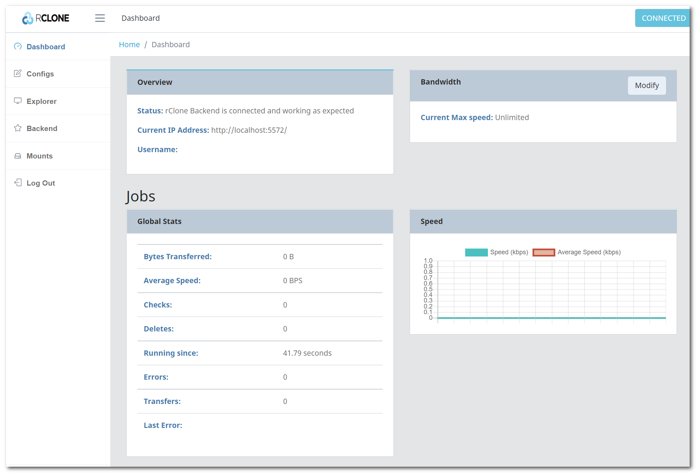

# S3 compatible object storage

Zerops provides a fully managed and scaled S3 compatible object storage service, suitable for both development and production projects using any load. You can choose any option you want and be sure that it will work. Your certainty and peace of mind are our top priority.

## Adding the Object Storage Service in Zerops

### Used technology

Zerops Object Storage is based on the technology of the [Ceph cluster](https://docs.ceph.com/en/latest/architecture) in version [v15.2 OCTOPUS](https://docs.ceph.com/en/latest/releases/octopus) with one namespace shared by all Zerops accounts (similar to [AWS S3](https://docs.aws.amazon.com/AmazonS3/latest/userguide/UsingBucket.html)), providing interfaces compatible with most of the Amazon S3 RESTful API. This means that after a bucket is created, the name of that bucket cannot be used by another Zerops account until the bucket is deleted.

You can choose any bucket naming conventions you want, but **we recommend the following logic**, which should **guarantee all Zerops accounts a very high level of reliability and conflict avoidance**.

<!-- markdownlint-disable DOCSMD004 -->
::: info Zerops recommendation for the bucket naming convention
A unique random **serviceId** 22-characters length internal value (see also [Storage access details](#from-local-development-environment)) is generated for each Zerops service instance. Using this value as a bucket name prefix, you can ensure that any of your created ones will be unique among all other bucket names across the whole Zerops namespace.

**Recommended syntax**: `<serviceId>:<bucketName>`

Use this prefix value consistently for each created bucket name. Because it's a soft rule, it is not 100% certain, and always use the existence checking for such a new bucket name. There is a very low probability that other users will accidentally use such a combination of characters if, for some reason, they don't respect our recommendation.
:::
<!-- markdownlint-enable DOCSMD004 -->

### Object storage name

Choose a short and descriptive URL-friendly name, for example, **store**. The following rules apply:

* maximum length **==25==** characters,
* only lowercase ASCII letters **==a-z==** and numbers **==0-9==**,
* **==has to be unique==** in relation to other existing project's hostnames,
* the object storage name **==can't be changed==** later.

<!-- markdownlint-disable DOCSMD004 -->
::: info
The object storage name is also automatically used to create a user account under which all buckets and objects are subsequently created. This user is, therefore, their **owner with full access rights**. See [Object storage owner identity](#object-storage-owner-identity) section for more info. ==**You can't create any new users on your own.**==

Creating different object storage services allows you to set different ACL settings to get required [access rights](https://docs.aws.amazon.com/AmazonS3/latest/userguide/acl-overview.html), including canned ACL like [public read/write access](https://docs.aws.amazon.com/AmazonS3/latest/userguide/acl-overview.html#canned-acl) ([see examples](/documentation/services/storage/s3.html#from-runtime-services-inside-the-project)).
:::
<!-- markdownlint-enable DOCSMD004 -->

### API URL endpoint and port

The Zerops Object Storage service is accessible on [https://s3.app.zerops.io](https://s3.app.zerops.io). The port is always set to the default value of HTTPS protocol **==443==** and can't be changed.

<!-- markdownlint-disable DOCSMD004 -->
::: info
The object storage cluster is running in a HA mode (with multiple node flexibility controlled by Zerops) as a directly accessible service in the same way from all Zerops project's services and from the outside Internet through HTTPS protocol. Each new Zerops Object Storage Service creates a reserved and independent space based on the required disk capacity.
:::
<!-- markdownlint-enable DOCSMD004 -->

### Required disk capacity

You can choose the maximum amount of data in GB the created Object Storage Service should be capable of holding. The default value is set to **2 GB**, but you can change it as you like between **1** and **100 GB**.

<!-- markdownlint-disable DOCSMD004 -->
::: warning Only manual scaling
Chosen disk capacity is currently not automatically scaled in any way and needs to be changed manually as needed via the Zerops GUI.
:::
<!-- markdownlint-enable DOCSMD004 -->

### Location of the Zerops HW infrastructure

The Zerops infrastructure is completely located in **Europe/Prague**. Regardless of this fact, the default S3 region option ==**us-east-1**== must be used as a region property value. This option is related to minimizing any subsequent complications when communicating with various client tools and SDKs.

### Object store bucket names

The [following rules](https://docs.ceph.com/en/latest/radosgw/s3/bucketops/#constraints) apply:

* must be unique in the same shared Zerops region namespace,
* cannot be formatted as IP address,
* can be between 3 and 63 characters long,
* must not contain uppercase characters or underscores,
* must start with a lowercase letter or number,
* must be a series of one or more labels separated by a single period ( ==**.**== ),
* can contain lowercase letters, numbers, and hyphens,
* each label must start and end with a lowercase letter or a number.

### Number of buckets per a service

You can create up to 1000 buckets per one Zerops Object Storage Service.

### Object storage owner identity

For each Zerops Object Storage Service, one account with the same [canonical id](https://docs.aws.amazon.com/general/latest/gr/acct-identifiers.html) as the uniquely generated **serviceId** (see also [Storage access details](#from-local-development-environment)) of that instance, is automatically created with the same name as the chosen [Object storage name](#object-storage-name). Under this account, all buckets and objects/files are created later, and this user is listed as the owner and the the only one grantee with the following attributes, as an example:

|DisplayName  |ID                        |Type             |
|:------------|:-------------------------|:----------------|
|==**store**==|==0LW7E_BUT-yKmmEcyf3dzQ==|**CanonicalUser**|

<!-- markdownlint-disable DOCSMD004 -->
::: info User canonical ID
The unique generated **serviceId** (see [Storage access details](#from-local-development-environment)) of the created Zerops Object Storage Service instance is used as the canonical **ID** property above.
:::
<!-- markdownlint-enable DOCSMD004 -->

## How to access an object storage service

Other project's services can access the object storage using its public [API URL endpoint](#api-url-endpoint-and-port) in the same way as any access from the outside Internet, including your [local development environment](/documentation/services/storage/s3.html#from-local-development-environment), through HTTPS protocol and the default ==**443**== port.

### From runtime services inside the project

In most cases, this will be a way to create application logic within the Zerops runtime environments ([Node.js](/documentation/services/runtimes/nodejs.html), [Golang](/documentation/services/runtimes/golang.html), and [PHP](/documentation/services/runtimes/php.html)) using relevant programming code, ensuring communication and all steps associated with creating and managing buckets and their contents.

Each programming language requires a bit different setting. The following examples show some elementary tasks for each of them. You need to understand each of them and also have knowledge of using appropriate SDKs for more advanced cases and real applications.

* How to manage an object storage's buckets:
  * [create a default new one](/knowledge-base/how-to-do/using-object-storage-in-php.html#creating-a-new-object-storage-bucket), [get existed ACL](/knowledge-base/how-to-do/using-object-storage-in-php.html#getting-an-existed-object-storage-bucket-acl-setting), or [update existed ACL](/knowledge-base/how-to-do/using-object-storage-in-php.html#update-an-existed-object-storage-bucket-acl)) from [PHP](/knowledge-base/how-to-do/using-object-storage-in-php.html)
  * create a default new one, get existed ACL, or update existed ACL from [Node.js](/knowledge-base/how-to-do/using-object-storage-in-nodejs.html)
  * create a default new one, get existed ACL, or update existed ACL from [Golang](/knowledge-base/how-to-do/using-object-storage-in-golang.html)

* How to manage a bucket's objects (with body or a file):
  * [put](/knowledge-base/how-to-do/using-object-storage-in-php.html#adding-a-new-bucket-s-object-with-body-or-a-file) and [get](/knowledge-base/how-to-do/using-object-storage-in-php.html#getting-an-existed-bucket-s-object-with-body-or-a-file) from [PHP](/knowledge-base/how-to-do/using-object-storage-in-php.html)
  * put and get from [Node.js](/knowledge-base/how-to-do/using-object-storage-in-nodejs.html)
  * put and get from [Golang](/knowledge-base/how-to-do/using-object-storage-in-golang.html)

<!-- markdownlint-disable DOCSMD004 -->
::: info How to update the content of existed objects
There is no dedicated method to update an object's content. Overwrite it using the same way you created it. But you can specify other object settings (ACL, Tags, …), see [supported API](https://docs.aws.amazon.com/aws-sdk-php/v3/api/class-Aws.S3.S3Client.html).
:::
<!-- markdownlint-enable DOCSMD004 -->

It's always recommended not to place configuration values as constants directly into the application code. The better way is to use them indirectly, for example, via [custom environment variables](/knowledge-base/best-practices/how-to-use-environment-variables-efficiently.html), referencing Zerops [implicit environment variables](/documentation/environment-variables/helper-variables.htm) and given that [all environment variables](/documentation/environment-variables/how-to-access.html) are shared within the project across all services. Another reason not to hard-code the values inside your applications is that it can be dangerous because it is easy to commit them (like your credentials) into a repository, potentially exposing them to more people than intended.

### From local development environment

As said above, the Zerops Object Storage service is directly accessible using its public [API URL endpoint](#api-url-endpoint-and-port) through HTTPS protocol. You don't need to utilize the [VPN](/documentation/cli/vpn.html) functionality of our [Zerops zcli](/documentation/cli/installation.html), unlike all other Zerops services.

Because code runs from outside your Zerops project's network, you cannot use references to the environment variables. Therefore, you should copy the values manually through the „**How To Access** / **Storage access details**“ section of the service detail in your application if you need some of them and use them in your private local configuration strategy.

#### Using Rclone as a local management tool

We mention the [Rclone](https://rclone.org) as it's an excellent OSS project on [GitHub](https://github.com/rclone/rclone) with CLI & GUI interfaces, allowing you to browse and manage objects/files on Zerops object storage services.

<!-- markdownlint-disable DOCSMD004 -->
::: warning Using for backup/restore operations
To a certain extent, it's possible to use it also for fundamental backups & restores. The essence of this restriction is that it works with just objects and files and not with their extended data structures, like ACLs and metadata. When it's necessary to use them, for example, when transferring data from a local file system to a Zerops S3 compatible object storage service, it's possible to use a pre-defined setting on which such structures will be set.
:::
<!-- markdownlint-enable DOCSMD004 -->

The installation is straightforward, as you can find in the [instructions](https://rclone.org/install). To config accessing data of Zerops object storage services, run the config wizard by the command ==`rclone config`== , follow the instructions and default options. Be careful only in the steps when choosing:

|Question                                                                |Answer                                                                   |
|:-----------------------------------------------------------------------|:------------------------------------------------------------------------|
|**Name** (named remote)                                                 |choose the same value as the **Object storage name** , like ==`store`==  |
|**Choose your S3 provider**                                             |==`Ceph`==                                                               |
|**Enter AWS credentials in the next step**                              |==`false`==                                                              |
|**AWS Access Key ID**                                                   |a value from the Zerops Storage access details ==`Access Key Id`==       |
|**AWS Secret Access Key**                                               |a value from the Zerops Storage access details ==`Secret Access Key`==   |
|**Region to connect to**                                                |==`""`==                                                                 |
|**Endpoint for S3 API**                                                 |a value from the Zerops Storage access details ==`Api Url`==             |
|**Canned ACL used when creating buckets and storing or copying objects**|as you want, probably the default value ==`private`==                    |

After that you can run [commands](https://rclone.org/commands), for example:

<!-- markdownlint-disable DOCSMD004 -->
::: info Using a simplified bucket name
As explained earlier, the standard way to get a unique name of a bucket is using a randomly generated prefix that guarantees a high probability of such uniqueness, such as an internal ID of each Zerops service. To simplify the syntax of the following examples, we use only the ==`records`== bucket name.
:::
<!-- markdownlint-enable DOCSMD004 -->

|Command                                            |Result                                                                                        |
|:--------------------------------------------------|:---------------------------------------------------------------------------------------------|
|==`rclone lsd store:`==                            |List all existed buckets in the named remote `store`.                                         |
|==`rclone ls store:`==                             |List all existed object/files in the named remote `store`.                                    |
|==`rclone ls store:records`==                      |List existed object/files in the `records` bucket.                                            |
|==`rclone copy store:records C:/Data/Records`==    |Copy all object/files from the `records` bucket to a local path in the file system on Windows.|
|==`rclone copy store:records /usr/<user>/records`==|Copy all object/files from the `records` bucket to a local path in the file system on Linux.  |
|==`rclone copy C:/Data/Records store:records`==    |Copy all files from a local path in the file system on Windows to the `records` bucket.       |
|==`rclone copy /usr/<user>/records store:records`==|Copy all files from a local path in the file system on Linux to the `records` bucket.         |

<!-- markdownlint-disable DOCSMD004 -->
::: info What to use as keys for objects/files
The equivalent of an object/file key is a file name in a local file system. Then it's practical to always use a file name (including an extension) as a key, even for objects, like `*.txt` or `*.json`. It allows you to open such a file easily later.
:::
<!-- markdownlint-enable DOCSMD004 -->

You can also run the command ==`rclone rcd --rc-web-gui --rc-user=<user> --rc-pass=<pass>`== to locally serve a web based [GUI](https://github.com/rclone/rclone-webui-react) of Rclone. The optional parameters `rc-user` and `rc-pass` allows to choose your own defined values to secure the environment.

## Data protection in Zerops Object Storage

Zerops S3 compatible [Ceph](https://docs.ceph.com/en/latest/architecture) object storage cluster provides similar storage infrastructure as AWS S3. Objects/files are redundantly stored on multiple HW devices, and their durability is maintained by quickly detecting and repairing any lost redundancy. All of that guarantees 99.99999 % data availability at any moment.

<!-- markdownlint-disable DOCSMD004 -->
::: warning Accidentally deleted data
Zerops does not ensure the back availability of accidentally deleted data to the user in any way. You have to use your way to protect against such cases. For example, using more Zerops object storage services and periodical backing up versioned data sets among them or syncing data between Zerops and other environments, including local file systems.
:::
<!-- markdownlint-enable DOCSMD004 -->
