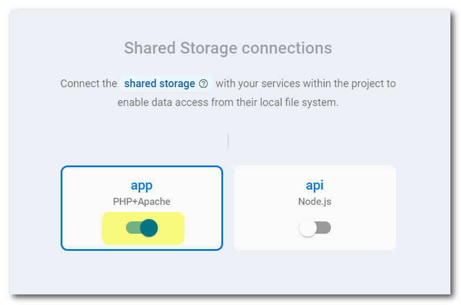
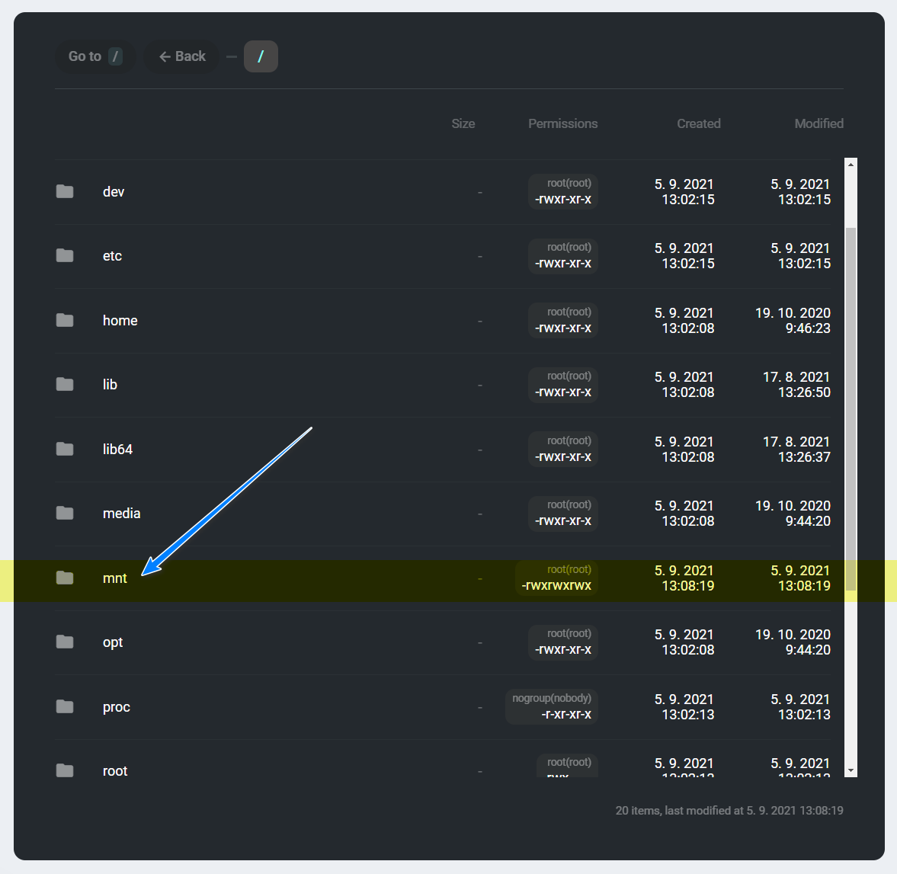

# Shared Storage

Zerops provides a fully managed and scaled **shared storage** service (replicated volume) based on the [GlusterFS](https://docs.gluster.org) cluster technology, suitable for both development and production projects using any load. You can choose any option you wish in the knowledge that it will work.

<!-- markdownlint-disable DOCSMD004 -->
::: tip When and why using Zerops Shared or Object Storage
If you are not sure what storage type to choose, take a look at [the best practices](/knowledge-base/best-practices/when-and-why-use-shared-or-object-storage.html) to help with your decision.
:::
<!-- markdownlint-enable DOCSMD004 -->

[[toc]]

## Adding the Shared Storage Service in Zerops

### Which version to choose

The service is completely a managed technology from the Zerops side, and it's not directly related to any publicly distributed version number. Therefore, you do not have to select any specific version.

Used as the export & import type: ==`shared-storage`== .

### Shared storage name

Choose a short and descriptive URL-friendly name, for example, **disk**. The following rules apply:

* maximum length **==25==** characters,
* only lowercase ASCII letters **==a-z==** and numbers **==0-9==**,
* **==has to be unique==** in relation to other existing project hostnames,
* the shared storage name **==can't be changed==** later.

<!-- markdownlint-disable DOCSMD004 -->
::: tip Relation between shared storage names and hostnames
There's only one namespace for all service hostnames, shared storage names, and object storage names. Each one of them has to be unique.
:::
<!-- markdownlint-enable DOCSMD004 -->

### Storage mounting

A shared storage disk can only be mounted to runtime environment services ([Node.js](/documentation/services/runtimes/nodejs.html#accessing-a-zerops-shared-storage), [Golang](/documentation/services/runtimes/golang.html#accessing-a-zerops-shared-storage), and [PHP](/documentation/services/runtimes/php.html#accessing-a-zerops-shared-storage)).

The mounting is done automatically by **enabling** the corresponding switch for an already existing runtime service to which you want to mount the storage. If you want to do this anytime after creating the service, return to its **Storage configuration** section in the service details and make the same change.

The figure above shows that the path to the root of a mounted shared storage disk in the PHP service is ==`/mnt/app`== . If you also enable the switch for **api** (Node.js service), the path will be ==`/mnt/api`== . Here, your application code can create any directory structure and content you need. Access rights are slightly different for each runtime environment. See the details for [PHP](/documentation/services/runtimes/php.html#accessing-a-zerops-shared-storage), Node.js, or Golang.

<!-- markdownlint-disable DOCSMD004 -->
::: tip 
If you would like to learn more about the technical details and how this service is built internally, take a look at the [Shared Storage Service, Internal](/documentation/overview/how-zerops-works-inside/glusterfs-cluster-internally.html) section of the documentation.
:::
<!-- markdownlint-enable DOCSMD004 -->

## Default hardware configuration and autoscaling

* The Shared storage service is always instantiated in HA mode only with **3 containers**. This means that any files are always replicated through 3 different physical places. A non-HA version isn't available.
* Each of them runs in a different container located on a **different physical machine** and starts with 1 vCPU, 0.25 GB RAM, and 5 GB of disk space.
* Zerops will automatically scale the resources **vertically only** (up to 32 vCPU, 64 GB RAM, 1 TB disk space).

## How to browse the content

You can use the **File browser** functionality available in all runtime services to view folders, files, and their contents & attributes of mounted shared storage disks at the path `/mnt/`.

