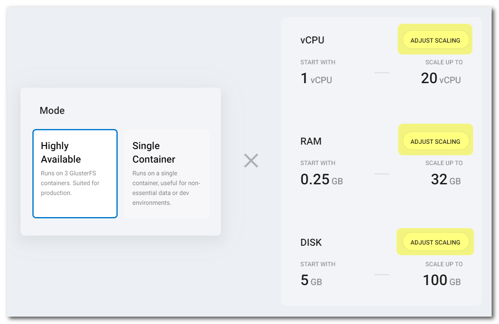

# Shared Storage

Zerops provides a fully managed and scaled **shared storage** service (replicated volume) based on the [GlusterFS](https://docs.gluster.org) cluster technology, suitable for both development and production projects using any load. You can choose any option you wish in the knowledge that it will work.

<!-- markdownlint-disable DOCSMD004 -->
::: tip When and why using Zerops Shared or Object Storage
If you are not sure what storage type to choose, take a look at [the best practices](/knowledge-base/best-practices/when-and-why-use-shared-or-object-storage.html) to help with your decision.
:::
<!-- markdownlint-enable DOCSMD004 -->

[[toc]]

## Adding the Shared Storage Service in Zerops

The Zerops Shared Storage service is based on a [Linux LXD container](/documentation/overview/projects-and-services-structure.html#services-containers) with **Ubuntu** **==v18.04.06==**.

There are two possible ways of creating a new Shared Storage service. Either manually in the [Zerops GUI](#through-the-zerops-gui-interface), or using the Zerops [import functionality](/documentation/export-import/project-service-export-import.html#how-to-export-import-a-project).

### Using the import functionality

Zerops uses a YAML definition format to describe the structure. View the complete specification of the [import/export syntax in the YAML format](/documentation/export-import/project-service-export-import.html#used-yaml-specification).

To import a Shared Storage service, you can use something similar to the following:

```yaml
services:
  # Service will be able to mount using the path /mnt/disk
  # The mounting point is always derived from the chosen service hostname.
  - hostname: disk
    # Type of service used (the version is generic and not necessary to enter).
    type: shared-storage
    # Whether the service will be run on one or multiple containers.
    # Since this is a simple example, using only one container is fine.
    mode: NON_HA
```

### Through the Zerops GUI interface

#### Which version to choose

The service is completely a managed technology from the Zerops side, and it's not directly related to any publicly distributed version number. Therefore, you do not have to select any specific version.

Used as the export & import type: ==`shared-storage`== .

#### Shared storage name

Choose a short and descriptive URL-friendly name, for example, **disk**. The following rules apply:

* maximum length **==25==** characters,
* only lowercase ASCII letters **==a-z==** and numbers **==0-9==**,
* **==has to be unique==** in relation to other existing project hostnames,
* the shared storage name **==can't be changed==** later.

<!-- markdownlint-disable DOCSMD004 -->
::: tip Relation between shared storage names and hostnames
There's only one namespace for all service hostnames, shared storage names, and object storage names. Each one of them has to be unique.
:::
<!-- markdownlint-enable DOCSMD004 -->

#### HA / non-HA shared storage mode

When creating a new service, you can choose whether the shared storage should be run in **HA** (High Availability) mode, using 3 containers, or **non-HA mode**, using only a single container. ==**The chosen mode can't be changed later.**== If you would like to learn more about the technical details and how this service is built internally, take a look at the [Shared Storage Service, deep dive view](/documentation/overview/how-zerops-works-inside/glusterfs-cluster-internally.html) part of the documentation.

##### Shared storage in non-HA mode

* great for local development to save money,
* data is stored only in a single container, higher risk of data loss,
* all data changes since the last backup are not recoverable,
* not recommended for production projects.

##### Shared storage in HA mode

* will run always on three containers, each on a **different physical machine**,
* therefore the data are stored redundantly always in 3 places, with no risk of total failure,
* when one container fails, it's automatically replaced with a new one,
* recommended for production projects.

## Storage mounting

A shared storage disk can only be mounted to runtime environment services ([Node.js](/documentation/services/runtimes/nodejs.html#accessing-a-zerops-shared-storage), [Golang](/documentation/services/runtimes/golang.html#accessing-a-zerops-shared-storage), and [PHP](/documentation/services/runtimes/php.html#accessing-a-zerops-shared-storage)).

The mounting is done automatically by **enabling** the corresponding switch for an already existing runtime service to which you want to mount the storage. If you want to do this anytime after creating the service, return to its **Storage configuration** section in the service details and make the same change.


The figure above shows that the shared storage is enabled for mounting in the **PHP** service with the `app` hostname. The mounting point will be ==`/mnt/disk`== (based on the chosen shared service hostname `disk`). If you enable also the switch for the **Node.js** service with the `api` hostname, the mounting point for it will be the same ==`/mnt/disk`== (as in the PHP service). Here, your application code can create any directory structure and content you need. Access rights are slightly different for each runtime environment. See the details for [PHP](/documentation/services/runtimes/php.html#accessing-a-zerops-shared-storage), [Node.js](/documentation/services/runtimes/nodejs.html#accessing-a-zerops-shared-storage), or [Golang](/documentation/services/runtimes/golang.html#accessing-a-zerops-shared-storage).

<!-- markdownlint-disable DOCSMD004 -->
::: warning Mounting points and the import YAML scripts
Zerops is able to create shared storage services found in the [import YAML scripts](#using-the-import-functionality), but mounting them to the existing runtime services must be done manually in the Zerops GUI.
:::
<!-- markdownlint-enable DOCSMD004 -->

## Default hardware configuration and autoscaling

* In HA mode, the Shared storage service is instantiated always with **3 containers**. This means that any files are always replicated through 3 different physical places. In non-HA mode, only **1 container** is used.
* Each of them runs in a different container located on a **different physical machine** and starts with 1 vCPU, 0.25 GB RAM, and 5 GB of disk space.
* Zerops will automatically scale the container resources only **vertically** (up to 20 vCPU, 32 GB RAM, 100 GB disk space).
* You can also manually adjust those resources' custom upper limit manually in the Zerops GUI.



## How to browse the content

You can use the **File browser** functionality available in all runtime services to view folders, files, and their contents & attributes of mounted shared storage disks at the path `/mnt/`.


